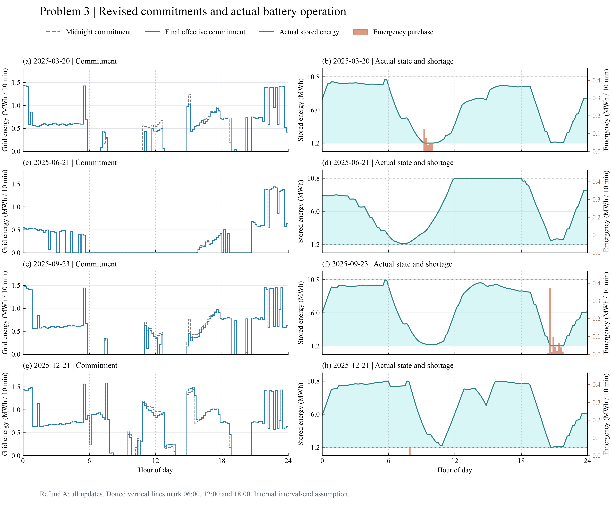

# 问题3：含改购费用的光伏预报更新与储能反馈

内部模型、数值结果与论文初稿；未精修全文，不是正式提交版。

## 1. 从固定计划到允许时刻的反馈重规划

问题3每天0、6、12、18点取得未来24小时的整点光伏功率预报。本文沿用统一方案，在每个允许时刻取得实际储电量，优化尚未执行的区间，并执行到下一个允许时刻；合同不能在其他时刻任意重做。光伏使用当前发布版本按既有分段线性积分得到的十分钟电量，只截取到当天24点。首小时左端点按已复核规则使用此前可得版本，不用未来版本补点；原始时间键保持不变。

负荷预测沿用问题2于2月1日冻结的模型类型，每日0点按此前历史重估后保持日内固定。虽然问题2的候选全年表现劣于季节基线，这里不在评价期更换负荷模型。评价仍为2月1日至12月31日334天，共48,096段，各策略从相同的7,268.423164 kWh初态出发，随后各自连续运行。0点计划根据附件3预报重新优化，并非复制问题2购电量。

当前内部时间假设为原标签代表区间终点，例如00:10对应[00:00,00:10)。正式模板的十分钟偏移尚未确认，本稿不是正式提交版。90%效率采用充、放两向各0.9，5000 kW为交流母线侧限额。问题2—3本身没有重新明确日循环约束，本文为继承统一基线，对每次预测规划保留当天0点实际电量作为24点终态目标；实际电量不在午夜重置。这一额外约束需要后续做终态策略对照，不能当作题面强制要求。

## 2. 变量、守恒与分段费用

以$t$表示十分钟区间，$k$表示当前决策时刻，$\mathcal H_k$为从$k$到当天24点的未执行区间。$q_t^0$是0点原承诺，$q_t^k$是本次有效承诺，$c_t,b_t$分别是交流侧充、放电量，$w_t$为无收益处置的富余，$E_t$为区间起点储电量；电量单位均为kWh。$\widehat L_t$为0点负荷预测，$\widehat G_{t|k}$为当前光伏预测，$p_t>0$为已知固定价格，单位元/kWh。规划约束为

$$q_t^k+\widehat G_{t|k}+b_t=\widehat L_t+c_t+w_t,$$
$$E_{t+1}=E_t+0.9c_t-b_t/0.9,$$
$$1200\le E_t\le10800,\quad q_t^k,w_t\ge0,$$
$$0\le c_t\le(5000/6)z_t,\quad0\le b_t\le(5000/6)(1-z_t),\quad z_t\in\{0,1\}.$$

规划初态等于决策时刻已观测的实际储能，规划终态等于当天0点实际储能。$w_t$包括无法利用的已付费购电和弃光，不是向电网售电。该处置通道保证不退款情形的富余承诺不会因人为禁止处置而假性不可行。0点正常价严格为正，初始优化没有主动购买再丢弃的经济动机。

对最终执行量$q_t$，令$\Delta_t^+=(q_t-q_t^0)_+$、$\Delta_t^-=(q_t^0-q_t)_+$，$(x)_+=\max(x,0)$。题面关于减购是否退原款存在两种解释：

$$F_A(q_t)=p_tq_t^0+1.5p_t\Delta_t^+-0.5p_t\Delta_t^-,$$
$$F_B(q_t)=p_tq_t^0+1.5p_t\Delta_t^++0.5p_t\Delta_t^-.$$

A表示退取消部分原款、再收50%违约费；B表示原款保留、另收50%违约费。每段按相对0点原计划的最终量结算一次，不累加中间版本目标。例如原量100、价格1，最终120时两者130元；最终80时A为90元、B为110元。先改到120又改回100的最终合同费为100元，此数值只适用于当前一次结算假设，不能推广到逐笔变更都收费的市场。

两种费用均为凸分段线性，可引入$v_t$并最小化其和。A使用
$$v_t\ge0.5p_tq_t^k+0.5p_tq_t^0,\qquad v_t\ge1.5p_tq_t^k-0.5p_tq_t^0;$$
B将第一条替换为$v_t\ge-0.5p_tq_t^k+1.5p_tq_t^0$。B下若$q<q^0$，将$q$提高到$q^0$并处置增加的富余即可保持同一充放电轨迹，费用反而不增，故可限定$q\ge q^0$。这不禁止把上一次超购的承诺降低到原计划。0点目标为$\min\sum p_tq_t^0$；更新目标为$\min\sum_{t\in\mathcal H_k}v_t$。

统一方案中的预计紧急补购在本实现可消去：常规增购没有数量上限，最大边际费1.5p低于紧急5p。把任意正的预计紧急量替换为等量常规增购，守恒和充放电轨迹均不变，目标下降。该支配关系仅限预测规划，不说明实际紧急量为零。

## 3. 实际执行与实验设计

继承问题2准静态执行器。令$a_t=q_t+G_t-L_t$。若$a_t\ge0$，实际充电量为$\min\{a_t,5000/6,(10800-E_t)/0.9\}$，余量处置；若$a_t<0$，实际放电量为$\min\{-a_t,5000/6,0.9(E_t-1200)\}$，剩余缺口$e_t$按$5p_t$紧急补购。实际储电按同一效率递推。执行器只在当前段接收实际负荷和PV，未来实际值不进入规划；由于它是十分钟电量级仿真，不能据此保证亚区间的瞬时功率响应。每段账单为$F(q_t)+5p_te_t$，未使用的合同电量仍收费。

主实验包括只用0点预报、A/B全更新和A下分别仅6、仅12、仅18点更新，共六组。时刻消融在本次Q3求解前列明，但此前已查看Q2全年结果，因此属于回顾性机制对照，不是未触及测试集上的策略选优。之后增加仅更新实际储能、继续使用0点PV预报的A对照，以区分反馈重规划与新PV信息；该补充在主实验结果之后提出，单独留存，未覆盖原六组。

所有策略保持相同负荷预测方法、物理参数、日终目标定义、执行器和起始实际SOC。不同策略后续SOC、甚至次日0点计划可能不同，这是连续闭环运行的结果；不会每日人为重置为共同SOC。费用比较的附加库存修正为$J-\bar p\eta_d(E_{\rm end}-E_{\rm start})$，它只用于检查末态价值影响，不是实际电网账单。

## 4. 实际费用与机制解释

| 策略 | 实际总费/元 | 合同费/元 | 紧急费/元 | 紧急量/kWh | 相对0点节省/% | 期末储电/kWh |
| --- | --- | --- | --- | --- | --- | --- |
| 只用0点预报 | 15,842,067.99 | 12,281,584.60 | 3,560,483.39 | 574,236.05 | 0.000 | 4,391.08 |
| 6/12/18全更新 A | 13,772,880.06 | 13,053,598.95 | 719,281.11 | 125,345.25 | 13.061 | 7,173.09 |
| 6/12/18全更新 B | 13,765,041.25 | 13,065,826.78 | 699,214.47 | 121,548.11 | 13.111 | 7,144.64 |
| 仅6点更新 A | 15,167,392.95 | 12,656,594.48 | 2,510,798.47 | 394,008.18 | 4.259 | 4,453.85 |
| 仅12点更新 A | 15,067,335.84 | 12,418,603.14 | 2,648,732.70 | 438,816.90 | 4.890 | 4,562.33 |
| 仅18点更新 A | 14,167,394.07 | 13,037,729.42 | 1,129,664.65 | 211,441.86 | 10.571 | 7,149.11 |
| 只反馈储能状态 A | 13,934,357.97 | 13,120,798.33 | 813,559.64 | 143,574.44 | 12.042 | 7,142.85 |


以上为2025年2—12月累计实际费用，不是完整365天的账单。全更新A相对仅0点节省2,069,187.93元（13.061%），紧急量减少78.17%。原六策略共5,010次MILP、288,576个实际区间；补充对照再增加1,336次MILP及48,096个区间。

A的合同费比0点基线增加772,014.35元，但紧急费减少2,841,202.28元，净节省来自用较便宜的合同调整代替部分5倍价紧急电。A全年0点原计划费12,287,868.65元，增购项960,461.74元，减购净调整项-194,731.44元；相加得到合同费，并非把每版规划目标再次加入账单。

B实际总费比A低7,838.81元，差异仅约0.057%。B合同费反而高12,227.83元，紧急费低20,066.64元。B保持更多原承诺，产生不同的储能和富余轨迹；该闭环结果不违背相同q、q0下A费用不高于B，也不能据此证明不退款规则优于退款。两种费用解释都需保留。

若只允许一次日内更新，A下18点对照节省1,674,673.92元，优于本次6点和12点对照。三次全更新相对仅18点仍节省394,514.01元。但18点操作同时获得实际SOC，因此不能把全部效果归于18点PV预报。

补充控制给出更严格的分解：只反馈储能状态费用13,934,357.97元，相对只用0点节省1,907,710.02元；再刷新PV预报进一步节省161,477.91元，相对该控制为1.159%。在这三条连续策略路径的数值比较中，状态反馈控制已经取得总节省的92.20%。这是一组回顾性控制比较，不是普遍可加的因果贡献率。

是否引入其他时刻预报：在题设不计获取和通信开销、当前执行器及费用解释下，新预报带来额外正收益，支持纳入日内重规划；不能把13.06%的全部收益宣称为纯信息价值。实际采用前还需结合预报/通信成本、延迟、储能寿命费以及结算规则确认。单一时刻结果说明18点重规划很有价值，尚不能单独证明18点PV信息最有价值。

以下预测误差是求解后，针对相同剩余区间比较当前版本与0点旧版本，未回流训练或改购决策；不同发布时刻的剩余区间不同，不跨行直接比较谁“最好”。

| 发布时刻 | 同一剩余时域段数 | 0点旧预报MAE/kWh | 新预报MAE/kWh | 旧RMSE/kWh | 新RMSE/kWh |
| --- | --- | --- | --- | --- | --- |
| 00:00 | 48096 | 34.44 | 34.44 | 64.80 | 64.80 |
| 06:00 | 36072 | 45.50 | 30.02 | 74.75 | 47.82 |
| 12:00 | 24048 | 38.47 | 17.60 | 70.25 | 30.31 |
| 18:00 | 12024 | 2.64 | 2.65 | 10.46 | 10.09 |


Q2已冻结选中策略费用16,333,683.39元；本题仅0点预报策略为15,842,067.99元。该差额同时包含光伏预测源变化及随后状态路径差异，作为背景呈现，不将其混入日内更新净收益。问题2季节基线15,378,207.35元及原候选退化证据继续保留。七策略库存修正后的排名与原始账单排名一致：6/12/18全更新 B, 6/12/18全更新 A, 只反馈储能状态 A, 仅18点更新 A, 仅12点更新 A, 仅6点更新 A, 只用0点预报。库存修正仅作期末残值敏感性参照，不计入上述账单。

## 5. 验证、计算与可追溯性

主实验独立文件审计110,401项通过，状态反馈控制30,048项通过。验证器不导入求解器模型或实际执行器，独立重建每版光伏源匹配、负荷冻结、允许更新集合、最新版本选用、原始承诺、实际反馈、物理约束、一次结算和全部表格。主实验最大实际平衡残差0.000e+00 kWh，最大计划平衡残差1.735e-10 kWh；约束容差为1e-6 kWh，费用汇总容差为1e-5元。求解输入与核心代码前后SHA-256一致。

四个指定日期、0点基线及A/B各次更新的36个时域，使用独立稀疏矩阵通过SciPy linprog构建连续松弛。最大MILP值减LP下界为2.183e-11元，最大LP原始约束误差9.095e-13。两接口底层同属HiGHS，因此是独立建模交叉核对，不是不同厂商算法验证；LP贴合只证明这些抽样预测时域的界，没有证明全年随机费用最优。

| 策略 | 时域求解次数 | 求解器累计秒 | 单次最大秒 | 最大gap |
| --- | --- | --- | --- | --- |
| 只用0点预报 | 334 | 8.188 | 0.0602 | 2.658e-16 |
| 6/12/18全更新 A | 1336 | 28.376 | 0.0707 | 6.621e-16 |
| 6/12/18全更新 B | 1336 | 21.472 | 0.0545 | 6.697e-16 |
| 仅6点更新 A | 668 | 17.201 | 0.0569 | 3.098e-16 |
| 仅12点更新 A | 668 | 14.983 | 0.0582 | 3.112e-16 |
| 仅18点更新 A | 668 | 10.879 | 0.0567 | 1.293e-15 |


单线程HiGHS、random_seed=0、相对gap容差1e-9、每次时间限120秒；全部状态Optimal。上表为求解器内部耗时，不含Pandas逐行仿真、读写及报告时间，不能当作端到端耗时。7项Q3边界单测覆盖A/B手算费用、最终一次结算、富余处置、禁止未来预报补缺和Q1目标回归；连同原Q1/Q2单测共20项通过。首次红灯测试和开发中暴露的API/序列化问题记录保留，最终验收以通过日志为准。

## 6. 假设敏感性与未完成项

已执行A/B结算情景、更新时刻消融、仅状态反馈控制和期末库存代理比较。这些分别是规则敏感性、机制消融与期末价值检查，不能冒称已覆盖全部稳健性。效率替代口径已有Q1数值对照，本题没有重新计算效率变化、误差扰动、备用储能、动态终态价值或电池寿命费，因此结论仍限于当前参数。实际执行采用贪心规则，不保证真实成本最优。

正式时间模板、取消原款退款规则、逐次交易或最终一次计费、90%效率含义及功率侧别尚待确认。正式result3.xlsx不导出。尚未做问题4波动电价计算、全文整合、最终参考文献与AI使用清单审核；本章为可追溯初稿，BZD审查是本地检查，不是第三方认证。

## 7. 图形证据

图3-1显示三组主策略的月度实际费用和相对0点节省，A/B曲线接近，不将视觉重合解释为完全相同。图3-2保留四个指定日原承诺与最终有效量的十分钟阶梯，以及实际SOC和紧急量；灰色竖线标出允许更新时刻，实际SOC不被强制重置到0点值。




两图按ModelViz候选召回、真实字段选择、模板适配、执行与技术/实际视觉复核生成，全部英文，300 dpi PNG和SVG并存。模板、输入副本、决策、原图修复历史与哈希在同目录workspace；最终质检文件为final_quality_report.json。图形技术记录中的初始失败和待观察状态是保留的修复证据，不代表最终未验收。

## 8. 指定日期结果

正文先列A口径；B口径全部对应表随reports/q3_representative_tables.md保存，规则未确认前不删除。

### 6/12/18全更新 A：四日指定输出

全天量费（购电量分列常规有效量及紧急量，避免遗漏紧急购电）：

| 日期 | 原计划量/kWh | 常规有效量/kWh | 紧急量/kWh | 原计划费/元 | 最终合同费/元 | 紧急费/元 | 实际总费/元 |
| --- | --- | --- | --- | --- | --- | --- | --- |
| 2025-03-20 | 67,561.43 | 66,165.73 | 327.42 | 40,914.96 | 43,493.27 | 1,600.69 | 45,093.96 |
| 2025-06-21 | 35,163.68 | 35,009.80 | 0.00 | 19,763.14 | 19,718.63 | 0.00 | 19,718.63 |
| 2025-09-23 | 66,912.22 | 66,035.43 | 667.86 | 41,134.91 | 43,439.93 | 4,003.51 | 47,443.44 |
| 2025-12-21 | 94,857.04 | 95,459.97 | 55.11 | 60,123.75 | 62,025.01 | 320.31 | 62,345.32 |

表1指定区间：

| 日期 | 区间 | 原计划/kWh | 最终有效/kWh |
| --- | --- | --- | --- |
| 2025-03-20 | 10:00–10:10 | 0.00 | 0.00 |
| 2025-03-20 | 12:00–12:10 | 536.81 | 430.09 |
| 2025-03-20 | 14:00–14:10 | 0.00 | 0.00 |
| 2025-03-20 | 16:00–16:10 | 620.23 | 620.23 |
| 2025-03-20 | 18:00–18:10 | 701.88 | 701.88 |
| 2025-03-20 | 20:00–20:10 | 0.00 | 0.00 |
| 2025-06-21 | 10:00–10:10 | 0.00 | 0.00 |
| 2025-06-21 | 12:00–12:10 | 0.00 | 0.00 |
| 2025-06-21 | 14:00–14:10 | 0.00 | 0.00 |
| 2025-06-21 | 16:00–16:10 | 152.52 | 113.18 |
| 2025-06-21 | 18:00–18:10 | 0.00 | 0.00 |
| 2025-06-21 | 20:00–20:10 | 0.00 | 0.00 |
| 2025-09-23 | 10:00–10:10 | 0.00 | 0.00 |
| 2025-09-23 | 12:00–12:10 | 362.80 | 347.92 |
| 2025-09-23 | 14:00–14:10 | 0.00 | 0.00 |
| 2025-09-23 | 16:00–16:10 | 532.44 | 472.03 |
| 2025-09-23 | 18:00–18:10 | 755.35 | 755.35 |
| 2025-09-23 | 20:00–20:10 | 0.00 | 0.00 |
| 2025-12-21 | 10:00–10:10 | 0.00 | 0.00 |
| 2025-12-21 | 12:00–12:10 | 953.93 | 835.28 |
| 2025-12-21 | 14:00–14:10 | 0.00 | 0.00 |
| 2025-12-21 | 16:00–16:10 | 777.10 | 792.54 |
| 2025-12-21 | 18:00–18:10 | 730.75 | 730.75 |
| 2025-12-21 | 20:00–20:10 | 0.00 | 0.00 |

表2实际充放电（交流侧电量）：

| 日期 | 区间 | 充电/kWh | 放电/kWh |
| --- | --- | --- | --- |
| 2025-03-20 | 00:00–04:00 | 2,876.57 | 385.73 |
| 2025-03-20 | 04:00–08:00 | 970.42 | 6,001.38 |
| 2025-03-20 | 08:00–12:00 | 3,043.55 | 2,449.96 |
| 2025-03-20 | 12:00–16:00 | 6,460.04 | 254.72 |
| 2025-03-20 | 16:00–20:00 | 192.17 | 5,324.08 |
| 2025-03-20 | 20:00–24:00 | 7,203.98 | 2,306.47 |
| 2025-06-21 | 00:00–04:00 | 259.79 | 2,123.17 |
| 2025-06-21 | 04:00–08:00 | 426.72 | 4,410.49 |
| 2025-06-21 | 08:00–12:00 | 10,201.60 | 0.00 |
| 2025-06-21 | 12:00–16:00 | 0.00 | 0.00 |
| 2025-06-21 | 16:00–20:00 | 100.52 | 5,769.70 |
| 2025-06-21 | 20:00–24:00 | 8,257.62 | 2,545.13 |
| 2025-09-23 | 00:00–04:00 | 4,525.21 | 200.49 |
| 2025-09-23 | 04:00–08:00 | 1,032.59 | 6,606.88 |
| 2025-09-23 | 08:00–12:00 | 5,156.26 | 1,896.62 |
| 2025-09-23 | 12:00–16:00 | 5,118.59 | 580.22 |
| 2025-09-23 | 16:00–20:00 | 19.90 | 5,762.00 |
| 2025-09-23 | 20:00–24:00 | 5,534.55 | 2,173.35 |
| 2025-12-21 | 00:00–04:00 | 5,172.86 | 135.71 |
| 2025-12-21 | 04:00–08:00 | 1,430.68 | 1,580.71 |
| 2025-12-21 | 08:00–12:00 | 5,242.86 | 7,619.12 |
| 2025-12-21 | 12:00–16:00 | 7,995.47 | 2,302.71 |
| 2025-12-21 | 16:00–20:00 | 35.28 | 5,772.65 |
| 2025-12-21 | 20:00–24:00 | 5,472.12 | 2,851.73 |

| 日期 | 0点实际储电/kWh | 24点实际储电/kWh |
| --- | --- | --- |
| 2025-03-20 | 7,556.67 | 7,648.34 |
| 2025-06-21 | 8,260.32 | 9,083.62 |
| 2025-09-23 | 6,035.42 | 6,150.97 |
| 2025-12-21 | 5,838.02 | 6,138.31 |

表3相邻紧急区间合并输出（聚合前后的逐段覆盖已核验）：

| 日期 | 紧急区间 | 紧急量/kWh |
| --- | --- | --- |
| 2025-03-20 | 09:10–10:00 | 327.42 |
| 2025-06-21 | 无紧急购电 | 0.00 |
| 2025-09-23 | 20:20–21:50 | 667.86 |
| 2025-12-21 | 07:50–08:10 | 55.11 |
## 运行与文件入口

在 `/Users/justingao/Documents/CUMCM` 执行。已有求解目录受到完成标记保护，禁止覆盖；迁移复算时复制所需输入到新的工作区版本，先不放置旧的results/q3和results/q3_feedback_control。

```bash
PYTHONDONTWRITEBYTECODE=1 C题工作区/.venv/bin/python C题工作区/scripts/run_q3.py
PYTHONDONTWRITEBYTECODE=1 C题工作区/.venv/bin/python C题工作区/scripts/run_q3_feedback_control.py
PYTHONDONTWRITEBYTECODE=1 C题工作区/.venv/bin/python C题工作区/scripts/validate_q3.py
PYTHONDONTWRITEBYTECODE=1 C题工作区/.venv/bin/python C题工作区/scripts/validate_q3.py --results results/q3_feedback_control
PYTHONDONTWRITEBYTECODE=1 C题工作区/.venv/bin/python C题工作区/scripts/audit_q3_lp.py
PYTHONDONTWRITEBYTECODE=1 C题工作区/.venv/bin/python -m unittest discover -s C题工作区/tests -p 'test_q*.py'
PYTHONDONTWRITEBYTECODE=1 C题工作区/.venv/bin/python C题工作区/scripts/report_q3.py
```

已验收的图可运行 `scripts/modelviz_q3.py quality` 重绘并核对被查看图像的哈希；首次适配的结构化选择与修复决策保留在workspace。导出结果为results/q3下逐策略ledger.csv、plan_versions.csv、solvers.json、daily.csv、summary.json、三张指定表及emergency_events.csv。补充控制完整结果在results/q3_feedback_control。reports/q3_representative_tables.md同时保存A/B四日全部指定输出。
