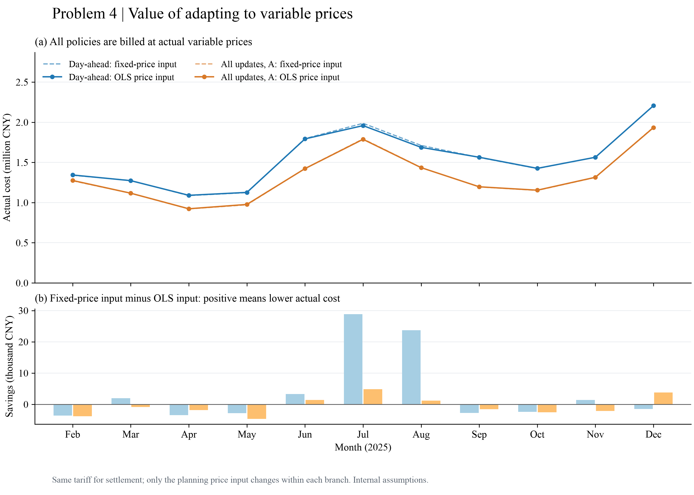
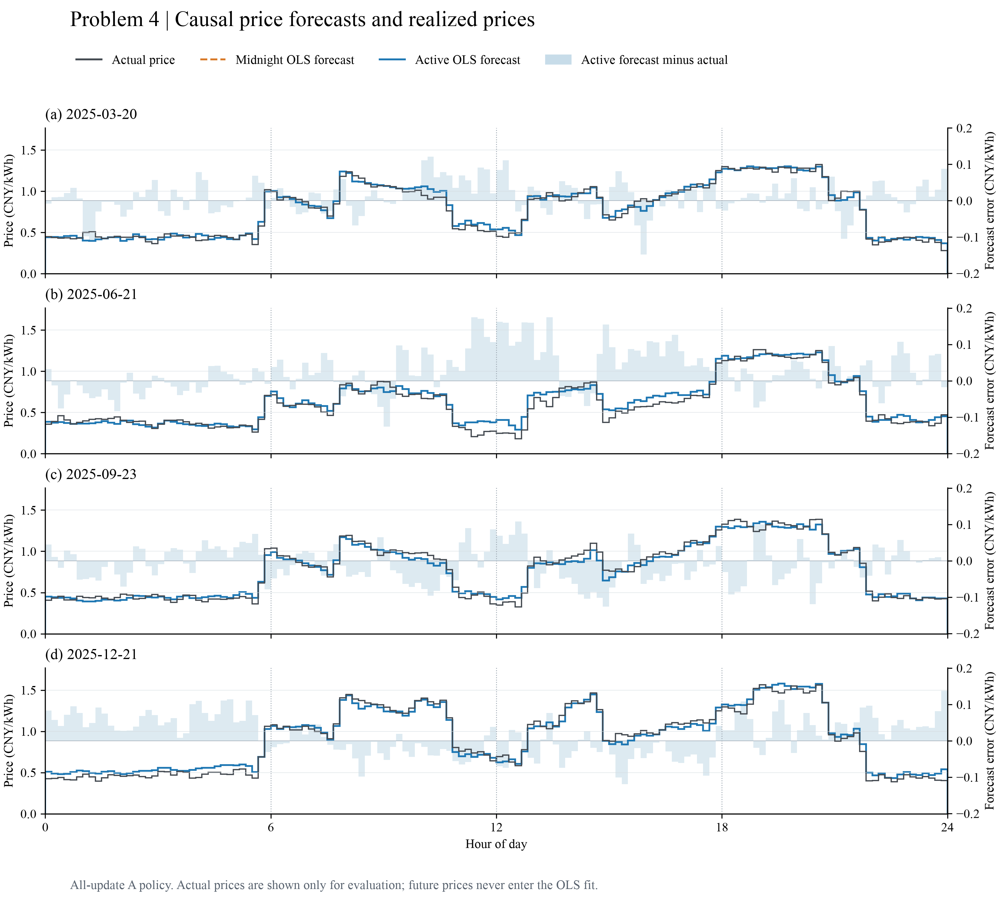

# 问题4：波动价格下的日前计划与日内调整

可追溯内部结果和论文初稿；尚未精修，不是正式提交版。

## 1. 信息结构与跨问题继承

问题4要求在实际波动电价下重算问题2、问题3。附件4只有每个目标区间的实际价格，未说明提前公开，也没有每次交易时刻的远期报价。因此本稿主分支采用未来价格未知、区间结束后才观测实际价的解释；另设提前知道全部目标价格的假想对照，不能与可实施策略混称。常规购电和调整量均按目标区间实际价结算，没有提前锁价；这一市场解释仍待人工确认。

评价期2025年2月1日至12月31日，共334天、48,096个十分钟区间。Q4-2继承Q2选中模型的每日0点负荷和历史PV预测；Q4-3使用同一负荷预测及附件3在0/6/12/18点精确发布的PV版本。负荷模型不因已看过全年结果重新选择，Q2负结果保留。Q4-3仅0点对照使日内更新的比较双方具有相同PV来源；不能把Q4-2到Q4-3的全部差额视为更新收益。

所有策略从Q2共同1月预热所得的2月1日7,268.423164 kWh状态出发，再各自连续递推。本轮没有按波动价格重新做各策略的1月初始化，这是继承比较的初态假设。每次计划仍以当天0点实际储能为24点目标，日内只改变规划初态，实际电量从不重置；Q2—Q4的每日循环目标是额外基线限制，不能冒充题面明示约束。

原数据标签按区间终点解释，例如00:10对应[00:00,00:10)，未平移、循环移位或填补未来数据。正式模板时间映射未确认，本稿和所有CSV是内部假设版，未生成正式result4-2.xlsx、result4-3.xlsx。

## 2. 因果价格预测

令$u$为十分钟区间起点，以该点的钟点相位$\phi_u$及星期构造已知日历特征。价格回归沿用统一方案的少参数结构：

$$\widetilde p_{u|k}=\beta_0+\sum_{j=1}^{2}\{a_j\sin(2\pi j\phi_u)+b_j\cos(2\pi j\phi_u)\}+\beta_1p_{u-1\mathrm d}+\beta_7p_{u-7\mathrm d}+\sum_{r=1}^{6}\gamma_r\mathbf1\{\mathrm{weekday}(u)=r\}.$$

共13个特征，星期省略一个基准。每个允许决策时刻$k$，只取最近28天内、且区间结束不晚于$k$的训练目标，要求每个训练行已有7天历史滞后；用最小二乘lstsq拟合，不计算矩阵逆，不把有时间相关性的区间当作独立样本做t检验。预测目标只到当天24点，因此其昨日和上周滞后在当前时刻都已知。日内更新可使用当天已结束区间的实际价格，但禁止当前未结束区间或未来价格进入回归。

规划采用$\widehat p_{u|k}=\max\{10^{-6},\widetilde p_{u|k}\}$，单位元/kWh。下限是计算前固定的严格正价数值规则，不是由全年最低价格估计；所有触发逐版记录。上周同期价格作为无参数误差对照，不凭它在评价期表现重新选型。价格保持0点的消融在日内继续使用0点回归预测向量，只更新PV和实际储能。

## 3. 优化与实际结算分离

重用Q3 MILP。$q_t^0$为0点原承诺，$q_t^k$为允许时刻更新后的承诺，$c_t,b_t,w_t$为交流侧充、放、富余处置电量，$E_t$为内部储电量。十分钟能量约束保持

$$q_t^k+\widehat G_{t|k}+b_t=\widehat L_t+c_t+w_t,\quad E_{t+1}=E_t+0.9c_t-b_t/0.9,$$
$$1200\le E_t\le10800,\quad0\le c_t\le(5000/6)z_t,\quad0\le b_t\le(5000/6)(1-z_t),\quad z_t\in\{0,1\}.$$

购电和无收益处置非负，不向外售电。免费处置包括未使用的已付费合同电量。Q4只继承Q1物理配置中的电池、步长、求解参数，处置规则沿用Q3，不受Q1配置叙述字段“仅弃光”约束。已执行区间冻结，更新规划只到本日24点。

Q4-2在0点最小化$\sum_t\widehat p_{t|0}q_t^0$。Q4-3在允许时刻最小化剩余区间的分段合同费：
$$F_A(q;q^0,p)=pq^0+1.5p(q-q^0)_+-0.5p(q^0-q)_+,$$
$$F_B(q;q^0,p)=pq^0+1.5p(q-q^0)_++0.5p(q^0-q)_+.$$
A为取消原款退还后收50%违约费，B为原款保留再收50%。用Q3的凸分段上图形式线性化；B下$q\ge q^0$由自由处置的支配关系保证不损最优性。预计紧急购电仍被无限额、最多1.5倍边际价的常规增购支配，故规划不额外设置紧急通道。

实际执行沿用同一准静态贪心反馈：合同电加实际PV若有富余，按功率和容量上限充电后处置；不足时按功率和SOC上限放电，剩余缺口$e_t$紧急补购。规划阶段不用未来真实缺口，账单阶段才使用实际价格：

$$J_{4-2}=\sum_t p_t^{\rm actual}(q_t^0+5e_t),$$
$$J_{4-3}=\sum_t\{F(\bar q_t;q_t^0,p_t^{\rm actual})+5p_t^{\rm actual}e_t\}.$$

$\bar q_t$为该区间最终执行的有效承诺。相对0点原量每段只结算一次，不相加6/12/18点的整段目标。未用合同量也付费，预测价绝不直接代替账单实际价。完美价格情景只替换规划价格，仍有负荷/PV误差和同一执行器，因此它不是全信息最优调度，不是实际费用下界。

## 4. 实验组织

固定九组策略：Q4-2固定价输入、因果OLS、完美价格；Q4-3 OLS仅0点、OLS全更新A/B、A下价格保持0点、A固定价输入和A完美价格。所有实际账单均用同一套附件4实际价。“固定价输入”表示仍按附件1制定决策，不表示按附件1付费。

这是在已查看Q2/Q3全年结果之后开展的回顾性计算，没有未触及测试集上的选优声明。对照在本次Q4计算前固定，不把表现较好的事后曲线替换主策略。完整保存各时域价格输入、预测、状态、购电承诺、求解界及实际账本。库存修正采用已知附件1平均价乘放电效率，仅作末态比较代理，不把全年未来平均实际价用于控制。

## 5. 实际结果与解释

| 策略 | 实际总费/元 | 合同费/元 | 紧急费/元 | 紧急量/kWh | 较同分支固定输入节省/% | 期末储电/kWh |
| --- | --- | --- | --- | --- | --- | --- |
| 4-2 固定价输入 | 17,073,742.68 | 12,676,256.96 | 4,397,485.72 | 751,925.13 | 0.000 | 2,723.62 |
| 4-2 因果OLS价格 | 17,030,881.70 | 12,683,183.67 | 4,347,698.03 | 748,055.24 | 0.251 | 3,056.77 |
| 4-2 完美价格（假想） | 17,013,664.08 | 12,545,906.05 | 4,467,758.03 | 772,568.70 | 0.352 | 3,178.14 |
| 4-3 仅0点/OLS | 16,642,457.21 | 13,001,655.26 | 3,640,801.94 | 573,155.62 | -14.555 | 5,531.46 |
| 4-3 全更新A/OLS | 14,534,062.64 | 13,795,851.02 | 738,211.62 | 126,591.53 | -0.043 | 7,804.59 |
| 4-3 全更新B/OLS | 14,537,309.28 | 13,819,586.87 | 717,722.41 | 122,828.69 | -0.065 | 7,795.19 |
| 4-3 全更新A/价格保持0点 | 14,533,977.19 | 13,795,835.39 | 738,141.80 | 126,576.67 | -0.042 | 7,804.54 |
| 4-3 全更新A/固定价输入 | 14,527,879.61 | 13,782,011.35 | 745,868.26 | 125,345.25 | 0.000 | 7,173.09 |
| 4-3 全更新A/完美价格（假想） | 14,428,710.54 | 13,660,157.28 | 768,553.26 | 136,556.84 | 0.683 | 6,419.18 |


表中Q4-2统一以q42_fixed为参照，Q4-3统一以全更新A/固定价输入为参照。B行还改变退款规则，仅0点行还改变更新机制，因此这些行的百分比不是单独的价格预测贡献；正文只用规则和机制匹配的对照解释价格收益。

Q4-2因果OLS价格的实际费用为17,030,881.70元，比同核固定价输入对照减少42,860.98元（0.251%）。Q4-3全更新A为14,534,062.64元，比其固定价输入对照增加6,183.03元（节省率-0.043%）。这才是在相同实际收费条件下价格适配的效果；不能将Q4与原固定价Q2/Q3账单的全部差额解释成策略变化。

Q4-3全更新A相对同为附件3光伏来源的仅0点OLS基线，节省2,108,394.56元，比例12.669%。其中同时包含PV版本更新、实际SOC反馈和价格再拟合，不等于纯价格或纯PV信息收益。Q3已证明SOC反馈是重要来源，本题没有将这些作用全部归给价格模型。

每次重估价格的A策略相对保持0点价格预测的A策略，实际费用差为85.45元（正值为更贵）。这项小差额不支持“价格越频繁更新越省钱”；两组都使用最新PV及实际SOC，并按同一收费机制结算。保留此负结果，不在报告阶段调参使其转正。

B口径费用为14,537,309.28元；B减购不能获得原款退款，模型不会主动把承诺降到0点原量以下。A/B的总账单差还受各自连续状态和紧急电量影响，不能把不同轨迹的总费比较误当作同一交易量下收费函数的大小比较。

完美价格Q4-2费用17,013,664.08元，比OLS全年差-17,217.62元，但有111天的实际费用反而更高。即使规划价格准确，净负荷预测误差和贪心补救仍可能造成不利轨迹；本稿不把完美价格对照称为真实费用下界。

本轮固定价输入对照统一使用Q3求解核。旧Q2已冻结动作按实际价重计为17,073,577.45元，与本轮q42_fixed相差165.23元。物理模型在严格正价下的最优费用可一致而轨迹未必唯一，求解表示及后续状态反馈可能使重算轨迹不同；因此不把旧动作重计价与本轮同核对照混用。旧账本本身未修改。

## 6. 价格误差与数值验证

| 发布时刻 | 模型 | 同一剩余时域段数 | MAE/元每kWh | RMSE/元每kWh |
| --- | --- | --- | --- | --- |
| 00:00 | OLS | 48096 | 0.042701 | 0.056520 |
| 00:00 | lag7 | 48096 | 0.047151 | 0.065348 |
| 06:00 | OLS | 36072 | 0.044856 | 0.059599 |
| 06:00 | lag7 | 36072 | 0.050480 | 0.070431 |
| 12:00 | OLS | 24048 | 0.043116 | 0.057704 |
| 12:00 | lag7 | 24048 | 0.048713 | 0.069492 |
| 18:00 | OLS | 12024 | 0.037605 | 0.051361 |
| 18:00 | lag7 | 12024 | 0.043170 | 0.065117 |


同一行时域中的OLS/上周对照可以比较；不同发布时刻的剩余时域和重复目标不同，不能把所有行当独立样本。共1,336次价格拟合，正价数值下限实际触发0次；不存在由截断制造的本轮收益。所有回归矩阵和系数由不导入预测模块的验证器独立重建，每次训练截止、未来目标的可用滞后、版本数和价格序列均核对。

独立审计211,834项通过，包括全部价格模型及九组账本：实际与计划守恒、SOC递推、充放互斥、每日初态/固定日终目标、实际价计费、最新版本、0点原承诺、表1/2/3和相邻紧急事件展开。最大能量平衡残差2.965e-10 kWh，检查阈值1e-6；费用汇总阈值1e-5元。全部输入和核心代码SHA-256前后保持一致。

36个指定日时域以独立稀疏矩阵LP核验，MILP减LP下界最大2.910e-11元，LP约束误差最大1.819e-12。底层同属HiGHS，不是不同厂商算法验证，结论只限这些预测时域。新5项单测覆盖拒绝未来数据、常价预测、当前已完成价格影响、时域长度及实际价结算；全套Q1—Q4单测共25项。

| 策略 | 求解次数 | 累计求解器秒 | 单次最大秒 | 最大gap |
| --- | --- | --- | --- | --- |
| 4-2 固定价输入 | 334 | 7.456 | 0.0642 | 2.757e-16 |
| 4-2 因果OLS价格 | 334 | 7.454 | 0.0576 | 2.485e-16 |
| 4-2 完美价格（假想） | 334 | 7.544 | 0.0637 | 3.493e-16 |
| 4-3 仅0点/OLS | 334 | 7.707 | 0.0595 | 2.325e-16 |
| 4-3 全更新A/OLS | 1336 | 25.785 | 0.0558 | 5.525e-15 |
| 4-3 全更新B/OLS | 1336 | 20.330 | 0.0550 | 7.023e-16 |
| 4-3 全更新A/价格保持0点 | 1336 | 26.097 | 0.0602 | 8.210e-16 |
| 4-3 全更新A/固定价输入 | 1336 | 26.906 | 0.0670 | 6.621e-16 |
| 4-3 全更新A/完美价格（假想） | 1336 | 26.585 | 0.0694 | 7.920e-16 |


全年共8,016次MILP、432,864个实际执行段。Python3.12.14、highspy1.14.0、单线程、seed0、每次限时120秒、相对gap1e-9；所有状态Optimal。上述耗时是求解器内部时间，未包含回归、CSV读写和仿真，不代表端到端墙钟时间。扩展环境沿用requirements-q3.txt，实际版本日志另留在logs/q4。

## 7. 范围与剩余问题

已完成价格信息情景、固定价决策对照、A/B规则及保持0点价格消融；没有Q4终态、效率、寿命费、预测误差扰动或通信延迟敏感性，不声称全面鲁棒。物理执行器是电量级准静态贪心补救，MILP最优不等于全年真实费用最优。库存残值代理与原账单分别保存，不能把代理费当电网账单。

未来价格是否可知、目标实际价或提前锁价、改购是否逐次收费、A/B退款、90%效率和功率侧别、额外日循环约束及正式时间模板仍需确认。下一步可先解决这些解释，再整合Q1—Q4论文、文献和AI使用清单；当前不做文章精修或虚构正式提交文件。

## 8. 英文图形

图4-1在相同实际收费口径下比较固定价输入和OLS输入，主图曲线接近时用差值柱显示小额收益。图4-2展示四个指定日实际价、0点价预测和按允许时刻更新的预测；实际价仅用于事后评价。





两图按ModelViz模板候选、字段适配、执行和实际视觉复核生成，全部英文，300 dpi PNG和SVG，来源与质检在各图workspace。

## 9. 指定日期完整结果

### 4-2 因果OLS价格：四日指定输出

全天量费（购电量分列常规有效量及紧急量，避免遗漏紧急购电）：

| 日期 | 原计划量/kWh | 常规有效量/kWh | 紧急量/kWh | 原计划费/元 | 最终合同费/元 | 紧急费/元 | 实际总费/元 |
| --- | --- | --- | --- | --- | --- | --- | --- |
| 2025-03-20 | 65,739.04 | 65,739.04 | 840.93 | 40,808.48 | 40,808.48 | 5,211.57 | 46,020.05 |
| 2025-06-21 | 33,792.99 | 33,792.99 | 540.64 | 16,776.20 | 16,776.20 | 1,588.70 | 18,364.90 |
| 2025-09-23 | 61,892.40 | 61,892.40 | 4,297.85 | 39,716.92 | 39,716.92 | 26,946.87 | 66,663.79 |
| 2025-12-21 | 94,126.22 | 94,126.22 | 1,047.86 | 69,937.06 | 69,937.06 | 8,035.01 | 77,972.07 |

表1指定区间：

| 日期 | 区间 | 原计划/kWh | 最终有效/kWh |
| --- | --- | --- | --- |
| 2025-03-20 | 10:00–10:10 | 0.00 | 0.00 |
| 2025-03-20 | 12:00–12:10 | 513.29 | 513.29 |
| 2025-03-20 | 14:00–14:10 | 0.00 | 0.00 |
| 2025-03-20 | 16:00–16:10 | 520.48 | 520.48 |
| 2025-03-20 | 18:00–18:10 | 59.92 | 59.92 |
| 2025-03-20 | 20:00–20:10 | 743.63 | 743.63 |
| 2025-06-21 | 10:00–10:10 | 0.00 | 0.00 |
| 2025-06-21 | 12:00–12:10 | 0.00 | 0.00 |
| 2025-06-21 | 14:00–14:10 | 0.00 | 0.00 |
| 2025-06-21 | 16:00–16:10 | 170.03 | 170.03 |
| 2025-06-21 | 18:00–18:10 | 0.00 | 0.00 |
| 2025-06-21 | 20:00–20:10 | 0.00 | 0.00 |
| 2025-09-23 | 10:00–10:10 | 0.00 | 0.00 |
| 2025-09-23 | 12:00–12:10 | 370.05 | 370.05 |
| 2025-09-23 | 14:00–14:10 | 0.00 | 0.00 |
| 2025-09-23 | 16:00–16:10 | 507.84 | 507.84 |
| 2025-09-23 | 18:00–18:10 | 0.00 | 0.00 |
| 2025-09-23 | 20:00–20:10 | 0.00 | 0.00 |
| 2025-12-21 | 10:00–10:10 | 0.00 | 0.00 |
| 2025-12-21 | 12:00–12:10 | 882.15 | 882.15 |
| 2025-12-21 | 14:00–14:10 | 0.00 | 0.00 |
| 2025-12-21 | 16:00–16:10 | 778.70 | 778.70 |
| 2025-12-21 | 18:00–18:10 | 730.75 | 730.75 |
| 2025-12-21 | 20:00–20:10 | 0.00 | 0.00 |

表2实际充放电（交流侧电量）：

| 日期 | 区间 | 充电/kWh | 放电/kWh |
| --- | --- | --- | --- |
| 2025-03-20 | 00:00–04:00 | 7,248.75 | 218.77 |
| 2025-03-20 | 04:00–08:00 | 3,477.58 | 5,827.47 |
| 2025-03-20 | 08:00–12:00 | 5,829.45 | 2,662.76 |
| 2025-03-20 | 12:00–16:00 | 5,151.69 | 301.93 |
| 2025-03-20 | 16:00–20:00 | 0.00 | 7,810.39 |
| 2025-03-20 | 20:00–24:00 | 211.57 | 939.53 |
| 2025-06-21 | 00:00–04:00 | 244.82 | 2,067.20 |
| 2025-06-21 | 04:00–08:00 | 1,166.63 | 1,487.47 |
| 2025-06-21 | 08:00–12:00 | 10,322.21 | 0.00 |
| 2025-06-21 | 12:00–16:00 | 0.00 | 0.00 |
| 2025-06-21 | 16:00–20:00 | 59.31 | 5,996.68 |
| 2025-06-21 | 20:00–24:00 | 3,785.15 | 2,549.57 |
| 2025-09-23 | 00:00–04:00 | 8,200.27 | 91.64 |
| 2025-09-23 | 04:00–08:00 | 18.28 | 7,264.69 |
| 2025-09-23 | 08:00–12:00 | 3,761.90 | 1,379.86 |
| 2025-09-23 | 12:00–16:00 | 5,552.43 | 589.05 |
| 2025-09-23 | 16:00–20:00 | 18.73 | 6,967.33 |
| 2025-09-23 | 20:00–24:00 | 2,641.96 | 106.39 |
| 2025-12-21 | 00:00–04:00 | 9,615.88 | 134.94 |
| 2025-12-21 | 04:00–08:00 | 744.97 | 1,141.24 |
| 2025-12-21 | 08:00–12:00 | 5,150.14 | 7,488.48 |
| 2025-12-21 | 12:00–16:00 | 8,245.72 | 2,645.20 |
| 2025-12-21 | 16:00–20:00 | 34.70 | 6,416.06 |
| 2025-12-21 | 20:00–24:00 | 1,635.98 | 2,449.03 |

| 日期 | 0点实际储电/kWh | 24点实际储电/kWh |
| --- | --- | --- |
| 2025-03-20 | 1,222.95 | 1,215.83 |
| 2025-06-21 | 4,189.34 | 4,764.19 |
| 2025-09-23 | 3,506.42 | 3,459.56 |
| 2025-12-21 | 1,663.27 | 2,020.18 |

表3相邻紧急区间合并输出（聚合前后的逐段覆盖已核验）：

| 日期 | 紧急区间 | 紧急量/kWh |
| --- | --- | --- |
| 2025-03-20 | 09:30–10:00 | 114.62 |
| 2025-03-20 | 20:30–20:40 | 672.04 |
| 2025-03-20 | 21:20–21:50 | 32.67 |
| 2025-03-20 | 23:40–23:50 | 21.60 |
| 2025-06-21 | 06:10–07:20 | 540.64 |
| 2025-09-23 | 08:40–09:50 | 516.76 |
| 2025-09-23 | 18:20–18:30 | 1.08 |
| 2025-09-23 | 19:20–19:40 | 914.80 |
| 2025-09-23 | 19:50–22:00 | 2,816.81 |
| 2025-09-23 | 22:20–22:40 | 48.41 |
| 2025-12-21 | 07:50–08:10 | 67.39 |
| 2025-12-21 | 20:20–20:40 | 980.47 |

### 4-3 全更新A/OLS：四日指定输出

全天量费（购电量分列常规有效量及紧急量，避免遗漏紧急购电）：

| 日期 | 原计划量/kWh | 常规有效量/kWh | 紧急量/kWh | 原计划费/元 | 最终合同费/元 | 紧急费/元 | 实际总费/元 |
| --- | --- | --- | --- | --- | --- | --- | --- |
| 2025-03-20 | 67,509.87 | 66,082.09 | 327.42 | 42,100.96 | 44,217.74 | 1,687.53 | 45,905.27 |
| 2025-06-21 | 35,504.27 | 35,350.38 | 0.00 | 17,478.08 | 17,453.23 | 0.00 | 17,453.23 |
| 2025-09-23 | 66,912.22 | 65,895.36 | 684.51 | 43,231.52 | 45,324.27 | 4,129.05 | 49,453.32 |
| 2025-12-21 | 94,764.93 | 95,380.44 | 55.11 | 70,338.28 | 72,556.21 | 388.71 | 72,944.92 |

表1指定区间：

| 日期 | 区间 | 原计划/kWh | 最终有效/kWh |
| --- | --- | --- | --- |
| 2025-03-20 | 10:00–10:10 | 0.00 | 0.00 |
| 2025-03-20 | 12:00–12:10 | 536.81 | 430.09 |
| 2025-03-20 | 14:00–14:10 | 0.00 | 0.00 |
| 2025-03-20 | 16:00–16:10 | 620.23 | 620.23 |
| 2025-03-20 | 18:00–18:10 | 152.41 | 701.88 |
| 2025-03-20 | 20:00–20:10 | 743.63 | 743.63 |
| 2025-06-21 | 10:00–10:10 | 0.00 | 0.00 |
| 2025-06-21 | 12:00–12:10 | 0.00 | 0.00 |
| 2025-06-21 | 14:00–14:10 | 0.00 | 0.00 |
| 2025-06-21 | 16:00–16:10 | 152.52 | 113.18 |
| 2025-06-21 | 18:00–18:10 | 0.00 | 0.00 |
| 2025-06-21 | 20:00–20:10 | 0.00 | 0.00 |
| 2025-09-23 | 10:00–10:10 | 0.00 | 0.00 |
| 2025-09-23 | 12:00–12:10 | 362.80 | 347.92 |
| 2025-09-23 | 14:00–14:10 | 0.00 | 0.00 |
| 2025-09-23 | 16:00–16:10 | 532.44 | 472.03 |
| 2025-09-23 | 18:00–18:10 | 0.00 | 755.35 |
| 2025-09-23 | 20:00–20:10 | 0.00 | 0.00 |
| 2025-12-21 | 10:00–10:10 | 0.00 | 0.00 |
| 2025-12-21 | 12:00–12:10 | 953.93 | 835.28 |
| 2025-12-21 | 14:00–14:10 | 0.00 | 0.00 |
| 2025-12-21 | 16:00–16:10 | 777.10 | 792.54 |
| 2025-12-21 | 18:00–18:10 | 730.75 | 730.75 |
| 2025-12-21 | 20:00–20:10 | 0.00 | 0.00 |

表2实际充放电（交流侧电量）：

| 日期 | 区间 | 充电/kWh | 放电/kWh |
| --- | --- | --- | --- |
| 2025-03-20 | 00:00–04:00 | 3,035.07 | 299.48 |
| 2025-03-20 | 04:00–08:00 | 153.94 | 6,079.51 |
| 2025-03-20 | 08:00–12:00 | 3,043.55 | 2,449.96 |
| 2025-03-20 | 12:00–16:00 | 6,398.18 | 254.72 |
| 2025-03-20 | 16:00–20:00 | 218.00 | 6,737.67 |
| 2025-03-20 | 20:00–24:00 | 7,825.16 | 839.15 |
| 2025-06-21 | 00:00–04:00 | 197.21 | 6,101.24 |
| 2025-06-21 | 04:00–08:00 | 1,240.72 | 1,831.61 |
| 2025-06-21 | 08:00–12:00 | 10,218.38 | 0.00 |
| 2025-06-21 | 12:00–16:00 | 0.00 | 0.00 |
| 2025-06-21 | 16:00–20:00 | 100.52 | 5,769.70 |
| 2025-06-21 | 20:00–24:00 | 9,259.72 | 2,543.74 |
| 2025-09-23 | 00:00–04:00 | 5,117.00 | 154.52 |
| 2025-09-23 | 04:00–08:00 | 131.96 | 6,680.65 |
| 2025-09-23 | 08:00–12:00 | 5,156.26 | 1,896.62 |
| 2025-09-23 | 12:00–16:00 | 5,133.48 | 537.10 |
| 2025-09-23 | 16:00–20:00 | 27.13 | 5,841.07 |
| 2025-09-23 | 20:00–24:00 | 5,822.06 | 2,184.37 |
| 2025-12-21 | 00:00–04:00 | 4,837.87 | 135.71 |
| 2025-12-21 | 04:00–08:00 | 198.17 | 907.88 |
| 2025-12-21 | 08:00–12:00 | 5,276.00 | 7,631.47 |
| 2025-12-21 | 12:00–16:00 | 8,228.31 | 2,528.71 |
| 2025-12-21 | 16:00–20:00 | 35.28 | 5,749.76 |
| 2025-12-21 | 20:00–24:00 | 6,195.57 | 2,842.53 |

| 日期 | 0点实际储电/kWh | 24点实际储电/kWh |
| --- | --- | --- |
| 2025-03-20 | 8,139.83 | 8,234.68 |
| 2025-06-21 | 9,123.60 | 9,987.06 |
| 2025-09-23 | 6,345.36 | 6,378.54 |
| 2025-12-21 | 6,501.18 | 6,799.64 |

表3相邻紧急区间合并输出（聚合前后的逐段覆盖已核验）：

| 日期 | 紧急区间 | 紧急量/kWh |
| --- | --- | --- |
| 2025-03-20 | 09:10–10:00 | 327.42 |
| 2025-06-21 | 无紧急购电 | 0.00 |
| 2025-09-23 | 18:20–18:30 | 1.08 |
| 2025-09-23 | 20:10–20:20 | 10.23 |
| 2025-09-23 | 20:30–22:00 | 673.19 |
| 2025-12-21 | 07:50–08:10 | 55.11 |

### 4-3 全更新B/OLS：四日指定输出

全天量费（购电量分列常规有效量及紧急量，避免遗漏紧急购电）：

| 日期 | 原计划量/kWh | 常规有效量/kWh | 紧急量/kWh | 原计划费/元 | 最终合同费/元 | 紧急费/元 | 实际总费/元 |
| --- | --- | --- | --- | --- | --- | --- | --- |
| 2025-03-20 | 67,509.87 | 68,032.99 | 327.42 | 42,101.12 | 42,742.75 | 1,687.53 | 44,430.29 |
| 2025-06-21 | 35,576.04 | 35,591.77 | 0.00 | 17,528.51 | 17,555.03 | 0.00 | 17,555.03 |
| 2025-09-23 | 66,912.22 | 67,334.25 | 684.51 | 43,231.52 | 44,072.43 | 4,129.05 | 48,201.48 |
| 2025-12-21 | 94,764.93 | 95,756.07 | 53.68 | 70,337.30 | 71,938.56 | 378.39 | 72,316.95 |

表1指定区间：

| 日期 | 区间 | 原计划/kWh | 最终有效/kWh |
| --- | --- | --- | --- |
| 2025-03-20 | 10:00–10:10 | 0.00 | 0.00 |
| 2025-03-20 | 12:00–12:10 | 536.81 | 536.81 |
| 2025-03-20 | 14:00–14:10 | 0.00 | 0.00 |
| 2025-03-20 | 16:00–16:10 | 620.23 | 620.23 |
| 2025-03-20 | 18:00–18:10 | 152.41 | 179.43 |
| 2025-03-20 | 20:00–20:10 | 743.63 | 743.63 |
| 2025-06-21 | 10:00–10:10 | 0.00 | 0.00 |
| 2025-06-21 | 12:00–12:10 | 0.00 | 0.00 |
| 2025-06-21 | 14:00–14:10 | 0.00 | 0.00 |
| 2025-06-21 | 16:00–16:10 | 152.52 | 152.52 |
| 2025-06-21 | 18:00–18:10 | 0.00 | 0.00 |
| 2025-06-21 | 20:00–20:10 | 0.00 | 0.00 |
| 2025-09-23 | 10:00–10:10 | 0.00 | 0.00 |
| 2025-09-23 | 12:00–12:10 | 362.80 | 362.80 |
| 2025-09-23 | 14:00–14:10 | 0.00 | 0.00 |
| 2025-09-23 | 16:00–16:10 | 532.44 | 532.44 |
| 2025-09-23 | 18:00–18:10 | 0.00 | 393.25 |
| 2025-09-23 | 20:00–20:10 | 0.00 | 0.00 |
| 2025-12-21 | 10:00–10:10 | 0.00 | 0.00 |
| 2025-12-21 | 12:00–12:10 | 953.93 | 953.93 |
| 2025-12-21 | 14:00–14:10 | 0.00 | 0.00 |
| 2025-12-21 | 16:00–16:10 | 777.10 | 792.54 |
| 2025-12-21 | 18:00–18:10 | 730.75 | 730.75 |
| 2025-12-21 | 20:00–20:10 | 0.00 | 0.00 |

表2实际充放电（交流侧电量）：

| 日期 | 区间 | 充电/kWh | 放电/kWh |
| --- | --- | --- | --- |
| 2025-03-20 | 00:00–04:00 | 3,044.85 | 299.48 |
| 2025-03-20 | 04:00–08:00 | 153.94 | 6,079.51 |
| 2025-03-20 | 08:00–12:00 | 5,238.27 | 2,449.96 |
| 2025-03-20 | 12:00–16:00 | 5,742.87 | 254.72 |
| 2025-03-20 | 16:00–20:00 | 53.55 | 7,148.76 |
| 2025-03-20 | 20:00–24:00 | 7,815.38 | 1,541.04 |
| 2025-06-21 | 00:00–04:00 | 190.27 | 6,400.29 |
| 2025-06-21 | 04:00–08:00 | 1,240.72 | 1,831.61 |
| 2025-06-21 | 08:00–12:00 | 10,216.75 | 0.00 |
| 2025-06-21 | 12:00–16:00 | 0.00 | 0.00 |
| 2025-06-21 | 16:00–20:00 | 100.52 | 5,769.70 |
| 2025-06-21 | 20:00–24:00 | 9,608.63 | 2,543.74 |
| 2025-09-23 | 00:00–04:00 | 5,117.00 | 154.52 |
| 2025-09-23 | 04:00–08:00 | 131.96 | 6,648.39 |
| 2025-09-23 | 08:00–12:00 | 5,604.74 | 1,896.62 |
| 2025-09-23 | 12:00–16:00 | 5,334.37 | 443.58 |
| 2025-09-23 | 16:00–20:00 | 27.13 | 6,492.84 |
| 2025-09-23 | 20:00–24:00 | 5,822.06 | 2,184.37 |
| 2025-12-21 | 00:00–04:00 | 4,820.67 | 135.71 |
| 2025-12-21 | 04:00–08:00 | 198.17 | 907.88 |
| 2025-12-21 | 08:00–12:00 | 5,690.03 | 7,343.45 |
| 2025-12-21 | 12:00–16:00 | 7,755.99 | 2,731.87 |
| 2025-12-21 | 16:00–20:00 | 35.28 | 5,787.40 |
| 2025-12-21 | 20:00–24:00 | 6,212.76 | 2,842.53 |

| 日期 | 0点实际储电/kWh | 24点实际储电/kWh |
| --- | --- | --- |
| 2025-03-20 | 8,131.03 | 8,226.70 |
| 2025-06-21 | 9,463.59 | 10,301.08 |
| 2025-09-23 | 6,345.36 | 6,378.54 |
| 2025-12-21 | 6,516.66 | 6,815.11 |

表3相邻紧急区间合并输出（聚合前后的逐段覆盖已核验）：

| 日期 | 紧急区间 | 紧急量/kWh |
| --- | --- | --- |
| 2025-03-20 | 09:10–10:00 | 327.42 |
| 2025-06-21 | 无紧急购电 | 0.00 |
| 2025-09-23 | 18:20–18:30 | 1.08 |
| 2025-09-23 | 20:10–20:20 | 10.23 |
| 2025-09-23 | 20:30–22:00 | 673.19 |
| 2025-12-21 | 07:50–08:10 | 53.68 |
## 运行与文件索引

在 `/Users/justingao/Documents/CUMCM` 运行；完成标记禁止覆盖现有求解。若完整重算，复制所需输入到新的版本工作区，不把旧results/q4放入新目录。

```bash
PYTHONDONTWRITEBYTECODE=1 C题工作区/.venv/bin/python C题工作区/scripts/run_q4.py
PYTHONDONTWRITEBYTECODE=1 C题工作区/.venv/bin/python C题工作区/scripts/validate_q4.py
PYTHONDONTWRITEBYTECODE=1 C题工作区/.venv/bin/python C题工作区/scripts/audit_q4_lp.py
PYTHONDONTWRITEBYTECODE=1 C题工作区/.venv/bin/python -m unittest discover -s C题工作区/tests -p 'test_q*.py'
PYTHONDONTWRITEBYTECODE=1 C题工作区/.venv/bin/python C题工作区/scripts/report_q4.py
PYTHONDONTWRITEBYTECODE=1 C题工作区/.venv/bin/python C题工作区/scripts/modelviz_q4.py quality
```

每个策略目录有ledger、plan_versions、solvers、daily、summary和指定表；price_forecasts.csv和price_models.json记录逐发布版本价格模型，price_error_summary.csv只作事后评估。完整指定日表包括Q4-2 OLS及Q4-3 A/B OLS，见reports/q4_representative_tables.md。原Q1—Q3及其冻结包保留。
