# 1 Problem Restatement

## 1.1 Research Background

With distributed photovoltaic (PV) generation connected to residential communities, electricity demand, PV output, the state of energy storage, and the price of electricity exchanged with the external grid form a continuously changing supply–demand system. A grid-connected, non-islanded microgrid must reliably meet community demand while using storage to absorb energy during low-price or PV-surplus periods and release it when electricity is more expensive. This improves local PV utilization and helps control the cost of purchased electricity.

This problem concerns intraday power scheduling for a grid-connected microgrid. Its main challenge is the variability of PV output and load, the possible mismatch between forecasts and actual generation, and the limits imposed by storage capacity, charging/discharging power, efficiency, and safe energy bounds. Under fixed and time-varying tariffs, with or without plan revisions and associated settlement charges, a purchasing and storage-operation policy is required to balance supply reliability and economic performance.

## 1.2 Problem Review

The storage unit has a maximum capacity of 12,000 kWh, a maximum charging/discharging power of 5,000 kW, and a charging/discharging efficiency of 90%. Its stored energy must remain between 1,200 and 10,800 kWh, and its energy at 00:00 on January 1, 2025 is 6,000 kWh. The load and PV data are measured in kW, electricity prices in CNY/kWh, and reported purchased and charged/discharged electricity in kWh. In every task, the electricity supplied by the microgrid must not fall below the community load.

**Problem 1: Day-ahead scheduling with identical daily load and tariff.** Given a repeated daily tariff and load profile and the forecast PV power for one day, determine a planned electricity-purchasing policy at 00:00 each day, subject to equal storage energy at 00:00 and 24:00. Using Appendix 1 and Attachment 1, report purchases for the specified 10-minute intervals, total daily purchases and cost, charging and discharging over six four-hour intervals, and beginning and ending storage energy. Save the complete schedule in `result1.xlsx` following the provided template.

**Problem 2: Day-ahead scheduling with varying realized load and PV output.** The daily tariff remains unchanged, whereas the community load and actual PV generation vary over time. Based on the tariff in Attachment 1 and the 2025 time-series data in Attachment 2, prepare a planned purchase schedule at 00:00 every day. If supply is insufficient in actual operation, the deficit must be covered by emergency purchases charged at five times the tariff at that trading time; purchases in all other periods are charged according to the planned amount. Produce complete schedules from February 1 through December 31, 2025, present planned purchases, storage operation, and emergency purchases for March 20, June 21, September 23, and December 21, and complete `result2.xlsx`.

**Problem 3: Schedule revision using multiple PV forecasts.** At 00:00, 06:00, 12:00, and 18:00 each day, a 24-hour hourly PV forecast becomes available. A purchase plan is made from the 00:00 forecast and may be revised using later forecasts. For any reduction from the planned amount, a breach charge equal to 50% of the tariff at the trading time applies; for any amount added above the plan, the excess is priced at 1.5 times that tariff. Total cost includes planned-purchase cost, emergency-purchase cost, and revision-related charges. Using Attachments 1–3, develop the annual schedules, report the required results for the specified dates, complete `result3.xlsx`, and assess whether subsequent forecasts should be used to revise the plan.

**Problem 4: Rescheduling under time-varying tariffs.** Replace the fixed tariff with the 2025 real-time price data in Attachment 4. Using actual load and PV data from Attachment 2 and PV forecasts from Attachment 3, recompute the results for Problems 2 and 3, report the corresponding results, and save the complete schedules as `result4-2.xlsx` and `result4-3.xlsx`, respectively.

## 1.3 Literature Review

Microgrid research commonly treats distributed generation, energy storage, and loads as a locally coordinated energy system. Lasseter introduced the MicroGrid concept as a controllable aggregation of loads and microsources that can interact with the utility system [1]. Guerrero et al. later discussed hierarchical microgrid control, including management of power flow between a microgrid and the external distribution grid [2]. For grid-connected microgrids, day-ahead energy management is often formulated to minimize purchased-electricity cost or total operating cost while enforcing power balance, battery state-of-charge limits, charging/discharging limits, and equipment operating constraints. Tenfen and Finardi formulated microgrid energy management as a mixed-integer linear programming problem, illustrating the suitability of this approach when discrete operating states coexist with linear technical constraints [3]. Sigalo et al. applied a related formulation to battery control in a grid-connected microgrid [4].

Forecast errors in load, PV generation, and electricity prices can make a deterministic day-ahead schedule inconsistent with realized operation. To respond to such uncertainty, the literature employs stochastic programming, robust optimization, and receding-horizon control to update dispatch decisions as new information becomes available. In an experimental study, Parisio, Rikos, and Glielmo combined two-stage stochastic programming with model predictive control to address uncertainty in renewable generation and demand [5]. These approaches can reconcile advance planning with operational adaptation, but they require a defensible description of forecast error, clear information-availability times, and sufficient computation within each decision interval. Existing studies often emphasize device-level control or general multi-resource scheduling; they do not necessarily represent a settlement framework that simultaneously includes planned purchases, schedule revisions, emergency purchases, and asymmetric revision charges. This problem therefore provides a setting to compare fixed and variable price scenarios while accounting consistently for storage constraints, forecast-update timing, and the cost consequences of plan revisions.

## Items Requiring Confirmation

1. The statement specifies a 6,000 kWh initial storage level only at 00:00 on January 1, 2025. The daily initial energy in Problem 1 and whether storage energy should carry over continuously between days in Problems 2–4 should be stated explicitly as modeling assumptions.
2. The statement does not specify whether “90% charging/discharging efficiency” means 90% efficiency in each direction or 90% round-trip efficiency. A consistent interpretation, with an appropriate sensitivity discussion, is needed.
3. Before submission, verify the time alignment between the 10-minute power records and hourly PV forecasts, forecast coverage, and the time-row mapping in the Attachment 5 templates.

# 2 Problem Analysis

The four tasks form a sequential energy-management problem that combines time-series forecasting, constrained scheduling, online plan revision, and ex-post cost accounting. Their common physical core is the power balance between community load, PV generation, grid purchases, and battery charging or discharging, subject to storage capacity, power, efficiency, and state-of-charge limits. Problem 1 is a deterministic day-ahead scheduling problem because its tariff, load, and PV forecast are supplied as fixed inputs. Problem 2 introduces forecast-to-realization deviation and an asymmetric penalty for unmet demand, so it requires both a day-ahead planning layer and a causal execution layer. Problem 3 retains the same physical system but expands the information set at 06:00, 12:00, and 18:00; it is therefore a multi-stage scheduling problem with revision costs. Problem 4 preserves the two mechanisms of Problems 2 and 3 while replacing the fixed tariff with a time-varying price process. A single scheduling architecture can consequently be used throughout, while the available information, settlement rule, and tariff input are changed in a controlled manner.

The linkage between the tasks is essential. The storage-state convention, unit conversion, power-balance logic, and feasibility audit established for Problem 1 become the common foundation for the remaining tasks. The v5 direct-purchase mechanism then supplies a common empirical-scenario objective and strict realized-operation executor for Problems 2–4, while the information set and settlement inputs remain branch-specific. Problem 3 receives released PV information and may revise only unexecuted intervals; Q4-2 retains its fixed planning-price and historical-PV boundary, whereas Q4-3 combines released raw-PV updates with a causal price forecast. Each policy carries its own SOC trajectory from the common February initialization, so one policy's state is never reused by another. This design keeps within-family comparisons attributable to the declared information or planning-price change rather than to inconsistent storage initialization or execution rules.

The input data have heterogeneous time resolutions and must be organized before any optimization. Attachment 1 provides one daily profile with 144 ten-minute observations of tariff, load, and PV forecast. Attachments 2 and 4 provide 365 daily profiles, yielding 52,560 ten-minute observations each after time indexing. Attachment 3 contains four forecast releases per day and 24 hourly targets per release, for 35,040 forecast-version/target records over 2025. Load and PV are power measurements in kW, whereas purchases, battery flows, and the final outputs are energy quantities in kWh; the tariff is measured in CNY/kWh. The ten-minute power records can be converted to interval energy under an explicitly stated interval-average-power convention. The hourly PV forecasts require a separate, documented conversion to the ten-minute optimization grid. Because the statement supplies hourly forecasts without specifying whether they are point values or interval averages, the point-value interpretation, interpolation, and endpoint treatment are processing assumptions rather than facts of the problem and must be fixed before model comparison.

The current data audit should be used as a quality-control baseline, not as a source of unverified operational conclusions. It reports no missing, non-numeric, or non-finite values in the numerical input regions and no negative load, PV, or price values. Valid zero observations, including zero PV output, are retained rather than replaced. Attachment 3 contains blank date labels in repeated rows; these are structural labels that can be filled downward while preserving the original row order and a transformation log, rather than being treated as missing PV forecasts. Large adjacent changes should be flagged for source-cell review but not automatically deleted or smoothed, since a jump alone does not prove a measurement error. The review should also confirm uniqueness of the date–time key, the one-to-one correspondence among the load, PV, and price time grids, and the source-to-template mapping. Lagged and seasonal dependence may be examined on chronologically available history to guide forecasting, but it should not be presented as causal evidence or be allowed to leak future observations into an earlier decision.

For Problem 1, the supplied load, PV forecast, and fixed tariff permit a deterministic economic-dispatch formulation. The decision layer determines regular grid purchases and battery charging or discharging jointly across the day, rather than optimizing each interval independently, because a battery action changes the feasible energy available later. A linear programming baseline is appropriate for checking the energy-accounting structure. If simultaneous charging and discharging must be explicitly excluded, a mixed-integer linear formulation is the more direct option; the choice should be justified by the final constraint representation rather than by algorithmic complexity. The solution will be checked by independently recomputing interval energy balance, storage transitions, power limits, storage bounds, the required equality of beginning and ending energy, and the reported purchase cost from the exported schedule.

Problem 2 extends this baseline from a known day to a rolling sequence of uncertain days. The day-ahead plan should use only information available at 00:00, with interpretable time-series baselines for load and PV constructed from past observations, calendar position, and periodic structure where supported by chronological validation. More flexible alternatives, such as generalized additive or risk-quantile models, should be retained only if they improve an out-of-sample decision criterion under the same information boundary. After the plan is set, realized load and PV must be passed through one explicit execution rule that updates the battery state interval by interval and uses emergency purchases solely to cover an actual shortfall. This separation prevents future realizations from being used to create the original plan and ensures that the fivefold emergency price is evaluated as a real consequence of forecast and operating errors. A possible extension is to reserve a data-supported energy margin for consecutive net-load errors, but it should remain a tested alternative rather than an assumed guarantee.

For Problem 3, Attachment 3 should first be used in its original release structure, with any forecast-bias correction treated as an optional, separately validated component. At each permitted update time, the current state of charge, already executed decisions, current purchase commitment, and the newest admissible forecast define the new decision state. A receding-horizon or model-predictive-control framework is suitable because it freezes executed intervals and re-optimizes only future intervals. The model must be able to retain the existing commitment when revision is not economically justified; otherwise, it cannot distinguish the value of better information from the cost of changing a purchase plan. The exact accounting treatment for reductions in planned purchases is not fully specified by the statement—especially whether cancelled energy is refunded and whether repeated changes are charged transaction by transaction. The chosen interpretation must therefore be stated, applied once per commitment, and, if no official clarification is available, tested as clearly labeled alternative settlement scenarios rather than silently assumed.

Problem 4 is a price-information extension rather than an entirely new physical system. The Problem 2 branch is rerun with time-varying prices in the day-ahead objective and actual settlement, while the Problem 3 branch combines the same prices with forecast updates and paid revisions. The statement supplies realized prices but does not explicitly say whether future intraday prices are known when a decision is made. If they are unavailable, a price forecast using only prior information is required; if perfect future-price knowledge is adopted, it must be declared as a separate information scenario. The two branches should share the same data conventions, execution logic, and validation protocol while preserving distinct storage paths. Throughout Problems 2–4, time-ordered backtesting, not random row splitting, is needed to evaluate forecasting components. Final verification should include an independent re-read of each result workbook, consistency of all costs with the selected settlement rule, feasibility of every ten-minute interval, cross-day state continuity, and completeness of the required output sheets.

## Overall Solution Framework Design

Figure 1 condenses the revised v5 information boundary, the shared direct-purchase/execution core, and the branch-specific inputs used by all four tasks. The figure distinguishes the selected Q4-2 fixed-price planning branch from the Q4-3 rolling raw-PV/causal-price branch; it does not treat their absolute costs as a common price-effect estimate.

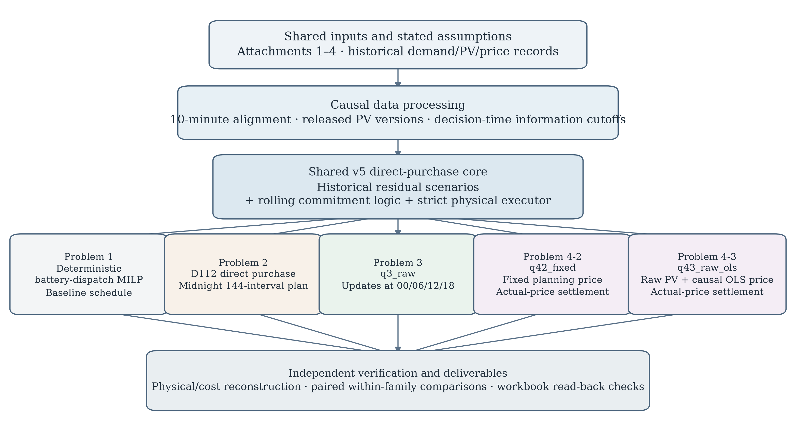

**Figure 1. Integrated v5 scheduling and verification framework**

The traceable data flow is: source attachments and operating assumptions → causal data alignment and release-time filtering → common physical executor and historical scenario engine → problem-specific planning or update branch → independent ledger reconstruction and workbook read-back. This framing preserves common physical constraints while making the Q3/Q4 policy and information distinctions explicit.

## Items Requiring Confirmation

1. Whether a ten-minute timestamp denotes the beginning or end of its interval, and how the time rows in Attachment 5 map to the source data.
2. Whether the stated 90% efficiency applies separately to charging and discharging or to the round trip, and whether the 5,000 kW limit is measured on the grid/bus side or battery side.
3. Whether storage state is required to carry continuously from one day to the next in Problems 2–4, and what terminal condition is intended for those problems.
4. Whether future variable prices in Problem 4 are known at the decision time; otherwise, the permitted price-forecast information set must be defined.
5. Whether a reduction from the original purchase plan receives a refund, and whether a later revision is settled only against the original plan or against every preceding revision.
6. Whether hourly PV forecast values represent instantaneous point values or hourly averages, including the endpoint rule needed to convert them to ten-minute energy.

# 3 Model Assumptions

To emphasize the central characteristics of microgrid scheduling and reduce the influence of factors that are not specified in the statement, the following assumptions are made on the basis of three sources: conditions explicitly supplied by the problem, operating conditions reasonably inferred from those conditions, and additional conditions required to make the scheduling model executable and auditable. They do not assert that the data, forecasting models, or resulting schedules are intrinsically correct.

1. **Assumption 1: The retained, time-aligned load, PV, forecast, and tariff observations represent the corresponding operating intervals and are suitable as model inputs.**  
   **Explanation:** This is a data-use condition rather than a claim that every measurement is error-free. After structural label handling, key checks, and source tracing, the retained data are used without automatically deleting valid zero values or abrupt changes. This preserves the observed supply–demand variation for forecasting and replay while allowing flagged source values to remain subject to later review.

2. **Assumption 2: Each ten-minute timestamp is treated as the interval end, each power record is treated as the interval-average power, and the hourly PV forecasts are assumed to be point values converted to the ten-minute grid by a fixed interpolation convention.**
   **Explanation:** The optimization requires a common energy unit, whereas the supplied actual series are ten-minute kW records and the PV forecasts are hourly values. This assumption permits consistent conversion to kWh and preserves the forecast issue-time structure; it does not use future realized PV values to fill forecast endpoints. The timestamp orientation and the interpolation rule must be kept identical in planning, execution, and validation.

3. **Assumption 3: The battery is represented by a single aggregated energy state with the stated capacity, operating range, and charging/discharging power limits; self-discharge, degradation, ramping, and sub-interval converter dynamics are neglected.**  
   **Explanation:** The statement provides storage capacity, a safe SOC interval, a power limit, and efficiency, but no parameters for ageing or high-frequency dynamics. The simplification retains the intertemporal role of storage that is central to all four questions, while avoiding unsupported device-level parameters. Charging and discharging are mutually exclusive within a modeled interval.

4. **Assumption 4: The base case interprets the stated 90% efficiency in each direction and applies the 5,000 kW charge/discharge limit to energy crossing the AC bus; the symmetric 90% round-trip interpretation is retained as a sensitivity case.**
   **Explanation:** The wording of the statement does not identify whether 90% applies in each direction or to the full cycle. A single primary convention is needed to update SOC, but the alternative is evaluated separately because the choice changes feasible energy transfer and purchase cost. Neither convention is treated as an official interpretation before clarification.

5. **Assumption 5: Surplus electricity has no sale revenue; PV surplus may be curtailed, while any disposal of committed grid energy is permitted only in the Q2–Q4 execution and settlement branches that explicitly require it.**  
   **Explanation:** The problem specifies purchases and storage operation but supplies neither an export tariff nor a rule for selling back to the external grid. This condition prevents unsupported revenue through arbitrage. In particular, the Problem 1 model restricts surplus disposal to available PV, whereas the later no-refund or fixed-commitment branches may need a documented disposal channel for energy that has already been contracted. Emergency purchases are used only to cover an actual supply shortfall and never to charge the battery for arbitrage.

6. **Assumption 6: At every decision time, the schedule uses only completed actual observations, forecasts already released by that time, the current actual SOC, and causally available price information; actual SOC is propagated continuously across days.**
   **Explanation:** This is required to distinguish a day-ahead or rolling decision from a retrospective schedule that uses future realizations. It connects the original commitment in Problem 2 to the forecast updates in Problem 3 and prevents state resets from artificially improving a later policy. No normality, independence, or stationarity assumption is imposed on forecast errors; forecasting components are assessed chronologically instead of by random row splitting.

7. **Assumption 7: For Problems 2–4, the planning model uses the current daily initial SOC as a terminal reference, while realized operation carries the actual terminal SOC into the next day; Problem 3 is settled once against the original 00:00 commitment under the declared settlement scenario.**  
   **Explanation:** The daily equality condition is explicit only in Problem 1, so its extension to later planning problems is a baseline modeling choice rather than a stated fact. Similarly, the wording of the reduction charge does not settle refund treatment or whether every intermediate revision is separately charged. The primary analysis uses the one-time refund-and-breach-charge scenario and keeps the no-refund alternative as a sensitivity branch, preventing either settlement interpretation from being silently imposed.

## Items Requiring Confirmation

- Confirm whether the source time labels denote interval starts or ends and reconcile them with the time rows in Attachment 5.
- Confirm whether the 90% efficiency is one-way or round-trip and whether the 5,000 kW limit is measured on the bus side or battery side.
- Confirm the intended terminal-SOC treatment for Problems 2–4 and whether actual storage must be continuous across days.
- Confirm whether future variable prices are known at the decision time and whether cancelled planned purchases are refunded or each revision is separately settled.
- Verify that the selected hourly-forecast interpolation convention is accepted for the official result templates.

# 4 Definitions and Notation

For clarity in the shared scheduling formulation, the principal symbols used repeatedly throughout the paper are summarized in Table 1. Local variables introduced for a single derivation are defined where they first appear.

**Table 1. Main notation**

| Symbol | Meaning | Unit |
|---|---|---|
| \(d\) | Index of an operating day in the evaluation horizon | — |
| \(s\) | Index of a completed historical day used as an empirical residual scenario | — |
| \(t\) | Index of a ten-minute interval within day \(d\) | — |
| \(k\) | Index of a permitted decision/update time; \(k\in\{00{:}00,06{:}00,12{:}00,18{:}00\}\) when PV updates are available | — |
| \(T\) | Number of ten-minute intervals in one day, equal to 144 | — |
| \(\Delta t\) | Duration of one scheduling interval | h |
| \(\ell_{d,t}\) | Actual community load energy in interval \(t\) of day \(d\) | kWh |
| \(g_{d,t}\) | Actual PV generation energy in interval \(t\) of day \(d\) | kWh |
| \(\widehat{\ell}_{d,t\mid k}\) | Load-energy forecast for interval \(t\) of day \(d\), available at decision time \(k\) | kWh |
| \(\widehat{g}_{d,t\mid k}\) | PV-energy forecast for interval \(t\) of day \(d\), available at decision time \(k\) | kWh |
| \(p_{d,t}\) | Actual external-grid electricity price in interval \(t\) of day \(d\) | CNY/kWh |
| \(\widehat{p}_{d,t\mid k}\) | Electricity-price forecast for interval \(t\) of day \(d\), available at decision time \(k\) | CNY/kWh |
| \(r_{d,t}^{(s,k)}\) | Historical net-load residual used to construct scenario \(s\) for interval \(t\) at update time \(k\) | kWh |
| \(N_{d,t}^{(s,k)}\) | Scenario net-load energy for interval \(t\) of day \(d\), scenario \(s\), and update time \(k\) | kWh |
| \(q^0_{d,t}\) | Original regular grid-purchase commitment made at 00:00 for interval \(t\) of day \(d\) | kWh |
| \(q^k_{d,t}\) | Regular grid-purchase commitment for interval \(t\) of day \(d\) after the update at time \(k\) | kWh |
| \(\bar q_{d,t}\) | Final regular grid-purchase commitment executed in interval \(t\) of day \(d\) | kWh |
| \(e_{d,t}\) | Emergency grid purchase used to cover an actual deficit in interval \(t\) of day \(d\) | kWh |
| \(c_{d,t}\) | Energy charged from the microgrid bus into the battery in interval \(t\) of day \(d\) | kWh |
| \(b_{d,t}\) | Energy discharged from the battery to the microgrid bus in interval \(t\) of day \(d\) | kWh |
| \(E_{d,t}\) | Battery stored energy at the beginning of interval \(t\) of day \(d\) | kWh |
| \(w_{d,t}\) | Non-revenue surplus energy disposed of in interval \(t\) of day \(d\) | kWh |
| \(z_{d,t}\) | Binary charging/discharging mode for interval \(t\) of day \(d\) | — |
| \(\eta_c,\eta_d\) | Charging and discharging efficiencies, respectively | — |
| \(\mu\) | Fixed terminal-energy reference coefficient in the direct historical objective | CNY/kWh |
| \(\mathcal{K}\) | Set of permitted PV-forecast update times | — |
| \(\mathcal{H}_k\) | Set of intervals not yet executed at decision time \(k\) | — |
| \(J\) | Realized electricity cost under a specified policy and settlement scenario | CNY |

*Note: Local symbols not listed in the table are explained where they first appear in the text.*

## Items Requiring Confirmation

- \(c_{d,t}\) and \(b_{d,t}\) are currently defined on the microgrid-bus side. This must be retained or both definitions and efficiency equations must be changed if the 5,000 kW limit is confirmed to apply on the battery side.
- \(\widehat p_{d,t\mid k}\) is used only in the causal-OLS planning-price branch; realized Attachment 4 prices remain the sole settlement prices.
- The final rule for \(q^k_{d,t}\) settlement remains pending: the current manuscript reports one-time final-commitment settlement against \(q^0_{d,t}\), not a confirmed transaction-by-transaction market rule.

# 5 Model Establishment and Solution

## 5.1 Common Data Processing and Cross-Problem Interfaces

The common preprocessing workflow keeps source observations, time keys, and derived scheduling inputs distinct. Attachment 1 is retained as a 144-interval fixed-price daily profile. Attachments 2 and 4 are indexed on the common date–slot key, yielding 365 days × 144 ten-minute intervals, or 52,560 records, for actual load/PV and time-varying price respectively. Attachment 3 is retained as 35,040 PV forecast-version/target records, comprising four releases per day and 24 hourly targets per release. The raw workbooks are not overwritten: all derived tables preserve source-row traceability, and all joins are validated on explicit date–time keys before they are offered to a scheduling model.

Figure 2 summarizes the transformation boundary. Ten-minute power observations are interpreted consistently as interval-average kW and converted to kWh using \(\Delta t=1/6\) h; prices remain in CNY/kWh. This creates a common energy basis for purchases, charge/discharge flows, load, and PV while retaining the forecast issue time separately from the forecast target time. The stated interval-end convention and the point-value interpolation convention used to translate hourly forecasts to the ten-minute grid remain processing assumptions, rather than facts inferred from the attachments.

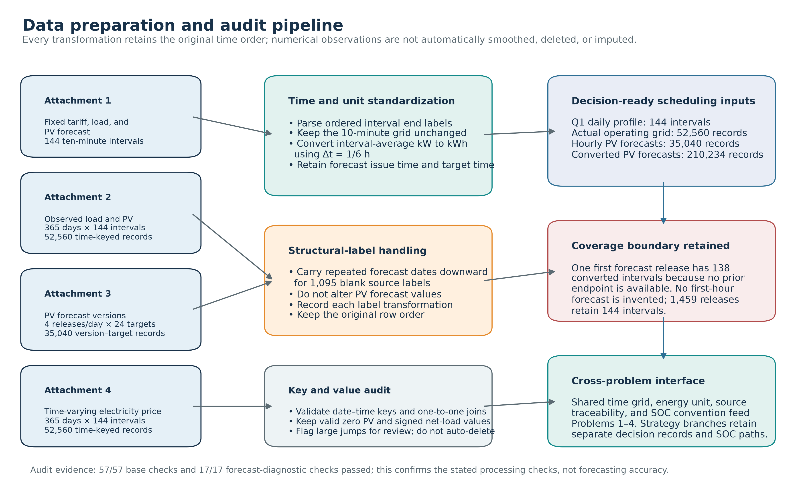

**Figure 2. Data preparation and audit pipeline**

The quality-control stage distinguishes structural labels from numerical values. The numerical input regions in the audited data contain no missing, non-finite, or negative load/PV/price values; the 57 base checks and 17 independent forecast-diagnostic checks all passed. Valid zero observations are preserved, rather than filled or dropped, and large adjacent changes are recorded for source review rather than automatically smoothed or deleted. In particular, Attachment 3 includes 1,095 blank date labels on repeated within-day forecast-release rows. These labels are carried forward in the original row order with a transformation record; they are not treated as 1,095 missing PV forecasts and do not change a forecast-power value.

Hourly PV forecast records are converted only under the declared availability boundary. The first release at 00:00 on January 1 lacks a prior endpoint for its first hourly span, so six ten-minute derived intervals are deliberately left unavailable. The other 1,459 releases each supply 144 derived intervals, giving 210,234 converted records in total. This incompleteness does not enter the required February–December output horizon. Figure 3 separates record coverage from numerical values: it shows that all 52,560 actual-grid records are retained and that 23,540 valid zero-PV observations remain present. The chart is a processing audit, not an assertion about PV-forecast accuracy or operating performance.

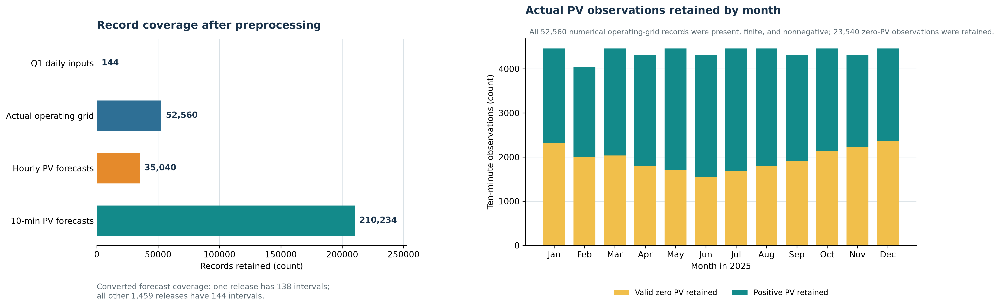

**Figure 3. Record coverage and retained actual PV observations**

The physical outputs of every question use the same AC-bus variables \(q\), \(c\), and \(b\) and the same internal stored-energy state \(E\) defined in Chapter 4. The original commitment is \(q^0\), an update produces \(q^k\), and the last commitment for an interval is \(\bar q\). Problem 1 establishes the deterministic battery-dispatch core. Problems 2–4 then use the v5 historical-scenario direct-purchase architecture under their respective information and price inputs. Thus, no policy is allowed to borrow a terminal SOC, a future forecast, a price realization, or a post-hoc purchase vector from another strategy.

## 5.2 Problem 1: Model Establishment and Solution

### 5.2.1 Modeling Rationale and Model Selection

Problem 1 seeks a least-cost day-ahead purchase and battery schedule under known daily load, PV forecast, and tariff profiles. It is a deterministic finite-horizon economic-dispatch problem with intertemporal storage constraints. A mixed-integer linear program is selected because energy balance, storage evolution, capacity limits, power limits, and purchase cost are linear under the declared efficiency convention, whereas simultaneous charging and discharging must be excluded. A linear-programming relaxation is retained as a lower-bound and structural cross-check.

### 5.2.2 Data Processing

This problem uses the 144 ten-minute records in Attachment 1 and the battery parameters in Appendix 1. Load and PV power are converted to interval energy by multiplying by \(\Delta t=1/6\) h; the tariff already has units of CNY/kWh and is not scaled. The processed input therefore contains 144 valid scheduling intervals with fixed price, load energy, and forecast PV energy. No independent demand or PV forecasting model is introduced because the required forecast is supplied directly by the attachment.

### 5.2.3 Model Formulation

Let regular purchase \(q_t\), charge \(c_t\), discharge \(b_t\), surplus disposal \(w_t\), stored energy \(E_t\), and operating-mode variable \(z_t\) be the decision variables. The model minimizes the daily regular-purchase bill:

$$
\min J_1=\sum_{t=1}^{T}p_tq_t.
\tag{1}
$$

The complete formulation is

$$
\begin{aligned}
q_t+\widehat g_t+b_t&=\widehat\ell_t+c_t+w_t, &&t=1,\ldots,T,\\
E_{t+1}&=E_t+\eta_cc_t-\frac{b_t}{\eta_d}, &&t=1,\ldots,T,\\
1200\le E_t&\le10800, &&t=1,\ldots,T+1,\\
0\le c_t&\le\frac{5000}{6}z_t,\qquad
0\le b_t\le\frac{5000}{6}(1-z_t), &&t=1,\ldots,T,\\
q_t,w_t&\ge0,\qquad z_t\in\{0,1\}, &&t=1,\ldots,T,\\
0\le w_t&\le\widehat g_t, &&t=1,\ldots,T,\\
E_1&=E_{T+1}=6000.
\end{aligned}
\tag{2}
$$

The first constraint enforces interval energy balance, the second updates battery energy, the next two impose safe operating and power limits, and the final equality implements the explicit same-SOC requirement of Problem 1.

### 5.2.4 Model Solution

The MILP is solved with HiGHS 1.14.0 under Python 3.12.14. The implementation uses one thread, random seed 0, a 120-second time limit, relative and absolute MIP-gap tolerances of \(10^{-9}\) and \(10^{-7}\) CNY, and primal, dual, and integer feasibility tolerances of \(10^{-8}\). No separate maximum-iteration limit is specified; termination is controlled by the solver status, gap tolerances, or time limit. The reproducible source is maintained in the project solver script, but the formal supplementary-code number has not yet been assigned.

### 5.2.5 Results Analysis

The optimized plan purchases 59,482.698998 kWh and incurs a modeled cost of CNY 35,126.948589. At the six required ten-minute intervals, purchases are 0.000000, 480.412450, 0.000000, 445.431650, 531.894050, and 0.000000 kWh from 10:00 through 20:10 in the order specified by the statement. The SOC starts and ends at 6,000 kWh, while the four-hour charge/discharge totals are reported in Tables 2 and 3. Compared with the no-storage policy under the same surplus-disposal convention, the modeled cost is lower by CNY 12,925.098002. The result is consistent with shifting usable energy across time, but this monetary reduction is not interpreted as a direct reduction in electricity demand.

Figure 4 displays the same 144-interval solution as the purchase and storage tables. It makes the link between the tariff profile, planned grid energy, signed battery power, and SOC trajectory visible without replacing the numerical schedule.

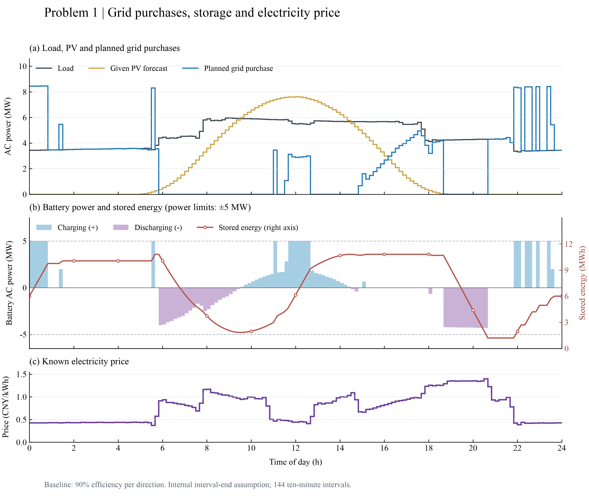

**Figure 4. Problem 1 grid purchases, storage, and electricity price**

**Table 2. Required purchase summary for Problem 1**

| Interval | Purchase (kWh) | Interval | Purchase (kWh) | Interval | Purchase (kWh) |
|---|---:|---|---:|---|---:|
| 10:00–10:10 | 0.000000 | 12:00–12:10 | 480.412450 | 14:00–14:10 | 0.000000 |
| 16:00–16:10 | 445.431650 | 18:00–18:10 | 531.894050 | 20:00–20:10 | 0.000000 |
| Daily total | 59,482.698998 | Daily cost (CNY) | 35,126.948589 | | |

**Table 3. Required storage summary for Problem 1**

| Interval | Charge (kWh) | Discharge (kWh) | Interval | Charge (kWh) | Discharge (kWh) |
|---|---:|---:|---|---:|---:|
| 00:00–04:00 | 4,500.000000 | 0.000000 | 04:00–08:00 | 833.333333 | 6,365.841200 |
| 08:00–12:00 | 4,787.964288 | 1,702.996983 | 12:00–16:00 | 5,286.035177 | 91.101383 |
| 16:00–20:00 | 0.000000 | 5,780.131883 | 20:00–24:00 | 5,333.333333 | 2,859.868117 |
| SOC at 00:00 | 6,000.000000 | | SOC at 24:00 | 6,000.000000 | |

### 5.2.6 Model Verification and Sensitivity Analysis

An independent read-back check recomputes interval energy balance, SOC recursion, capacity and power limits, non-negativity, charge/discharge exclusivity, the initial/terminal equality, and total cost. The maximum balance and SOC-recursion residuals are \(1.14\times10^{-13}\) and \(8.81\times10^{-13}\) kWh, both below the \(10^{-6}\) kWh acceptance tolerance. The MILP objective equals the LP lower bound for this input, which supports optimality only for the stated deterministic formulation. Sensitivity to the two defensible interpretations of 90% efficiency changes the modeled cost to CNY 33,801.495542 under the symmetric round-trip convention; the conclusion is therefore conditional on the selected efficiency definition.

## 5.3 Problem 2: Model Establishment and Solution

### 5.3.1 Modeling Rationale and Model Selection

Problem 2 requires a daily commitment before load and PV outcomes are realized, followed by emergency purchases for actual deficits. It is therefore a causal forecasting and two-stage operational scheduling problem. The original OLS/harmonic point forecasts remain the information source, but the final Q2 candidate directly selects a 144-interval purchase vector against complete historical net-load-error trajectories. This choice is appropriate because the fivefold emergency tariff makes the operational consequence of under-purchasing asymmetric; minimizing point-forecast error alone is not the decision objective. A strict interval-by-interval battery executor evaluates every historical scenario and the actual trajectory, so the direct-purchase extension preserves the storage limits and the midnight commitment boundary.

### 5.3.2 Data Processing

Attachment 2 provides the actual load and PV records. The formal replay covers February 1–December 31, or 334 days and 48,096 ten-minute intervals, after the January warm-up. At midnight, the load forecast uses calendar features and completed lagged load values, while the PV forecast uses only completed PV history; no random time split is used. For the direct-purchase model, the published net-load forecast error of each completed historical day is retained as an entire 144-interval trajectory, rather than treating ten-minute residuals as independent. The D112 result uses a trailing scenario window capped at 112 completed days; each day is planned only from its own initial SOC, previously completed forecast errors, and its original point forecasts.

### 5.3.3 Model Formulation

For day \(d\), the causal forecast layer produces \(\widehat\ell_{d,t\mid0}\) and \(\widehat g_{d,t\mid0}\):

$$
\widehat\ell_{d,t\mid0}=\left[\beta_0+\beta_1\ell_{d-1,t}/1000+\beta_2\ell_{d-7,t}/1000+
\sum_{j=1}^{6}\gamma_jI\{\mathrm{weekday}(d)=j\}+
\sum_{m=1}^{2}\left(a_m\sin\frac{2\pi mt}{144}+b_m\cos\frac{2\pi mt}{144}\right)\right]_+,
\tag{3}
$$

$$
\widehat g_{u_0+h}=\left[f(t_h)^\top\alpha+\phi^h v_{u_0}\right]_+,
\qquad -0.99\le\phi\le0.99,
\tag{4}
$$

where \(\beta_0,\beta_1,\beta_2,\gamma_j,a_m,b_m\) are load-regression coefficients, \(I\{\cdot\}\) is an indicator, \(f(\cdot)\) is the PV harmonic basis, \(\alpha\) is its coefficient vector, and \(v_{u_0}\) is the most recent PV residual. Let \(r_{s,t}\) be the published net-load error on a completed historical day \(s\), and let \(\mathcal H_d\) contain up to the latest 112 such days. The day-\(d\) scenario net load is

$$
N_{d,t}^{(s)}=\widehat\ell_{d,t\mid0}-\widehat g_{d,t\mid0}+r_{s,t}.
\tag{5}
$$

For a fixed commitment \(q_{d,t}\), scenario surplus \(v_{d,t}^{(s)}=q_{d,t}-N_{d,t}^{(s)}\) is passed through the physical executor:

$$
\begin{aligned}
c_{d,t}^{(s)}&=\min\left\{(v_{d,t}^{(s)})_+,\frac{5000}{6},\frac{(10800-E_{d,t-1}^{(s)})_+}{\eta_c}\right\},\\
b_{d,t}^{(s)}&=\min\left\{(-v_{d,t}^{(s)})_+,\frac{5000}{6},\eta_d(E_{d,t-1}^{(s)}-1200)_+\right\},\\
e_{d,t}^{(s)}&=(-v_{d,t}^{(s)}-b_{d,t}^{(s)})_+,\qquad
E_{d,t}^{(s)}=E_{d,t-1}^{(s)}+\eta_cc_{d,t}^{(s)}-b_{d,t}^{(s)}/\eta_d .
\end{aligned}
\tag{6}
$$

The direct purchase vector is selected by the finite historical objective

$$
\min_{q_{d,t}\ge0}\ \widehat J_d(q)=\sum_t p_tq_{d,t}+\frac1{|\mathcal H_d|}\sum_{s\in\mathcal H_d}
\left[5\sum_t p_te_{d,t}^{(s)}-\mu\left(E_{d,144}^{(s)}-E_{d,0}\right)\right],
\qquad
J_2=\sum_{d,t}\left(p_tq_{d,t}+5p_te_{d,t}^{\mathrm{actual}}\right).
\tag{7}
$$

Here \(\mu=0.38232\) CNY/kWh is a fixed one-day inventory-value proxy used only to rank candidates; it is not deducted from the realized bill. The actual executor uses the realized net load in place of \(N_{d,t}^{(s)}\), carries actual SOC continuously across days, and purchases emergency energy only for a residual deficit. Paid but unused grid energy has no revenue or export credit.

### 5.3.4 Model Solution

Each day starts from two deterministic purchase-vector initializations: a risk-profile MILP solution and the nonnegative point net-load forecast. A bounded L-BFGS-B search evaluates the direct objective from both initializations; the best evaluated candidate, its incumbent, and the returned point are all re-scored before a fixed tie rule is applied. The D112 configuration uses a scenario window of at most 112 completed days, risk weight \(\kappa=5\), \(\mu=0.38232\) CNY/kWh, nonnegative purchases, 180 maximum iterations, 1,600 maximum function evaluations, and fixed stopping tolerances. HiGHS 1.14.0 produces the daily MILP initializations with one thread, seed 0, a 120-second time limit, and a relative MIP gap of \(10^{-9}\). L-BFGS-B is a local search on a non-smooth objective, so solver status is not interpreted as a global optimality certificate.

### 5.3.5 Results Analysis

The D112 direct-purchase replay has a February–December realized cost of CNY 13,913,892.48, comprising CNY 13,075,237.03 in regular purchases and CNY 838,655.45 in emergency purchases. It is lower than the original January-selected policy and the matched seasonal baseline by CNY 2,419,790.91 and CNY 1,464,314.87, respectively. It also lowers the observed annual cost by CNY 80,389.78 relative to the preceding X_strong_morning85 risk-purchase result, but does so by reducing regular cost while increasing emergency cost. The earlier January-selected result remains in Table 4 as a negative control: it costs CNY 955,476.04 more than the seasonal baseline and must not be retrospectively presented as a successful annual model selection.

Figure 5 decomposes the four annual bills and plots the D112 month-by-month total-cost difference relative to X_strong. Positive monthly bars denote lower D112 realized cost. Figure 6 then reports the corresponding resampling intervals and the daily comparison counts; because both total-cost intervals include zero, neither figure is evidence of a statistically established or future-year advantage.

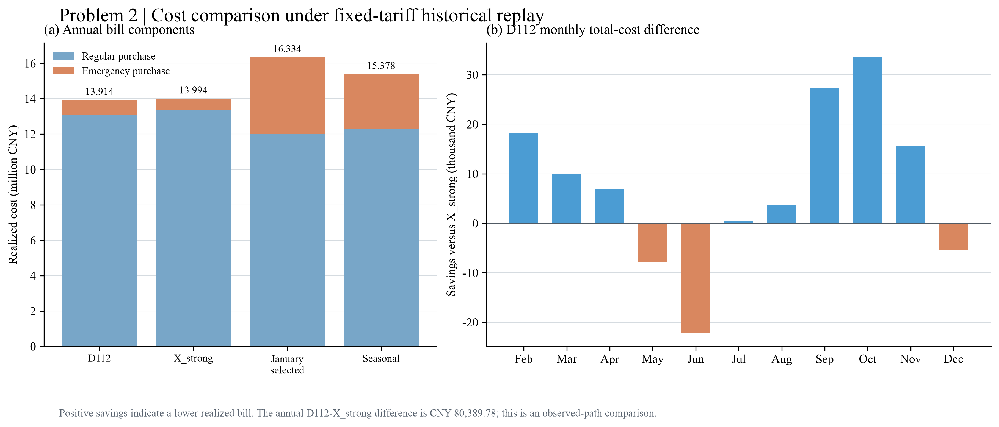

**Figure 5. Problem 2 policy costs and monthly D112 differences**

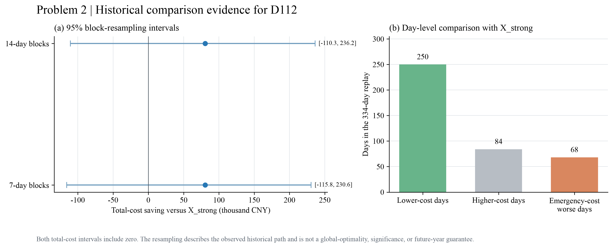

**Figure 6. Problem 2 historical comparison evidence for D112**

**Table 4. Problem 2 policy comparison over 334 days**

| Policy | Planned cost (CNY) | Emergency cost (CNY) | Realized cost (CNY) | Emergency purchase (kWh) |
|---|---:|---:|---:|---:|
| D112 direct purchase | 13,075,237.03 | 838,655.45 | 13,913,892.48 | 147,407.73 |
| X_strong_morning85 risk purchase | 13,349,990.09 | 644,292.17 | 13,994,282.26 | 109,264.55 |
| January-selected linear/harmonic policy | 11,987,831.57 | 4,345,851.83 | 16,333,683.39 | 751,884.12 |
| Seasonal baseline | 12,263,657.58 | 3,114,549.77 | 15,378,207.35 | 519,849.59 |

**Table 5. Required-date purchases and fee components**

| Date | Interval | Original plan (kWh) | Plan fee (CNY) | Emergency fee (CNY) | All-in cost (CNY) |
|---|---:|---:|---:|---:|---:|
| 2025-03-20 | 10:00-10:10 | 0.000 | 0.00 | 0.00 | 0.00 |
| 2025-03-20 | 12:00-12:10 | 618.479 | 272.81 | 0.00 | 272.81 |
| 2025-03-20 | 14:00-14:10 | 0.000 | 0.00 | 0.00 | 0.00 |
| 2025-03-20 | 16:00-16:10 | 521.722 | 431.52 | 0.00 | 431.52 |
| 2025-03-20 | 18:00-18:10 | 626.977 | 787.55 | 0.00 | 787.55 |
| 2025-03-20 | 20:00-20:10 | 8.697 | 11.75 | 0.00 | 11.75 |
| 2025-06-21 | 10:00-10:10 | 0.000 | 0.00 | 0.00 | 0.00 |
| 2025-06-21 | 12:00-12:10 | 0.000 | 0.00 | 0.00 | 0.00 |
| 2025-06-21 | 14:00-14:10 | 0.000 | 0.00 | 0.00 | 0.00 |
| 2025-06-21 | 16:00-16:10 | 126.819 | 104.89 | 0.00 | 104.89 |
| 2025-06-21 | 18:00-18:10 | 440.161 | 552.89 | 0.00 | 552.89 |
| 2025-06-21 | 20:00-20:10 | 0.000 | 0.00 | 0.00 | 0.00 |
| 2025-09-23 | 10:00-10:10 | 0.000 | 0.00 | 0.00 | 0.00 |
| 2025-09-23 | 12:00-12:10 | 405.338 | 178.79 | 0.00 | 178.79 |
| 2025-09-23 | 14:00-14:10 | 0.000 | 0.00 | 0.00 | 0.00 |
| 2025-09-23 | 16:00-16:10 | 518.408 | 428.78 | 0.00 | 428.78 |
| 2025-09-23 | 18:00-18:10 | 636.836 | 799.93 | 0.00 | 799.93 |
| 2025-09-23 | 20:00-20:10 | 43.013 | 58.12 | 0.00 | 58.12 |
| 2025-12-21 | 10:00-10:10 | 66.861 | 66.32 | 0.00 | 66.32 |
| 2025-12-21 | 12:00-12:10 | 998.579 | 440.47 | 0.00 | 440.47 |
| 2025-12-21 | 14:00-14:10 | 0.000 | 0.00 | 0.00 | 0.00 |
| 2025-12-21 | 16:00-16:10 | 823.436 | 681.06 | 0.00 | 681.06 |
| 2025-12-21 | 18:00-18:10 | 719.265 | 903.47 | 0.00 | 903.47 |
| 2025-12-21 | 20:00-20:10 | 43.132 | 58.28 | 0.00 | 58.28 |
| 2025-03-20 | Full-day total | 67,499.888 | 41,247.46 | 0.00 | 41,247.46 |
| 2025-06-21 | Full-day total | 35,017.434 | 20,879.13 | 0.00 | 20,879.13 |
| 2025-09-23 | Full-day total | 69,743.591 | 43,969.03 | 0.00 | 43,969.03 |
| 2025-12-21 | Full-day total | 98,655.863 | 64,565.19 | 24.37 | 64,589.56 |

**Table 6. Required-date four-hour battery operation**

The final row for each date reports actual SOC at 00:00 in the charge column and at 24:00 in the discharge column; both values are in kWh.

| Date | Block | Charge at AC bus (kWh) | Discharge at AC bus (kWh) |
|---|---:|---:|---:|
| 2025-03-20 | 00:00-04:00 | 7,695.219 | 0.000 |
| 2025-03-20 | 04:00-08:00 | 1,972.089 | 5,192.441 |
| 2025-03-20 | 08:00-12:00 | 6,167.206 | 2,777.377 |
| 2025-03-20 | 12:00-16:00 | 4,085.922 | 317.832 |
| 2025-03-20 | 16:00-20:00 | 141.098 | 5,459.100 |
| 2025-03-20 | 20:00-24:00 | 494.231 | 3,077.223 |
| 2025-06-21 | 00:00-04:00 | 594.477 | 159.722 |
| 2025-06-21 | 04:00-08:00 | 514.105 | 1,938.542 |
| 2025-06-21 | 08:00-12:00 | 9,324.293 | 0.000 |
| 2025-06-21 | 12:00-16:00 | 0.000 | 0.000 |
| 2025-06-21 | 16:00-20:00 | 0.000 | 4,478.069 |
| 2025-06-21 | 20:00-24:00 | 1,917.259 | 2,984.695 |
| 2025-09-23 | 00:00-04:00 | 8,232.538 | 0.000 |
| 2025-09-23 | 04:00-08:00 | 1,630.275 | 5,403.801 |
| 2025-09-23 | 08:00-12:00 | 5,374.812 | 1,896.616 |
| 2025-09-23 | 12:00-16:00 | 3,762.071 | 451.344 |
| 2025-09-23 | 16:00-20:00 | 2.393 | 5,804.031 |
| 2025-09-23 | 20:00-24:00 | 1,345.252 | 2,553.788 |
| 2025-12-21 | 00:00-04:00 | 7,364.500 | 0.000 |
| 2025-12-21 | 04:00-08:00 | 2,181.907 | 1,625.015 |
| 2025-12-21 | 08:00-12:00 | 5,721.688 | 6,315.437 |
| 2025-12-21 | 12:00-16:00 | 5,845.673 | 2,220.792 |
| 2025-12-21 | 16:00-20:00 | 53.641 | 4,818.236 |
| 2025-12-21 | 20:00-24:00 | 1,110.177 | 2,632.818 |
| 2025-03-20 | SOC at 00:00 / 24:00 | 2,011.246 | 1,818.132 |
| 2025-06-21 | SOC at 00:00 / 24:00 | 3,741.816 | 4,233.574 |
| 2025-09-23 | SOC at 00:00 / 24:00 | 2,069.516 | 2,482.591 |
| 2025-12-21 | SOC at 00:00 / 24:00 | 3,087.879 | 3,568.487 |

**Table 7. Required-date emergency-purchase episodes**

| Date | Interval or merged episode | Ten-minute intervals | Emergency purchase (kWh) |
|---|---:|---:|---:|
| 2025-03-20 | None | 0 | 0.000 |
| 2025-06-21 | None | 0 | 0.000 |
| 2025-09-23 | None | 0 | 0.000 |
| 2025-12-21 | 07:50-08:00 | 1 | 4.195 |

### 5.3.6 Model Verification and Sensitivity Analysis

An independent validator reconstructs the published forecasts, historical scenario sources, candidate objective, actual execution, SOC path, frozen purchase vector, physical limits, and fixed-price bill without importing the production predictor, executor, or gradient code. The acceptance tolerances are \(10^{-6}\) kWh for physical quantities and CNY \(10^{-5}\) for costs. A separate full-year reproduction of D112 in a fresh directory recompiles the numerical kernel and reproduces the saved ledger. Relative to X_strong_morning85, D112 has 250 lower-cost days and 84 higher-cost days; its 7-day and 14-day block-resampling intervals for the CNY 80,389.78 saving are [−115,755.07, 230,578.14] and [−110,347.84, 236,233.44] CNY. Both include zero. D112 is therefore an internally verified historical minimum among the evaluated direct candidates, not a proven global optimum, statistically significant improvement, or future-year guarantee.

## 5.4 Problem 3: Model Establishment and Solution

### 5.4.1 Modeling Rationale and Model Selection

Problem 3 requires a daily purchase commitment that can be updated when new PV releases arrive, while all decisions already executed remain irreversible. The updated v5 formulation therefore combines an empirical historical-scenario objective with a rolling commitment mechanism. It is *SAA-like* because future net-load uncertainty is represented by admissible historical residual scenarios, and *MPC-like* because only the remaining intervals are reconsidered at 00:00, 06:00, 12:00, and 18:00. The MILP is used only to construct physically feasible initial candidates; the final commitment is selected by the direct historical-scenario objective rather than by claiming a global MILP optimum.

### 5.4.2 Data Processing

The calculation uses the fixed tariff in Attachment 1, realized load and PV operation in Attachment 2, and the release-specific PV information in Attachment 3. The evaluation covers 334 days and 48,096 ten-minute intervals. At every decision time, only completed observations, the current actual SOC, the current commitment, and the PV version released by that time are admissible. The raw released PV forecast is retained for the selected policy. A 28-day release-stage correction is evaluated as a comparison only; it is not imposed as a preprocessing fact or adopted in the reported `q3_raw` policy. For each decision, up to 112 complete historical days are matched by PV-release stage to construct the residual-scenario set.

### 5.4.3 Model Formulation

Let the historical residual scenario for day \(s\), interval \(t\), and release time \(k\) be

$$
r_{d,t}^{(s,k)}=(L_{s,t}-G_{s,t})-(\widehat L_{s,t\mid0}-\widehat G_{s,t\mid k}),
\qquad
N_{d,t}^{(s,k)}=\widehat L_{d,t\mid0}-\widehat G_{d,t\mid k}+r_{d,t}^{(s,k)},
\tag{8}
$$

where \(N_{d,t}^{(s,k)}\) is the scenario net load used for the unexecuted horizon. The strict executor applies the chosen commitment to realized load and PV interval by interval, updates SOC with the common battery constraints, and purchases emergency energy only for an actual deficit. At midnight, the contract term is \(p_tq_{d,t}^{0}\). At an intraday update, the final commitment \(\bar q_{d,t}\) is evaluated once against the original midnight commitment \(q_{d,t}^{0}\):

$$
C_{d,t}(\bar q_{d,t};q_{d,t}^{0})=p_tq_{d,t}^{0}+1.5p_t(\bar q_{d,t}-q_{d,t}^{0})_+-0.5p_t(q_{d,t}^{0}-\bar q_{d,t})_+ .
\tag{9}
$$

The direct objective combines this final commitment cost with the mean scenario emergency fee and a terminal-energy reference term. Thus, purchase vectors are non-negative, completed intervals are fixed at later updates, and the same physical balance, SOC, capacity, power, and charging/discharging exclusivity conditions as in Problem 1 are enforced by the execution layer. The terminal reference coefficient is fixed at \(\mu=0.38232\), and the emergency multiplier is the stated value of five; neither quantity is calibrated from the evaluation-year outcomes.

### 5.4.4 Model Solution

At midnight, six feasible starts are generated, including MILP-based starts, and the local direct optimization selects the lowest unrounded historical total cost. At later updates, the current commitment is retained as an additional candidate, yielding seven candidates. The continuous search uses L-BFGS-B on the non-smooth direct objective, followed by strict interval-by-interval execution; a non-successful local optimizer flag is not treated as physical infeasibility, and no global-optimality claim is made. The frozen policy-selection rule is minimum unrounded historical total cost, then lower emergency fee, then a fixed candidate order. The selected `q3_raw` ledger and the specified-date schedules are exported to `result3.xlsx` and checked by independent read-back.

### 5.4.5 Results Analysis

Table 8 and Figure 7 compare only the four within-family Problem 3 policies under the shared v5 objective and execution convention. Introducing actual-SOC feedback lowers the realized total cost by CNY 285,573.74 relative to the no-update control. Adopting raw released-PV updates lowers the total by a further CNY 145,279.67 relative to the SOC-feedback policy, despite a modest increase in emergency cost, and is consequently selected. The 28-day correction increases total cost by CNY 3,036.93 relative to `q3_raw`; its paired intervals include zero, so it is retained as a negative comparison rather than an adopted improvement.

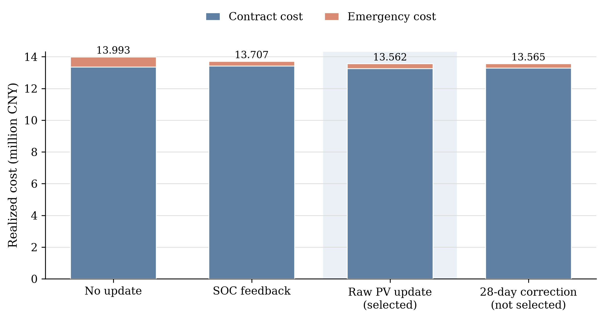

**Figure 7. Problem 3 realized cost composition under v5 rolling-update policies**

**Table 8. Within-family Problem 3 policy comparison over 334 days**

| Policy | Contract cost (CNY) | Emergency cost (CNY) | Realized total cost (CNY) |
|---|---:|---:|---:|
| No update | 13,352,739.63 | 639,947.23 | 13,992,686.86 |
| SOC feedback | 13,430,039.93 | 277,073.19 | 13,707,113.12 |
| Raw PV update (`q3_raw`, selected) | 13,262,305.80 | 299,527.65 | 13,561,833.45 |
| 28-day correction (not selected) | 13,286,830.29 | 278,040.09 | 13,564,870.38 |

Figure 8 adds the chronological dimension to the selected-policy comparison. Relative to the no-update control, `q3_raw` has a lower realized total cost in each month of the February–December replay, and the cumulative within-family difference reaches CNY 430,853.41. The month-level bars are descriptive rather than independent observations, so the figure is used to display the realized path, not to claim statistical significance or future-year persistence.

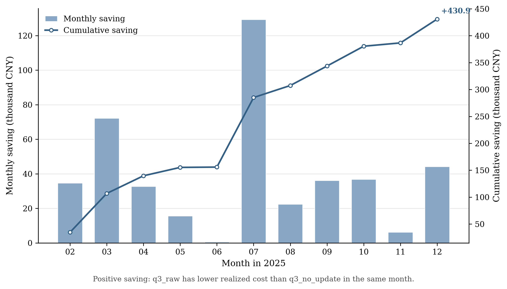

**Figure 8. Monthly and cumulative realized saving of the selected Problem 3 policy**

Figure 9 exposes the physical execution layer on 2025-07-04, selected by the fixed rule of maximum realized emergency energy in the `q3_raw` ledger (5,926.86 kWh). The upper panel distinguishes actual net load, committed regular purchases, and the residual emergency response. The lower panel shows the corresponding battery charge/discharge sequence and end-of-interval SOC within the stated operating band. This stress-day trace makes the strict executor visible, but it is not presented as a representative day or as an additional policy-selection criterion.

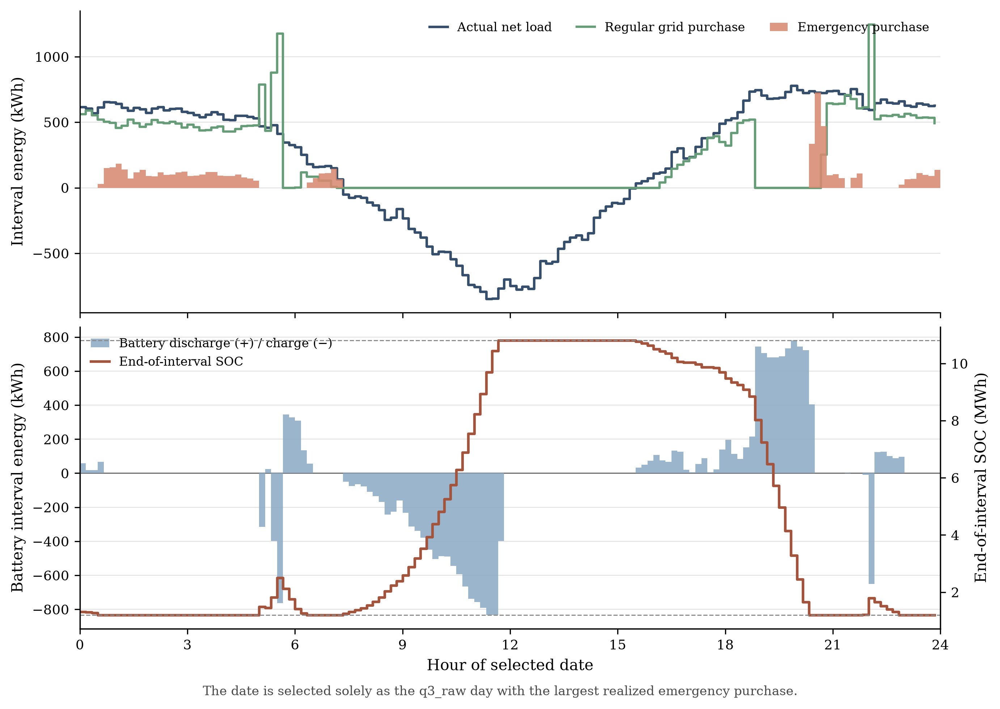

**Figure 9. Selected Problem 3 physical execution on the maximum-emergency day**

### 5.4.6 Model Verification and Sensitivity Analysis

The v5 independent replay confirms every selected Q3 ledger against the source data and the stated information cutoff. Across the full ten-policy v5 verification set, 480,960 realized intervals, 10,354 decisions, and 69,138 candidate vectors are reconstructed independently. The largest physical-balance residual is \(6.681\times10^{-9}\) kWh and the largest cost-reconstruction residual is \(1.863\times10^{-9}\) CNY, both below their stated acceptance thresholds. The raw-versus-corrected and update-policy comparisons are descriptive historical counterfactuals; their block-resampling intervals do not establish a future-year performance guarantee.

## 5.5 Problem 4: Model Establishment and Solution

### 5.5.1 Modeling Rationale and Model Selection

Problem 4 retains the shared v5 direct-purchase objective and strict executor but changes the price-information condition. The two requested branches are kept separate. Q4-2 uses a fixed planning-price input and actual-price settlement (`q42_fixed`), without gaining access to Attachment 3. Q4-3 uses raw released PV forecasts, rolling updates, and a causal OLS planning-price forecast (`q43_raw_ols`), while still settling each realized interval at the Attachment 4 price. The branches have different information structures and therefore are not interpreted as an absolute cross-branch price ranking.

### 5.5.2 Data Processing

Attachments 2 and 4 supply 48,096 realized load/PV/price intervals from February through December; Attachment 3 enters only the Q4-3 branch. The causal OLS price model is fitted at the decision time using a trailing 28-calendar-day history, two daily Fourier harmonics, one-day and seven-day price lags, and weekday indicators. Its forecast is bounded below by \(10^{-6}\) CNY/kWh only to preserve a positive planning coefficient. Realized Attachment 4 prices, not forecast prices, are always used in the final cost ledger.

### 5.5.3 Model Formulation

For Q4-2, the planned purchase vector is chosen from historical net-load scenarios using the fixed planning price, and its realized bill is computed with the actual price. For Q4-3, the same direct scenario objective as in Problem 3 uses the causal price forecast at each admissible update. The price equation has the generic form

$$
\widehat p_{u\mid k}=\max\{10^{-6},\;\beta_0+\text{daily Fourier terms}+\text{available 1-day and 7-day lags}+\text{weekday effects}\},
\tag{10}
$$

where all regressors are restricted to information completed by \(k\). Actual settlement is evaluated at the realized price \(p_{d,t}\): Q4-2 uses \(p_{d,t}q_{d,t}^{0}+5p_{d,t}e_{d,t}\), while Q4-3 applies the revision-cost function in (9) with \(p_{d,t}\) plus its fivefold emergency term. This separation prevents the planning forecast from being mistaken for realized revenue or cost.

### 5.5.4 Model Solution

`q42_fixed` freezes a midnight 144-interval direct-purchase vector; `q42_ols` is its matched planning-price alternative. `q43_raw_ols` runs the raw-PV rolling policy at 00:00, 06:00, 12:00, and 18:00, while `q43_raw_fixed` is the matched fixed-planning-price comparison. All selected vectors are executed by the common strict simulator and exported to `result4-2.xlsx` or `result4-3.xlsx`. The historical total-cost, emergency-fee, and candidate-order selection rule is unchanged from Problem 3; local optimization status is recorded rather than silently converted into a global-optimality claim.

### 5.5.5 Results Analysis

The matched comparisons in Table 9 and Figure 10 show mixed price-planning effects. In Q4-2, the OLS planning-price alternative is CNY 6,957.83 more expensive than `q42_fixed`. In Q4-3, `q43_raw_ols` is CNY 13,191.16 less expensive than its fixed-price counterpart. Both seven-day and fourteen-day block-resampling intervals cross zero, so neither sign is generalized beyond the observed historical path. The Q4-3 28-day PV correction also increases cost by CNY 3,289.26 relative to `q43_raw_ols` and is not adopted.

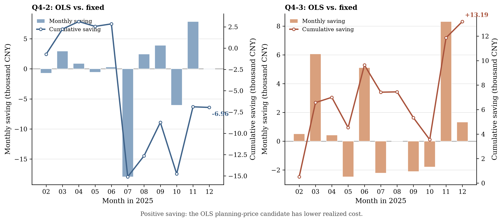

**Figure 10. Monthly and cumulative within-branch price-planning differences in Problem 4**

Figure 11 uses the predeclared causal-audit date 2025-07-14 to make the Q4-3 information boundary concrete. Each dashed forecast or purchase-plan segment starts only at its own 00:00, 06:00, 12:00, or 18:00 release time; the black price trace is the actual settlement price, not planning information. The lower panel therefore separates revised commitments from their subsequent strict execution. This is a causality and traceability illustration for one audited day, rather than an accuracy assessment of the OLS price model or a new source of model-selection evidence.

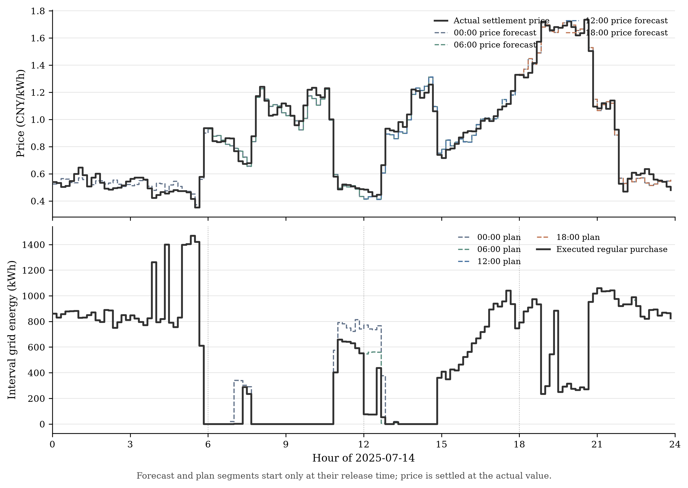

**Figure 11. Causal price forecasts and rolling purchase plans on a predeclared Q4-3 audit day**

**Table 9. Matched Problem 4 planning-price comparisons over 334 days**

| Branch and policy | Planning-price input | Contract cost (CNY) | Emergency cost (CNY) | Realized total cost (CNY) |
|---|---|---:|---:|---:|
| Q4-2 `q42_fixed` (selected) | Fixed | 13,807,519.17 | 871,020.30 | 14,678,539.46 |
| Q4-2 `q42_ols` | Causal OLS | 13,817,618.39 | 867,878.90 | 14,685,497.29 |
| Q4-3 `q43_raw_fixed` | Fixed | 14,007,184.03 | 327,865.50 | 14,335,049.53 |
| Q4-3 `q43_raw_ols` (selected) | Causal OLS | 13,994,313.65 | 327,544.72 | 14,321,858.37 |

### 5.5.6 Model Verification and Sensitivity Analysis

The five exported v5 workbooks pass independent read-back: 4,107,481 workbook checks and 2,143,182 numerical comparisons yield no error. The maximum workbook-output difference is \(7.275\times10^{-11}\) kWh and the maximum monetary difference is \(1.304\times10^{-7}\) CNY. These checks establish consistency of the current internal assumptions, source-price settlement, and exported schedules; they do not settle the unresolved interpretation of timestamp mapping, efficiency, terminal-state handling, or future-price availability.

<!-- Superseded pre-v5 Problem 3 and Problem 4 text retained only as an internal editing record. It is deliberately excluded from the rendered paper because the v5 direct-purchase model, policies, tables, figures, and verification evidence above replace it. Do not cite or submit the commented material below.

## 5.4 Problem 3: Model Establishment and Solution

### 5.4.1 Modeling Rationale and Model Selection

Problem 3 adds released PV forecasts and paid purchase revisions at 06:00, 12:00, and 18:00. It is a multi-stage rolling scheduling problem with state feedback and piecewise-linear contract cost. Model predictive control is selected because each permitted update observes the actual SOC, freezes executed intervals, and re-optimizes only the remaining same-day horizon. The internal optimization remains a MILP so that the shared battery constraints and charge/discharge exclusivity are preserved.

### 5.4.2 Data Processing

The problem uses Attachment 1 for fixed tariffs, Attachment 2 for actual load/PV during execution, and Attachment 3 for release-specific PV forecasts. The evaluation horizon again contains 334 days and 48,096 ten-minute intervals. Each released hourly forecast is transformed to the ten-minute grid by the fixed interpolation convention and truncated at the current day's 24:00 boundary. The original B0 load/PV forecast structure used to initialize the Q2 direct model is retained and re-estimated at midnight from past information only; the later Q2 direct-purchase vector is not imported into Q3. All policies share the February 1 SOC from the January warm-up and then evolve independently.

### 5.4.3 Model Formulation

At 00:00, the original plan minimizes \(\sum_tp_tq^0_{d,t}\). At a permitted update time \(k\), the remaining-horizon balance and battery constraints are

$$
\begin{aligned}
q^k_{d,t}+\widehat g_{d,t\mid k}+b_{d,t}&=\widehat\ell_{d,t\mid0}+c_{d,t}+w_{d,t}, &&t\in\mathcal H_k,\\
E_{d,t+1}&=E_{d,t}+\eta_cc_{d,t}-b_{d,t}/\eta_d, &&t\in\mathcal H_k,\\
1200\le E_{d,t}&\le10800,\\
0\le c_{d,t}&\le(5000/6)z_{d,t},\quad0\le b_{d,t}\le(5000/6)(1-z_{d,t}),\\
q^k_{d,t},w_{d,t}&\ge0,\quad z_{d,t}\in\{0,1\}.
\end{aligned}
\tag{8}
$$

The current measured SOC initializes each update. The planned terminal state is constrained to the original midnight plan's terminal reference as an added policy, while actual interval-end SOC continues without a reset. For the two unresolved reduction-settlement interpretations, the final interval contract cost is

$$
F_A(\bar q_{d,t};q^0_{d,t},p_t)=p_tq^0_{d,t}+1.5p_t(\bar q_{d,t}-q^0_{d,t})_+-0.5p_t(q^0_{d,t}-\bar q_{d,t})_+,
\tag{9}
$$

$$
F_B(\bar q_{d,t};q^0_{d,t},p_t)=p_tq^0_{d,t}+1.5p_t(\bar q_{d,t}-q^0_{d,t})_++0.5p_t(q^0_{d,t}-\bar q_{d,t})_+.
\tag{10}
$$

The update model minimizes the sum of the selected prospective \(F\) over \(\mathcal H_k\), using \(q^k\) as the candidate commitment at update \(k\). After the last applicable update, \(\bar q\) denotes the final commitment. Each interval is settled once by applying \(F_A\) or \(F_B\) to \(\bar q\) relative to the original midnight commitment \(q^0\); successive optimization objectives are not added. The realized daily bill adds fivefold emergency cost to the final contract cost.

For the corrected-PV extension, the raw PV forecast at release hour \(h\) is adjusted only when its raw value is positive:

$$
\widehat g^{\mathrm{corr}}_{d,t\mid k}=
\max\left\{0,\widehat g^{\mathrm{raw}}_{d,t\mid k}+\overline r_{h,28}\right\},
\tag{11}
$$

where \(\overline r_{h,28}\) is the mean realized-minus-forecast error from the latest 28 days available at the decision time and with the same release hour. The correction is a forecasting pre-processing step; it does not alter the storage constraints, settlement function, or actual executor.

### 5.4.4 Model Solution

Six pre-specified policies are solved: no update, all 06:00/12:00/18:00 updates under rules A and B, and three single-update A policies. At each update, executed decisions remain fixed and the latest allowable PV version and actual SOC are supplied to a new remaining-horizon MILP. The all-update policy therefore solves four horizons per day, or 1,336 horizons over the 334-day period. HiGHS 1.14.0 is run with one thread, seed 0, a 120-second horizon limit, and a relative MIP-gap tolerance of \(10^{-9}\); no maximum iteration count is separately set. The formal supplementary-code number remains pending. A populated review copy of `result3.xlsx` has passed independent read-back checks, including independent rebilling from exported purchases and source prices; adoption of the working assumptions remains pending.

### 5.4.5 Results Analysis

Under rule A, retaining only the midnight forecast costs CNY 15,842,067.99, whereas using all three later forecast updates costs CNY 13,772,880.061223. The all-update policy has a higher contract cost but a much lower emergency cost, reducing the realized bill by CNY 2,069,187.93 (13.061%) and lowering emergency purchases from 574,236.05 to 125,345.25 kWh. A feedback-only comparison costs CNY 13,934,357.97, showing that actual-SOC feedback and newly released PV information are jointly involved; the all-update difference must not be labelled as pure forecast value.

The 28-day, release-time-specific PV bias correction is selected after reviewing March outcomes, enabled on April 1, and then replayed continuously without an SOC reset. It lowers the 334-day rule-A all-update cost from CNY 13,772,880.061223 to CNY 13,726,733.574968. The continuous 334-day replay uses raw forecasts through March and the correction from April through December. Over those 275 corrected days it records 153 lower-cost days and 122 higher-cost days; July and December are loss months. Because the correction was selected after the March review, the Q3 gain of CNY 46,146.486255 and its Q4 transfer are retrospective post-selection findings rather than pre-registered or externally validated improvements.

Figure 7 presents the raw-PV policy comparison that isolates the role of permitted forecast updates against the midnight-only control. The post-selection PV-bias correction is not plotted in this figure and remains qualified by the continuous-replay evidence stated above.

**Figure 7. Problem 3 costs under forecast-update policies**

**Table 8. Principal Problem 3 comparisons over 334 days**

| Policy | Contract cost (CNY) | Emergency cost (CNY) | Realized cost (CNY) | Emergency purchase (kWh) |
|---|---:|---:|---:|---:|
| Midnight forecast only, rule A | 12,281,584.60 | 3,560,483.39 | 15,842,067.99 | 574,236.05 |
| All updates, raw PV, rule A | 13,053,598.95 | 719,281.11 | 13,772,880.06 | 125,345.25 |
| All updates, corrected PV, rule A | 13,066,874.04 | 659,859.54 | 13,726,733.57 | 116,794.75 |

**Table 9. Required-date purchases and fee components**

| Date | Interval | Original q0 (kWh) | Final qbar (kWh) | Original fee (CNY) | Increase fee (CNY) | Decrease adjustment (CNY) | Final contract fee (CNY) | Emergency fee (CNY) | All-in cost (CNY) |
|---|---:|---:|---:|---:|---:|---:|---:|---:|---:|
| 2025-03-20 | 10:00-10:10 | 0.000 | 0.000 | 0.00 | 0.00 | -0.00 | 0.00 | 0.00 | 0.00 |
| 2025-03-20 | 12:00-12:10 | 536.810 | 430.095 | 236.79 | 0.00 | -23.54 | 213.25 | 0.00 | 213.25 |
| 2025-03-20 | 14:00-14:10 | 0.000 | 0.000 | 0.00 | 0.00 | -0.00 | 0.00 | 0.00 | 0.00 |
| 2025-03-20 | 16:00-16:10 | 620.232 | 620.232 | 512.99 | 0.00 | -0.00 | 512.99 | 0.00 | 512.99 |
| 2025-03-20 | 18:00-18:10 | 701.879 | 701.879 | 881.63 | 0.00 | -0.00 | 881.63 | 0.00 | 881.63 |
| 2025-03-20 | 20:00-20:10 | 0.000 | 0.000 | 0.00 | 0.00 | -0.00 | 0.00 | 0.00 | 0.00 |
| 2025-06-21 | 10:00-10:10 | 0.000 | 0.000 | 0.00 | 0.00 | -0.00 | 0.00 | 0.00 | 0.00 |
| 2025-06-21 | 12:00-12:10 | 0.000 | 0.000 | 0.00 | 0.00 | -0.00 | 0.00 | 0.00 | 0.00 |
| 2025-06-21 | 14:00-14:10 | 0.000 | 0.000 | 0.00 | 0.00 | -0.00 | 0.00 | 0.00 | 0.00 |
| 2025-06-21 | 16:00-16:10 | 141.254 | 141.254 | 116.83 | 0.00 | -0.00 | 116.83 | 0.00 | 116.83 |
| 2025-06-21 | 18:00-18:10 | 0.000 | 0.000 | 0.00 | 0.00 | -0.00 | 0.00 | 0.00 | 0.00 |
| 2025-06-21 | 20:00-20:10 | 0.000 | 0.000 | 0.00 | 0.00 | -0.00 | 0.00 | 0.00 | 0.00 |
| 2025-09-23 | 10:00-10:10 | 0.000 | 0.000 | 0.00 | 0.00 | -0.00 | 0.00 | 0.00 | 0.00 |
| 2025-09-23 | 12:00-12:10 | 357.885 | 357.885 | 157.86 | 0.00 | -0.00 | 157.86 | 0.00 | 157.86 |
| 2025-09-23 | 14:00-14:10 | 0.000 | 0.000 | 0.00 | 0.00 | -0.00 | 0.00 | 0.00 | 0.00 |
| 2025-09-23 | 16:00-16:10 | 527.524 | 488.538 | 436.32 | 0.00 | -16.12 | 420.19 | 0.00 | 420.19 |
| 2025-09-23 | 18:00-18:10 | 755.349 | 755.349 | 948.79 | 0.00 | -0.00 | 948.79 | 0.00 | 948.79 |
| 2025-09-23 | 20:00-20:10 | 0.000 | 0.000 | 0.00 | 0.00 | -0.00 | 0.00 | 0.00 | 0.00 |
| 2025-12-21 | 10:00-10:10 | 0.000 | 0.000 | 0.00 | 0.00 | -0.00 | 0.00 | 0.00 | 0.00 |
| 2025-12-21 | 12:00-12:10 | 949.102 | 846.503 | 418.65 | 0.00 | -22.63 | 396.02 | 0.00 | 396.02 |
| 2025-12-21 | 14:00-14:10 | 0.000 | 0.000 | 0.00 | 0.00 | -0.00 | 0.00 | 0.00 | 0.00 |
| 2025-12-21 | 16:00-16:10 | 772.267 | 803.757 | 638.74 | 39.07 | -0.00 | 677.81 | 0.00 | 677.81 |
| 2025-12-21 | 18:00-18:10 | 730.755 | 730.755 | 917.90 | 0.00 | -0.00 | 917.90 | 0.00 | 917.90 |
| 2025-12-21 | 20:00-20:10 | 0.000 | 0.000 | 0.00 | 0.00 | -0.00 | 0.00 | 0.00 | 0.00 |
| 2025-03-20 | Full-day total | 67,561.426 | 66,165.726 | 40,914.96 | 3,504.31 | -926.01 | 43,493.27 | 1,600.69 | 45,093.96 |
| 2025-06-21 | Full-day total | 35,125.294 | 35,663.126 | 19,539.12 | 882.29 | -1.23 | 20,420.18 | 27.53 | 20,447.71 |
| 2025-09-23 | Full-day total | 66,554.687 | 66,133.817 | 40,893.26 | 2,079.28 | -440.33 | 42,532.22 | 4,023.34 | 46,555.56 |
| 2025-12-21 | Full-day total | 94,567.183 | 95,593.778 | 59,891.06 | 2,952.77 | -456.85 | 62,386.97 | 745.75 | 63,132.72 |

**Table 10. Required-date four-hour battery operation**

The final row for each date reports actual SOC at 00:00 in the charge column and at 24:00 in the discharge column; both values are in kWh.

| Date | Block | Charge at AC bus (kWh) | Discharge at AC bus (kWh) |
|---|---:|---:|---:|
| 2025-03-20 | 00:00-04:00 | 2,876.566 | 385.728 |
| 2025-03-20 | 04:00-08:00 | 970.423 | 6,001.377 |
| 2025-03-20 | 08:00-12:00 | 3,043.546 | 2,449.959 |
| 2025-03-20 | 12:00-16:00 | 6,460.042 | 254.723 |
| 2025-03-20 | 16:00-20:00 | 192.166 | 5,324.084 |
| 2025-03-20 | 20:00-24:00 | 7,203.980 | 2,306.471 |
| 2025-06-21 | 00:00-04:00 | 208.232 | 3,905.246 |
| 2025-06-21 | 04:00-08:00 | 398.313 | 4,746.396 |
| 2025-06-21 | 08:00-12:00 | 10,312.905 | 0.000 |
| 2025-06-21 | 12:00-16:00 | 0.000 | 0.000 |
| 2025-06-21 | 16:00-20:00 | 98.242 | 5,650.188 |
| 2025-06-21 | 20:00-24:00 | 10,017.719 | 2,543.740 |
| 2025-09-23 | 00:00-04:00 | 4,528.353 | 200.492 |
| 2025-09-23 | 04:00-08:00 | 1,022.536 | 6,755.983 |
| 2025-09-23 | 08:00-12:00 | 5,012.054 | 1,892.470 |
| 2025-09-23 | 12:00-16:00 | 5,773.335 | 547.204 |
| 2025-09-23 | 16:00-20:00 | 36.409 | 6,068.827 |
| 2025-09-23 | 20:00-24:00 | 5,531.409 | 2,173.346 |
| 2025-12-21 | 00:00-04:00 | 5,227.580 | 135.709 |
| 2025-12-21 | 04:00-08:00 | 1,430.682 | 1,580.707 |
| 2025-12-21 | 08:00-12:00 | 5,162.795 | 7,806.667 |
| 2025-12-21 | 12:00-16:00 | 8,162.110 | 2,159.333 |
| 2025-12-21 | 16:00-20:00 | 40.634 | 5,802.960 |
| 2025-12-21 | 20:00-24:00 | 5,417.398 | 2,851.733 |
| 2025-03-20 | SOC at 00:00 / 24:00 | 7,556.669 | 7,648.339 |
| 2025-06-21 | SOC at 00:00 / 24:00 | 10,585.431 | 10,800.000 |
| 2025-09-23 | SOC at 00:00 / 24:00 | 6,032.596 | 6,148.146 |
| 2025-12-21 | SOC at 00:00 / 24:00 | 5,788.767 | 6,089.058 |

**Table 11. Required-date emergency-purchase episodes**

| Date | Interval or merged episode | Ten-minute intervals | Emergency purchase (kWh) |
|---|---:|---:|---:|
| 2025-03-20 | 09:10-10:00 | 5 | 327.419 |
| 2025-06-21 | 06:50-07:00 | 1 | 6.606 |
| 2025-09-23 | 09:40-09:50 | 1 | 4.145 |
| 2025-09-23 | 20:20-21:50 | 9 | 667.863 |
| 2025-12-21 | 07:50-08:10 | 2 | 77.985 |
| 2025-12-21 | 10:40-10:50 | 1 | 73.140 |

### 5.4.6 Model Verification and Sensitivity Analysis

The main Q3 validator reports 110,401 passing independent checks and a separate feedback-control check reports 30,048 passing checks. It independently verifies allowed forecast versions, frozen load predictions, original commitments, actual state feedback, physical constraints, final-once settlement, and exported summaries. The maximum actual-balance residual is 0 kWh and the maximum planned-balance residual is \(1.735\times10^{-10}\) kWh, both within the \(10^{-6}\) kWh acceptance tolerance. Settlement-rule A/B, update-time ablations, and feedback-only control are mechanism comparisons, not general robustness proofs. The continuous correction is further checked at 14-, 28-, and 56-day windows, two efficiency conventions, and hard/soft terminal references; the evaluated comparisons retain positive cumulative correction gains but do not cover all parameter interactions.

## 5.5 Problem 4: Model Establishment and Solution

### 5.5.1 Modeling Rationale and Model Selection

Problem 4 reuses the original frozen Problem 2 and Problem 3 mechanisms when external-grid prices vary by interval; it does not import the later Q2 D112 direct-purchase extension. The main difficulty is information availability: Attachment 4 records realized prices but does not state that future prices are known when a plan is made. The implementable branch therefore uses a causal ordinary least-squares price forecast, while a perfect-price case is kept only as a labelled benchmark. Q4-2 retains the original historical-PV mechanism; Q4-3 retains the Problem 3 released-PV and rolling-update mechanism.

### 5.5.2 Data Processing

The variable-price study uses the 48,096 evaluation intervals from Attachments 2–4, with Attachment 3 used only by the Q4-3 branch. At every permitted decision time, the price model is trained on observations completed before that decision within the trailing 28-calendar-day window; at 06:00, 12:00, and 18:00 this includes already completed intervals from the current day. The model uses two daily Fourier harmonics, one-day and seven-day price lags, and weekday indicators. Forecast prices are constrained below by \(10^{-6}\) CNY/kWh, a pre-declared numerical positivity rule rather than an estimate from future minima. Actual settlement always uses the Attachment 4 target-interval price. Q4-2 does not gain access to Attachment 3 simply because Q4-3 uses it.

### 5.5.3 Model Formulation

The Q4-2 planning objective replaces the fixed tariff in Problem 2 with the causal forecast price:

$$
\widehat p_{u\mid k}=\max\left\{10^{-6},\beta_0+
\sum_{j=1}^{2}\left[a_j\sin(2\pi j\varphi_u)+b_j\cos(2\pi j\varphi_u)\right]
+\beta_1p_{u-1\mathrm{d}}+\beta_7p_{u-7\mathrm{d}}
+\sum_{r=1}^{6}\gamma_rI\{\mathrm{weekday}(u)=r\}\right\},
\tag{12}
$$

where \(\varphi_u\) is the within-day price phase; the coefficients are estimated only from the stated trailing window, and every lagged price is available when the forecast is formed. The Q4-2 planning objective replaces the fixed tariff in Problem 2 with this causal forecast price:

$$
\min J^{\mathrm{plan}}_{4-2,d}=\sum_{t=1}^{T}\widehat p_{d,t\mid0}q^0_{d,t},
\tag{13}
$$

subject to the same power-balance, SOC, capacity, power, non-negativity, and binary-mode constraints in Section 5.3.3. Q4-3 retains the rolling formulation in Section 5.4.3, substituting \(\widehat p_{d,t\mid k}\) into the selected contract-cost function. Both branches settle actual cost with the realized price:

$$
J_{4-2}=\sum_{d,t}p_{d,t}(q^0_{d,t}+5e_{d,t}),
\tag{14}
$$

$$
J_{4-3}=\sum_{d,t}\left[F(\bar q_{d,t};q^0_{d,t},p_{d,t})+5p_{d,t}e_{d,t}\right].
\tag{15}
$$

Thus, forecast prices guide the plan but never replace actual prices in the bill. The perfect-price benchmark changes only the planning-price input and remains subject to the same demand/PV uncertainty and actual execution rule.

### 5.5.4 Model Solution

Nine pre-specified policies are evaluated: three Q4-2 price-information cases and six Q4-3 cases covering no update, all updates under rules A/B, frozen-at-midnight price updates, fixed-price input, and perfect-price input. The Q4-3 corrected-PV transfer is evaluated only against the causally priced rule-A all-update policy; Q4-2 remains within its historical-PV information boundary. The same HiGHS environment, one-thread setting, seed 0, 120-second horizon limit, and MIP feasibility/gap criteria are used. The 28-day price-model window and the nine policy families are fixed before the Q4 calculation, but the PV correction was chosen after reviewing March and transferred after Q2/Q3 outcomes were known. The Q4 correction result is therefore retrospective and post-selection. Populated review copies of `result4-2.xlsx` and `result4-3.xlsx` have passed independent read-back checks; independent rebilling from exported purchases and source prices has also passed, while adoption of the working assumptions remains pending.

### 5.5.5 Results Analysis

The causal-price Q4-2 policy costs CNY 17,030,881.70, compared with CNY 17,073,742.68 for the otherwise matched fixed-price-input policy, a CNY 42,860.98 reduction. In Q4-3, however, the causal-price all-update A policy costs CNY 14,534,062.642403, CNY 6,183.03 more than its matched fixed-price-input comparison. The direction changes across branches, so price adaptation is not presented as a universally beneficial modification. When the Problem 3 28-day PV correction is transferred to the causal-price Q4-3 branch, the realized cost falls to CNY 14,492,279.546435, a CNY 41,783.10 reduction under the stated scenario.

Figure 8 isolates the effect of replacing the fixed planning-price input with the causal OLS price input while holding actual-price settlement within each branch. The mixed monthly signs reinforce that the price forecast is not claimed to improve every branch or every month; the corrected-PV transfer is reported separately in Table 12.

**Figure 8. Problem 4 value of adapting to variable prices**

**Table 12. Matched variable-price comparisons over 334 days**

| Branch and policy | Realized cost (CNY) | Matched reference (CNY) | Difference (CNY) |
|---|---:|---:|---:|
| Q4-2, causal price forecast | 17,030,881.70 | 17,073,742.68 | −42,860.98 |
| Q4-3, all updates A with causal price | 14,534,062.64 | 14,527,879.61 | +6,183.03 |
| Q4-3, all updates A with corrected PV | 14,492,279.55 | 14,534,062.64 | −41,783.10 |

**Table 13. Q4-2 required-date purchases and fee components**

| Date | Interval | Original q0 (kWh) | Final qbar (kWh) | Original fee (CNY) | Increase fee (CNY) | Decrease adjustment (CNY) | Final contract fee (CNY) | Emergency fee (CNY) | All-in cost (CNY) |
|---|---:|---:|---:|---:|---:|---:|---:|---:|---:|
| 2025-03-20 | 10:00-10:10 | 0.000 | 0.000 | 0.00 | 0.00 | -0.00 | 0.00 | 0.00 | 0.00 |
| 2025-03-20 | 12:00-12:10 | 513.287 | 513.287 | 231.95 | 0.00 | -0.00 | 231.95 | 0.00 | 231.95 |
| 2025-03-20 | 14:00-14:10 | 0.000 | 0.000 | 0.00 | 0.00 | -0.00 | 0.00 | 0.00 | 0.00 |
| 2025-03-20 | 16:00-16:10 | 520.477 | 520.477 | 456.30 | 0.00 | -0.00 | 456.30 | 0.00 | 456.30 |
| 2025-03-20 | 18:00-18:10 | 59.920 | 59.920 | 77.85 | 0.00 | -0.00 | 77.85 | 0.00 | 77.85 |
| 2025-03-20 | 20:00-20:10 | 743.628 | 743.628 | 951.03 | 0.00 | -0.00 | 951.03 | 0.00 | 951.03 |
| 2025-06-21 | 10:00-10:10 | 0.000 | 0.000 | 0.00 | 0.00 | -0.00 | 0.00 | 0.00 | 0.00 |
| 2025-06-21 | 12:00-12:10 | 0.000 | 0.000 | 0.00 | 0.00 | -0.00 | 0.00 | 0.00 | 0.00 |
| 2025-06-21 | 14:00-14:10 | 0.000 | 0.000 | 0.00 | 0.00 | -0.00 | 0.00 | 0.00 | 0.00 |
| 2025-06-21 | 16:00-16:10 | 170.029 | 170.029 | 97.66 | 0.00 | -0.00 | 97.66 | 0.00 | 97.66 |
| 2025-06-21 | 18:00-18:10 | 0.000 | 0.000 | 0.00 | 0.00 | -0.00 | 0.00 | 0.00 | 0.00 |
| 2025-06-21 | 20:00-20:10 | 0.000 | 0.000 | 0.00 | 0.00 | -0.00 | 0.00 | 0.00 | 0.00 |
| 2025-09-23 | 10:00-10:10 | 0.000 | 0.000 | 0.00 | 0.00 | -0.00 | 0.00 | 0.00 | 0.00 |
| 2025-09-23 | 12:00-12:10 | 370.047 | 370.047 | 128.81 | 0.00 | -0.00 | 128.81 | 0.00 | 128.81 |
| 2025-09-23 | 14:00-14:10 | 0.000 | 0.000 | 0.00 | 0.00 | -0.00 | 0.00 | 0.00 | 0.00 |
| 2025-09-23 | 16:00-16:10 | 507.838 | 507.838 | 473.56 | 0.00 | -0.00 | 473.56 | 0.00 | 473.56 |
| 2025-09-23 | 18:00-18:10 | 0.000 | 0.000 | 0.00 | 0.00 | -0.00 | 0.00 | 0.00 | 0.00 |
| 2025-09-23 | 20:00-20:10 | 0.000 | 0.000 | 0.00 | 0.00 | -0.00 | 0.00 | 5,247.20 | 5,247.20 |
| 2025-12-21 | 10:00-10:10 | 0.000 | 0.000 | 0.00 | 0.00 | -0.00 | 0.00 | 0.00 | 0.00 |
| 2025-12-21 | 12:00-12:10 | 882.147 | 882.147 | 611.86 | 0.00 | -0.00 | 611.86 | 0.00 | 611.86 |
| 2025-12-21 | 14:00-14:10 | 0.000 | 0.000 | 0.00 | 0.00 | -0.00 | 0.00 | 0.00 | 0.00 |
| 2025-12-21 | 16:00-16:10 | 778.696 | 778.696 | 763.12 | 0.00 | -0.00 | 763.12 | 0.00 | 763.12 |
| 2025-12-21 | 18:00-18:10 | 730.755 | 730.755 | 946.84 | 0.00 | -0.00 | 946.84 | 0.00 | 946.84 |
| 2025-12-21 | 20:00-20:10 | 0.000 | 0.000 | 0.00 | 0.00 | -0.00 | 0.00 | 0.00 | 0.00 |
| 2025-03-20 | Full-day total | 65,739.044 | 65,739.044 | 40,808.48 | 0.00 | 0.00 | 40,808.48 | 5,211.57 | 46,020.05 |
| 2025-06-21 | Full-day total | 33,792.989 | 33,792.989 | 16,776.20 | 0.00 | 0.00 | 16,776.20 | 1,588.70 | 18,364.90 |
| 2025-09-23 | Full-day total | 61,892.404 | 61,892.404 | 39,716.92 | 0.00 | 0.00 | 39,716.92 | 26,946.87 | 66,663.79 |
| 2025-12-21 | Full-day total | 94,126.215 | 94,126.215 | 69,937.06 | 0.00 | 0.00 | 69,937.06 | 8,035.01 | 77,972.07 |

**Table 14. Q4-2 required-date four-hour battery operation**

The final row for each date reports actual SOC at 00:00 in the charge column and at 24:00 in the discharge column; both values are in kWh.

| Date | Block | Charge at AC bus (kWh) | Discharge at AC bus (kWh) |
|---|---:|---:|---:|
| 2025-03-20 | 00:00-04:00 | 7,248.753 | 218.767 |
| 2025-03-20 | 04:00-08:00 | 3,477.584 | 5,827.467 |
| 2025-03-20 | 08:00-12:00 | 5,829.448 | 2,662.757 |
| 2025-03-20 | 12:00-16:00 | 5,151.691 | 301.928 |
| 2025-03-20 | 16:00-20:00 | 0.000 | 7,810.387 |
| 2025-03-20 | 20:00-24:00 | 211.568 | 939.527 |
| 2025-06-21 | 00:00-04:00 | 244.821 | 2,067.201 |
| 2025-06-21 | 04:00-08:00 | 1,166.633 | 1,487.475 |
| 2025-06-21 | 08:00-12:00 | 10,322.212 | 0.000 |
| 2025-06-21 | 12:00-16:00 | 0.000 | 0.000 |
| 2025-06-21 | 16:00-20:00 | 59.311 | 5,996.678 |
| 2025-06-21 | 20:00-24:00 | 3,785.153 | 2,549.570 |
| 2025-09-23 | 00:00-04:00 | 8,200.268 | 91.637 |
| 2025-09-23 | 04:00-08:00 | 18.277 | 7,264.686 |
| 2025-09-23 | 08:00-12:00 | 3,761.895 | 1,379.860 |
| 2025-09-23 | 12:00-16:00 | 5,552.427 | 589.053 |
| 2025-09-23 | 16:00-20:00 | 18.731 | 6,967.331 |
| 2025-09-23 | 20:00-24:00 | 2,641.965 | 106.386 |
| 2025-12-21 | 00:00-04:00 | 9,615.876 | 134.940 |
| 2025-12-21 | 04:00-08:00 | 744.968 | 1,141.244 |
| 2025-12-21 | 08:00-12:00 | 5,150.137 | 7,488.480 |
| 2025-12-21 | 12:00-16:00 | 8,245.716 | 2,645.200 |
| 2025-12-21 | 16:00-20:00 | 34.696 | 6,416.058 |
| 2025-12-21 | 20:00-24:00 | 1,635.977 | 2,449.030 |
| 2025-03-20 | SOC at 00:00 / 24:00 | 1,222.954 | 1,215.834 |
| 2025-06-21 | SOC at 00:00 / 24:00 | 4,189.340 | 4,764.187 |
| 2025-09-23 | SOC at 00:00 / 24:00 | 3,506.415 | 3,459.562 |
| 2025-12-21 | SOC at 00:00 / 24:00 | 1,663.274 | 2,020.183 |

**Table 15. Required-date emergency-purchase episodes**

| Date | Interval or merged episode | Ten-minute intervals | Emergency purchase (kWh) |
|---|---:|---:|---:|
| 2025-03-20 | 09:30-10:00 | 3 | 114.620 |
| 2025-03-20 | 20:30-20:40 | 1 | 672.038 |
| 2025-03-20 | 21:20-21:50 | 3 | 32.673 |
| 2025-03-20 | 23:40-23:50 | 1 | 21.603 |
| 2025-06-21 | 06:10-07:20 | 7 | 540.639 |
| 2025-09-23 | 08:40-09:50 | 7 | 516.755 |
| 2025-09-23 | 18:20-18:30 | 1 | 1.083 |
| 2025-09-23 | 19:20-19:40 | 2 | 914.795 |
| 2025-09-23 | 19:50-22:00 | 13 | 2,816.809 |
| 2025-09-23 | 22:20-22:40 | 2 | 48.407 |
| 2025-12-21 | 07:50-08:10 | 2 | 67.391 |
| 2025-12-21 | 20:20-20:40 | 2 | 980.473 |

**Table 16. Q4-3 required-date purchases and fee components**

| Date | Interval | Original q0 (kWh) | Final qbar (kWh) | Original fee (CNY) | Increase fee (CNY) | Decrease adjustment (CNY) | Final contract fee (CNY) | Emergency fee (CNY) | All-in cost (CNY) |
|---|---:|---:|---:|---:|---:|---:|---:|---:|---:|
| 2025-03-20 | 10:00-10:10 | 0.000 | 0.000 | 0.00 | 0.00 | -0.00 | 0.00 | 0.00 | 0.00 |
| 2025-03-20 | 12:00-12:10 | 536.810 | 430.095 | 242.58 | 0.00 | -24.11 | 218.47 | 0.00 | 218.47 |
| 2025-03-20 | 14:00-14:10 | 0.000 | 0.000 | 0.00 | 0.00 | -0.00 | 0.00 | 0.00 | 0.00 |
| 2025-03-20 | 16:00-16:10 | 620.232 | 620.232 | 543.76 | 0.00 | -0.00 | 543.76 | 0.00 | 543.76 |
| 2025-03-20 | 18:00-18:10 | 152.407 | 701.879 | 198.02 | 1,070.89 | -0.00 | 1,268.92 | 0.00 | 1,268.92 |
| 2025-03-20 | 20:00-20:10 | 743.628 | 743.628 | 951.03 | 0.00 | -0.00 | 951.03 | 0.00 | 951.03 |
| 2025-06-21 | 10:00-10:10 | 0.000 | 0.000 | 0.00 | 0.00 | -0.00 | 0.00 | 0.00 | 0.00 |
| 2025-06-21 | 12:00-12:10 | 0.000 | 0.000 | 0.00 | 0.00 | -0.00 | 0.00 | 0.00 | 0.00 |
| 2025-06-21 | 14:00-14:10 | 0.000 | 0.000 | 0.00 | 0.00 | -0.00 | 0.00 | 0.00 | 0.00 |
| 2025-06-21 | 16:00-16:10 | 141.254 | 141.254 | 81.14 | 0.00 | -0.00 | 81.14 | 0.00 | 81.14 |
| 2025-06-21 | 18:00-18:10 | 0.000 | 0.000 | 0.00 | 0.00 | -0.00 | 0.00 | 0.00 | 0.00 |
| 2025-06-21 | 20:00-20:10 | 0.000 | 0.000 | 0.00 | 0.00 | -0.00 | 0.00 | 0.00 | 0.00 |
| 2025-09-23 | 10:00-10:10 | 0.000 | 0.000 | 0.00 | 0.00 | -0.00 | 0.00 | 0.00 | 0.00 |
| 2025-09-23 | 12:00-12:10 | 357.885 | 357.885 | 124.58 | 0.00 | -0.00 | 124.58 | 0.00 | 124.58 |
| 2025-09-23 | 14:00-14:10 | 0.000 | 0.000 | 0.00 | 0.00 | -0.00 | 0.00 | 0.00 | 0.00 |
| 2025-09-23 | 16:00-16:10 | 527.524 | 488.538 | 491.92 | 0.00 | -18.18 | 473.74 | 0.00 | 473.74 |
| 2025-09-23 | 18:00-18:10 | 0.000 | 755.349 | 0.00 | 1,503.86 | -0.00 | 1,503.86 | 0.00 | 1,503.86 |
| 2025-09-23 | 20:00-20:10 | 0.000 | 0.000 | 0.00 | 0.00 | -0.00 | 0.00 | 0.00 | 0.00 |
| 2025-12-21 | 10:00-10:10 | 0.000 | 0.000 | 0.00 | 0.00 | -0.00 | 0.00 | 0.00 | 0.00 |
| 2025-12-21 | 12:00-12:10 | 949.102 | 846.503 | 658.30 | 0.00 | -35.58 | 622.72 | 0.00 | 622.72 |
| 2025-12-21 | 14:00-14:10 | 0.000 | 0.000 | 0.00 | 0.00 | -0.00 | 0.00 | 0.00 | 0.00 |
| 2025-12-21 | 16:00-16:10 | 772.267 | 937.374 | 756.82 | 242.71 | -0.00 | 999.53 | 0.00 | 999.53 |
| 2025-12-21 | 18:00-18:10 | 730.755 | 730.755 | 946.84 | 0.00 | -0.00 | 946.84 | 0.00 | 946.84 |
| 2025-12-21 | 20:00-20:10 | 0.000 | 0.000 | 0.00 | 0.00 | -0.00 | 0.00 | 0.00 | 0.00 |
| 2025-03-20 | Full-day total | 67,509.871 | 66,082.094 | 42,100.96 | 3,040.88 | -924.10 | 44,217.74 | 1,687.53 | 45,905.27 |
| 2025-06-21 | Full-day total | 35,208.359 | 35,743.520 | 17,301.90 | 751.02 | -0.84 | 18,052.08 | 0.00 | 18,052.08 |
| 2025-09-23 | Full-day total | 66,554.687 | 66,030.002 | 42,970.74 | 2,011.73 | -504.93 | 44,477.55 | 4,149.21 | 48,626.76 |
| 2025-12-21 | Full-day total | 94,466.006 | 95,466.474 | 70,031.47 | 3,611.71 | -637.11 | 73,006.06 | 955.50 | 73,961.57 |

**Table 17. Q4-3 required-date four-hour battery operation**

The final row for each date reports actual SOC at 00:00 in the charge column and at 24:00 in the discharge column; both values are in kWh.

| Date | Block | Charge at AC bus (kWh) | Discharge at AC bus (kWh) |
|---|---:|---:|---:|
| 2025-03-20 | 00:00-04:00 | 3,035.070 | 299.476 |
| 2025-03-20 | 04:00-08:00 | 153.936 | 6,079.509 |
| 2025-03-20 | 08:00-12:00 | 3,043.546 | 2,449.959 |
| 2025-03-20 | 12:00-16:00 | 6,398.184 | 254.723 |
| 2025-03-20 | 16:00-20:00 | 217.998 | 6,737.667 |
| 2025-03-20 | 20:00-24:00 | 7,825.156 | 839.152 |
| 2025-06-21 | 00:00-04:00 | 190.271 | 7,212.608 |
| 2025-06-21 | 04:00-08:00 | 600.268 | 1,787.651 |
| 2025-06-21 | 08:00-12:00 | 10,320.891 | 0.000 |
| 2025-06-21 | 12:00-16:00 | 0.000 | 0.000 |
| 2025-06-21 | 16:00-20:00 | 146.689 | 5,698.636 |
| 2025-06-21 | 20:00-24:00 | 10,029.083 | 2,543.740 |
| 2025-09-23 | 00:00-04:00 | 5,116.997 | 154.519 |
| 2025-09-23 | 04:00-08:00 | 127.039 | 6,834.892 |
| 2025-09-23 | 08:00-12:00 | 5,003.041 | 1,892.470 |
| 2025-09-23 | 12:00-16:00 | 5,762.443 | 504.078 |
| 2025-09-23 | 16:00-20:00 | 27.130 | 6,105.362 |
| 2025-09-23 | 20:00-24:00 | 5,822.062 | 2,184.371 |
| 2025-12-21 | 00:00-04:00 | 4,822.283 | 135.709 |
| 2025-12-21 | 04:00-08:00 | 198.169 | 907.880 |
| 2025-12-21 | 08:00-12:00 | 5,162.795 | 7,806.667 |
| 2025-12-21 | 12:00-16:00 | 8,295.728 | 2,267.563 |
| 2025-12-21 | 16:00-20:00 | 45.864 | 5,807.196 |
| 2025-12-21 | 20:00-24:00 | 6,211.151 | 2,842.526 |
| 2025-03-20 | SOC at 00:00 / 24:00 | 8,139.832 | 8,234.682 |
| 2025-06-21 | SOC at 00:00 / 24:00 | 10,800.000 | 10,800.000 |
| 2025-09-23 | SOC at 00:00 / 24:00 | 6,345.359 | 6,378.541 |
| 2025-12-21 | SOC at 00:00 / 24:00 | 6,515.211 | 6,813.666 |

**Table 18. Required-date emergency-purchase episodes**

| Date | Interval or merged episode | Ten-minute intervals | Emergency purchase (kWh) |
|---|---:|---:|---:|
| 2025-03-20 | 09:10-10:00 | 5 | 327.419 |
| 2025-06-21 | None | 0 | 0.000 |
| 2025-09-23 | 09:40-09:50 | 1 | 4.145 |
| 2025-09-23 | 18:20-18:30 | 1 | 1.083 |
| 2025-09-23 | 20:10-20:20 | 1 | 10.234 |
| 2025-09-23 | 20:30-22:00 | 9 | 673.190 |
| 2025-12-21 | 07:50-08:10 | 2 | 77.985 |
| 2025-12-21 | 10:40-10:50 | 1 | 69.296 |

### 5.5.6 Model Verification and Sensitivity Analysis

The Q4 validator records 211,834 passing checks across the nine policies, including source-price separation, forecast information cutoffs, physical constraints, commitment versions, actual-price settlement, and ledger reconstruction. Thirty-six representative update horizons are independently checked with LP relaxations; the maximum MILP-minus-LP lower-bound difference is \(2.910\times10^{-11}\) CNY and the largest LP feasibility residual is \(1.819\times10^{-12}\). The perfect-price case is not an achievable lower bound on actual cost, and Q4-2/Q4-3 are not treated as a pure update-value comparison because their PV information differs. The price-information rule, settlement timing, and official workbook time mapping remain the principal unresolved sensitivities.

The paper table numbers are editorial labels and are distinct from the original Attachment 5 template table names. In the review workbooks, each timestamp is explicitly labelled from 00:00-00:10 through 23:50-24:00 under the interval-end convention. EP is the sum of the 144 grid-energy entries. In a plan sheet, EQ is the original midnight scheduled fee and excludes emergency cost; in an adjusted sheet, EQ is the final rule-A contract fee, including the original charge and revision adjustments, and is not added a second time. All-in cost equals the applicable contract fee plus the emergency fee, with the components disclosed in the companion cost summary. These populated files remain internal review outputs pending approval of the assumptions.

-->

# 6 Verification, Sensitivity, and Scope Limits

Independent validation re-reads exported ledgers rather than relying on optimizer memory. The v5 audit reconstructs 480,960 realized ten-minute intervals, 10,354 decisions, 69,138 candidate vectors, and 7,039,035 candidate–scenario paths across ten policies. It checks energy balance, SOC recursion, capacity and power limits, charging/discharging exclusivity, cross-day continuity, source-data matching, information cutoffs, commitments, fee decomposition, and workbook tables. The largest physics residual is \(6.681\times10^{-9}\) kWh and the largest independent cost residual is \(1.863\times10^{-9}\) CNY. These results support internal arithmetic and implementation consistency; they neither prove global optimality of the non-smooth direct search nor establish performance in an uncertain future year.

A bounded Q1 sensitivity isolates where the 5,000 kW limit is applied. With 90% efficiency in each direction, the one-day cost is CNY 35,126.948589 under the AC-bus boundary and CNY 35,101.567554 under the battery-internal boundary, a decrease of CNY 25.381035. Under the symmetric round-trip convention, the corresponding costs are CNY 33,801.495542 and CNY 33,790.315371. Four MILP solves, four same-builder LP checks, and 48 independent algebra checks pass. This evidence is limited to the deterministic Q1 day; it is neither an annual robustness result nor evidence that either physical boundary is the official interpretation.

Sensitivity work compares raw versus 28-day corrected PV releases and fixed versus causal-OLS planning prices within matched policy families. The selected raw-PV policy is retained because the correction increases cost in both the reported Q3 and Q4-3 comparisons; its seven-day and fourteen-day block-resampling intervals cross zero. The two planning-price comparisons also have mixed signs and intervals crossing zero. Consecutive-date block resampling therefore describes variation along the observed historical path only; it is not a future-profit probability, a distributionally robust guarantee, or external validation on an unseen year.

The model excludes battery degradation, communication costs, measurement delay, and second-level converter dynamics because the statement supplies no parameters for them. The optimality claim for Problem 1 applies only to its deterministic finite-horizon formulation and the selected assumptions. Results for Problems 2–4 are retrospective closed-loop simulations over the required February–December period, not proof of performance in another year. The current interpretation of timestamp alignment, storage efficiency, price availability, refund treatment, and revision settlement must be confirmed before final numerical results are presented as an official submission.

# 7 Model Evaluation, Improvement, and Generalization

## 7.1 Model Summary

This study combines a deterministic battery-dispatch MILP, a direct historical-scenario purchase objective, causal information filtering, and rolling commitment updates. Problem 1 establishes the physical dispatch core; Problem 2 reports the D112 fixed-commitment direct-purchase comparison; Problem 3 applies raw released-PV updates with actual-SOC feedback; and Problem 4 uses the same v5 core under separate fixed and causal-OLS planning-price branches. The common energy balance, battery state, power limits, and strict realized-execution ledger are retained throughout, but each policy evolves an independent state trajectory. Independent ledger reconstruction, workbook read-back, physical-feasibility checks, and matched within-family comparisons support internal consistency of the reported results, not out-of-sample economic performance.

## 7.2 Strengths of the Model

(1) The formulation is closely matched to the operational structure of the problem. The dispatch model jointly represents grid purchases, PV availability, charging, discharging, energy storage, and non-simultaneous battery modes. In Problem 1 alone, the bound w <= forecast PV prevents regular grid purchases from being disposed of. In Problems 2-4, an already paid original or final grid commitment may become unused during causal execution; it is recorded as non-revenue disposal and receives no sale credit. This makes the cost objective and the physical balance consistent with the stated microgrid setting rather than treating storage arbitrage as an unconstrained accounting exercise.

(2) The information boundary is handled explicitly. Released PV versions are tied to their release times, price regressors use only completed observations, and executed intervals are frozen during rolling updates. This design distinguishes causal planning information from actual settlement data. The independent v5 audit reconstructs 480,960 realized intervals and verifies source-price settlement, commitment versions, and information cutoffs across ten policy ledgers.

(3) The four questions form a reusable and auditable sequence. Rather than changing the physical model from question to question, the analysis preserves the common battery and realized-operation rules, then changes the admissible information, commitment-update rule, or planning-price input. This isolates the source of each within-family comparison: for example, SOC feedback, raw PV releases, and the 28-day correction are separated in Problem 3, while fixed versus causal-OLS planning prices are separated within each Problem 4 branch.

(4) The study reports unfavorable as well as favorable evidence. The D112 comparison is bounded to the evaluated direct candidates; the Q3/Q4-3 28-day correction is not adopted because it raises the observed cost; and the causal-OLS planning-price comparison has opposite signs in Q4-2 and Q4-3. The reported paired block-resampling intervals cross zero for the correction and price effects, which prevents them from being presented as universal improvements.

## 7.3 Limitations of the Model

(1) The results depend on unresolved interpretation and data-mapping issues. In particular, the official workbook timestamp convention, the treatment of purchase reductions in settlement, the battery-efficiency convention, and future-price availability require confirmation. These choices can alter the ledger or objective and therefore limit the use of current numerical outputs as final submission results.

(2) The physical model deliberately omits battery degradation, converter transients, communication delays, measurement errors, and possible export or curtailment rules beyond the declared surplus-disposal treatment. This reduction keeps the MILP identifiable from the supplied data, but may bias cost and cycling conclusions if these omitted factors are material in a real deployment. The conclusions therefore apply to interval-level energy scheduling under the stated battery abstraction.

(3) Forecast and correction specifications are based on one historical microgrid series and limited rolling windows. The tested 28-day PV correction raises the matched Q3 and Q4-3 historical totals and its paired intervals cross zero; this negative result is informative but does not exclude a different correction rule in another data regime. Likewise, the price model is a causal OLS specification, not evidence that its selected predictors are universally sufficient.

(4) The D112 purchase vector is selected from a finite trailing error window of at most 112 completed days by bounded local search. It is internally reproducible and has the lowest realized cost among the reported direct candidates, but the non-smooth objective has no global-optimality certificate and the block-resampling intervals for its incremental saving include zero. Its result is therefore an exploratory historical comparison rather than a statistically established or future-year performance claim.

## 7.4 Improvements and Generalization

The first improvement priority is to confirm the official time map and settlement wording, then regenerate any affected outputs if the adopted conventions differ. The five populated v5 review workbooks have passed independent read-back and source-price rebilling under the current interpretation, but the interpretation itself is not yet an official clarification. Once the data definition is fixed, degradation cost, battery-side versus bus-side power limits, metering uncertainty, and explicit PV-export or curtailment options can be introduced as calibrated variables or constraints. Forecasting can then be assessed with rolling out-of-sample periods and alternative models selected by operational cost as well as forecast error. A robust or distributionally robust rolling-dispatch extension would be appropriate only after forecast-error scenarios, their dependence structure, and a decision-maker's risk tolerance are supported by data; it should not be claimed from the current historical replay.

The framework can be generalized to other behind-the-meter storage systems, industrial parks, charging stations, and renewable microgrids that face interval energy balance, limited storage, uncertain local generation, and tariff-dependent purchases. The core state-transition and dispatch constraints can be reused, whereas load, renewable generation, price, storage capacity, power rating, efficiency, settlement rule, and permitted update times must be recalibrated for the new setting. A new application may also require demand charges, multiple storage units, export tariffs, network limits, or emissions objectives; these should be added to the objective and constraints rather than assumed to be covered by the present single-battery formulation. Such extension is a modelling route, not a demonstrated performance guarantee.

## Evidence Still Required

- Confirm the Attachment 5 time mapping and the official interpretation of price availability and purchase-reduction settlement.
- Preserve the current v5 policy mapping and repeat independent read-back if any official clarification changes the settlement, time-map, efficiency, terminal-state, or price-information convention.
- Add rolling out-of-sample or cross-site evidence before claiming forecasting or economic performance beyond the evaluated February–December historical path.
- Finalize the [AI tool usage details working draft](revision_v1/AI工具使用详情_工作稿.md) against the team's human usage records, then generate and inspect the anonymous submission PDF for page size, pagination, and identity leakage.

## Three Highest-Priority Revisions

1. Resolve the timestamp, efficiency, and settlement definitions before freezing any final numerical conclusion.
2. Keep the within-family limits explicit: the correction and price-planning comparisons have block-resampling intervals crossing zero and must not be promoted to general improvements.
3. Finalize the AI-use record from human evidence, then generate and inspect the anonymous submission PDF; no final PDF is claimed at this manuscript stage.

# 8 Required Deliverables and Editorial Status

The paper now contains the common model logic, the D112 Problem 2 comparison, the selected v5 Q3/Q4 policies, unified notation, and eleven numbered figures with nine active tables. Five populated v5 review workbooks have explicit interval labels and pass independent read-back; independent source-price rebilling also passes under the stored working assumptions. The files remain internal outputs pending adoption of the timestamp, efficiency, power-boundary, terminal, price-information, and settlement assumptions. The [AI tool usage details working draft](revision_v1/AI工具使用详情_工作稿.md) must be finalized against the team's human usage records. An anonymous submission PDF has not yet been produced, so page size, pagination, and identity leakage remain unchecked submission items.

# 9 AI Tool Usage Declaration — Working Draft

This team used AI tools for model implementation and discussion, code generation and debugging, verification design and result analysis, figure generation, reference checks, and manuscript drafting. The team's specific manual-review and verification records remain to be supplied. This disclosure is a working draft and must not be submitted with incomplete human-review records. The supporting [AI-use working record](revision_v1/AI工具使用详情_工作稿.md) identifies known uses and missing records.

# 10 References

[1] Lasseter, R. H. *MicroGrids*. 2002 IEEE Power Engineering Society Winter Meeting, 2002. DOI: [10.1109/PESW.2002.985003](https://doi.org/10.1109/PESW.2002.985003).

[2] Guerrero, J. M., Vasquez, J. C., Matas, J., de Vicuña, L. G., & Castilla, M. Hierarchical Control of Droop-Controlled AC and DC Microgrids—A General Approach Toward Standardization. *IEEE Transactions on Industrial Electronics*, 58(1), 158–172, 2011. DOI: [10.1109/TIE.2010.2066534](https://doi.org/10.1109/TIE.2010.2066534).

[3] Tenfen, D., & Finardi, E. C. A mixed integer linear programming model for the energy management problem of microgrids. *Electric Power Systems Research*, 122, 19–28, 2015. DOI: [10.1016/j.epsr.2014.12.019](https://doi.org/10.1016/j.epsr.2014.12.019).

[4] Sigalo, M. B., Pillai, A. C., Das, S., & Abusara, M. An Energy Management System for the Control of Battery Storage in a Grid-Connected Microgrid Using Mixed Integer Linear Programming. *Energies*, 14(19), 6212, 2021. DOI: [10.3390/en14196212](https://doi.org/10.3390/en14196212).

[5] Parisio, A., Rikos, E., & Glielmo, L. Stochastic model predictive control for economic/environmental operation management of microgrids: An experimental case study. *Journal of Process Control*, 43, 24–37, 2016. DOI: [10.1016/j.jprocont.2016.04.008](https://doi.org/10.1016/j.jprocont.2016.04.008).
