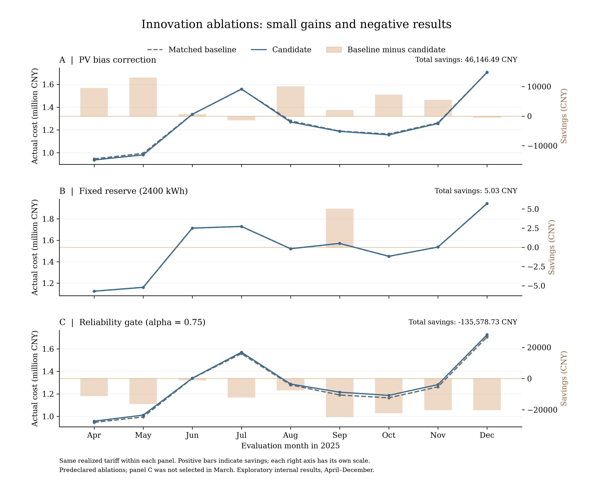
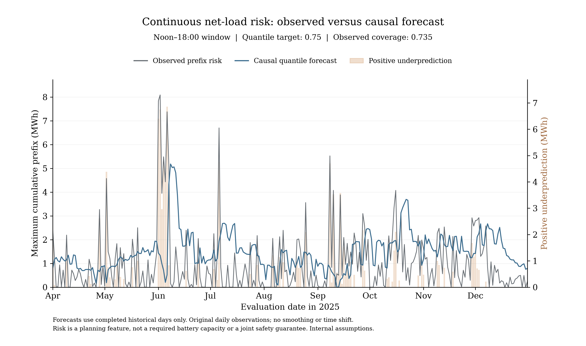

# 附录B 原创新实验完整记录

> 内部装配初稿；未确认口径不作正式提交结论。来源：innovation_draft.md全文原样保留，增加历史说明

> 下文是原冻结创新实验的历史快照。其“尚未Q4迁移/未连续全年”等状态已由本轮Part08补充，不代表当前状态。公式与全部成功/失败数值保留，正文只选Part05/06/09明确对应内容。

# 创新实验：预报校正、连续风险余量与付费更新门槛

内部可追溯实验及论文增补初稿，不是正式提交版。依据统一方案第6.3、11、12、14节逐项实施，不把常规MILP、MPC或数据防泄漏包装为算法原创。

## 1. 实验设计与信息边界

固定价A结算作为机制实验主场景，Q1—Q4原结果保持不变。2月用于启动历史模型，3月全部31天的实际回放费用用于选型，4月1日至12月31日275天为参数冻结后的评价期。此前已经看过全年基线，因此是探索性顺序回测；不能宣称评价期是此前完全未触及的数据。候选和数值参数在execution_plan.md预先写明，评价后没有替换选中策略。

校正实验使用Q3原发布PV、Q2冻结负荷和硬日终循环；风险实验使用Q2历史PV/负荷及同核日前计划；门槛实验使用Q3原PV但共同改成软终态以保证保持承诺的可行性。各组内部同初态、同价格、同执行器，不能跨组直接用费用差归因。4月各组共同初态来自旧对应基线4月1日实际SOC，之后每条策略连续演化；不是每日重置。收支均按目标区间固定价格及最终有效量相对0点承诺一次计费，代理惩罚不进入真实账单。

## 2. 三个改进的模型

**PV校正。** 采用统一方案允许的发布时间偏差简化，而不是另造复杂回归：用过去28个完整目标日、相同发布小时、原PV预报为正的区间估计平均残差(实际−原预报)。仅在原预报为正时加该偏差并裁剪到非负，夜间原零值保持零。训练目标全部在当前日0点前完成；日内也不使用当前日新实际PV校正。该限制减少信息泄漏可能，但不是复杂条件误差模型。全部/日间MAE按相同目标集合比较，实际日间掩码只在事后评价使用。

**连续风险。** 每日0点用冻结的样本外净负载预测，构造12—18点36段残差的最大正累计前缀S，而非终点累计和。最近56个已结束日作为训练样本，最少20日；不足时回退固定参考2400kWh。条件分位模型以S/1000为目标，特征为截距、预测净负载均值/1000、预测PV均值/1000，最小化α=0.75的pinball损失。秩不足回退经验分位。内部余量B=min(9600,γ*S_hat/0.9)，γ只比较0.5和1，在12点设置E+s≥1200+B的软参考；λ_B=已知固定价均值×0.9元/内部kWh。实际缺电仍可调用全部可用电池。无余量与固定2400kWh对照始终保留；它不是严格机会约束，也不保证覆盖全部连续缺口。

**更新门槛。** 在6/12/18点，从同一真实SOC、同一0点承诺和新PV预测分别优化保持当前q与允许修改q。两者共用预计紧急通道u≤预测负荷以及“紧急不充电”约束，并共用软终态λ_T|E_end−E_midnight|，λ_T取已知固定价均值×0.9。取预测总成本差Vhat。历史反事实回放将两条候选q分别固定到当日24点、之后不再更新，从同一实际SOC执行相同实际序列，计合同/紧急费及相同终态代理得到Vreplay。只有次日0点才把ζ=Vhat−Vreplay纳入同发布时刻最近56日历史；至少20个样本时τ=max(0,Qα(ζ))，α比较0.5/0.75。Vhat>τ+1e-7才更新；早期样本不足仍正常更新。

反事实终态代理不是电网账单；冻结到24点的局部收益也不是全年滚动策略的真实增量。无门槛优化已经包含保持承诺可行集，Vhat非负本身不是创新。接收新信息但购电冻结时，当前贪心执行器不会读取未来预测，因此两条冻结策略实际轨迹理应完全相同，这一点以实际账本验证。

## 3. 全部候选真实结果

| 策略 | 3月校准费/元 | 4—12月实际费/元 | 较组内基线节省/元 | 节省率/% | 紧急量/kWh | 3月选中 |
|---|---|---|---|---|---|---|
| Raw PV | 1,121,987.67 | 11,438,135.24 | 0.00 | 0.00000 | 115,781.78 | No |
| PV bias correction | 1,112,724.18 | 11,391,988.76 | 46,146.49 | 0.40344 | 107,231.29 | Yes |
| No reserve | 1,295,274.46 | 13,750,367.53 | 0.00 | 0.00000 | 676,738.39 | No |
| Fixed reserve | 1,295,174.25 | 13,750,362.50 | 5.03 | 0.00004 | 676,735.97 | Yes |
| Risk reserve gamma 0.5 | 1,295,174.25 | 13,750,362.50 | 5.03 | 0.00004 | 676,735.97 | No |
| Risk reserve gamma 1.0 | 1,295,174.25 | 13,750,365.17 | 2.36 | 0.00002 | 676,735.97 | No |
| Paid updates | 1,121,987.67 | 11,438,052.17 | 0.00 | 0.00000 | 115,748.10 | Yes |
| Gate alpha 0.50 | 1,122,129.28 | 11,440,332.16 | -2,279.99 | -0.01993 | 119,018.24 | No |
| Gate alpha 0.75 | 1,132,523.84 | 11,573,630.89 | -135,578.73 | -1.18533 | 145,217.45 | No |
| Frozen information and contract | 1,280,707.04 | 13,239,531.48 | -1,801,479.31 | -15.74988 | 507,500.07 | No |
| New information, frozen contract | 1,280,707.04 | 13,239,531.48 | -1,801,479.31 | -15.74988 | 507,500.07 | No |

门槛两条冻结策略以付费更新为表中参照，百分比同时反映是否更新，不能解释成单独门槛效果；PV和风险组各有自己的基线。选择只看3月，保留所有后续失败候选。

| 组别 | 3月选中策略 | 后续节省/元 | 后续方向 |
|---|---|---|---|
| pv | PV bias correction | 46,146.49 | 降低费用 |
| risk | Fixed reserve | 5.03 | 降低费用 |
| gate | Paid updates | 0.00 | 基线或近似无差异 |

固定风险余量若只有几元差异，相对于千万元账单不足以支持实际有效的创新主张，且MILP退化最优轨迹会改变后续反馈；不因3月微小差额选中便夸大优越性。风险组的全部计划都满足12点参考（计划欠量天数为0），但实际执行器只接受购电承诺，仍按真实净负荷贪心充放。计划SOC参考并不自动落实到实际SOC。表中另列实际12点参考未达天数与相对基线的购电量变化，说明仅改规划储能轨迹未形成显著实际经济收益。没有在看到这些结果后提高惩罚重跑以追求正收益。

## 4. 校准、误差与运行机制

| PV策略 | 发布时刻 | 评价范围 | MAE/kWh | RMSE/kWh |
|---|---|---|---|---|
| Raw PV | 00:00 | 全部 | 34.7765 | 65.3710 |
| Raw PV | 00:00 | 实际日间（仅评价） | 64.8112 | 89.6841 |
| Raw PV | 06:00 | 全部 | 30.4386 | 48.4301 |
| Raw PV | 06:00 | 实际日间（仅评价） | 44.5074 | 58.8368 |
| Raw PV | 12:00 | 全部 | 17.9144 | 30.8078 |
| Raw PV | 12:00 | 实际日间（仅评价） | 33.0595 | 42.1087 |
| Raw PV | 18:00 | 全部 | 3.1829 | 11.1025 |
| Raw PV | 18:00 | 实际日间（仅评价） | 29.3348 | 34.3485 |
| PV bias correction | 00:00 | 全部 | 35.5119 | 65.7256 |
| PV bias correction | 00:00 | 实际日间（仅评价） | 65.5807 | 89.9557 |
| PV bias correction | 06:00 | 全部 | 30.5633 | 48.6464 |
| PV bias correction | 06:00 | 实际日间（仅评价） | 44.5776 | 59.0812 |
| PV bias correction | 12:00 | 全部 | 14.8055 | 28.3685 |
| PV bias correction | 12:00 | 实际日间（仅评价） | 27.8516 | 39.0811 |
| PV bias correction | 18:00 | 全部 | 0.9931 | 4.4241 |
| PV bias correction | 18:00 | 实际日间（仅评价） | 9.9689 | 13.7856 |

| 门槛策略 | 采纳候选次数 | 非零改购次数 | 拒绝次数 | 局部真实回放收益>0占比 | 平均τ/元 |
|---|---|---|---|---|---|
| Paid updates | 825 | 816 | 0 | 0.687 | 2,708.30 |
| Gate alpha 0.50 | 651 | 651 | 174 | 0.676 | 795.68 |
| Gate alpha 0.75 | 357 | 357 | 468 | 0.664 | 2,965.56 |

采纳候选不一定产生非零改购，两个次数分列；累计改购量是历次候选变化的绝对量，不是最终结算电量。

风险分位评价样本275日，目标覆盖率0.75，实际覆盖率0.7345，平均pinball损失489.206kWh。覆盖不是联合安全概率，样本存在时间依赖。分时PV误差见pv_error_summary.csv；风险连续缺口、SOC最低值、放电功率受限和软参考欠量见risk_diagnostics.csv；逐次预测/实际回放收益、阈值与采纳见gate_diagnostics.csv。

| 策略 | 最低SOC/kWh | 最长紧急分钟 | 紧急段数 | 放电功率受限紧急段 | 到达SOC下限紧急段 | 计划参考欠量天数 | 实际参考未达天数 | 购电量绝对变化/kWh |
|---|---|---|---|---|---|---|---|---|
| No reserve | 1,200.00 | 440 | 3865 | 275 | 3590 | 0 | 0 | 0.00 |
| Fixed reserve | 1,200.00 | 440 | 3865 | 275 | 3590 | 0 | 9 | 4,765.92 |
| Risk reserve gamma 0.5 | 1,200.00 | 440 | 3865 | 275 | 3590 | 0 | 1 | 4,765.92 |
| Risk reserve gamma 1.0 | 1,200.00 | 440 | 3865 | 275 | 3590 | 0 | 6 | 4,860.69 |

## 5. 验证、计算量和限制

独立读回检查308,491项通过，不导入规划、预测、门槛或执行模块；重建物理、实际费用、历史截止、风险目标、偏差与门槛、成对回放和3月选择。最大核对误差5.852e-09（混合量纲，具体项见validation.json）。36个独立矩阵LP时域通过；最大真实松弛差226.8456元，最大LP约束误差1.819e-12。存在分数充放/预计紧急模式，因此不能声称LP与MILP完全等价。另有25项旧模型测试及9项新增测试通过。这些检验针对预测时域，不证明全年真实费用最优。

| 策略 | 实际求解次数 | 求解器秒 | 最大gap |
|---|---|---|---|
| Raw PV | 1100 | 23.722 | 6.621e-16 |
| PV bias correction | 1100 | 23.157 | 4.152e-16 |
| No reserve | 275 | 6.792 | 2.757e-16 |
| Fixed reserve | 275 | 6.991 | 2.420e-16 |
| Risk reserve gamma 0.5 | 275 | 6.837 | 2.420e-16 |
| Risk reserve gamma 1.0 | 275 | 6.966 | 2.757e-16 |
| Paid updates | 1925 | 43.092 | 3.723e-12 |
| Gate alpha 0.50 | 1925 | 42.710 | 1.061e-15 |
| Gate alpha 0.75 | 1925 | 42.656 | 9.434e-16 |
| Frozen information and contract | 275 | 7.023 | 2.639e-16 |
| New information, frozen contract | 1100 | 24.937 | 1.668e-15 |

上表仅统计4—12月评价阶段，把每次门槛比较的保持/更新两个MILP都计入；原export_policy的summary.solves仅表示最终保留计划数量。评价阶段完整计算总次数与耗时由已保存的两条求解器记录重建，见computation_summary.csv。求解器秒不含回归、文件读写和实际回放时间。

正式模板、效率/功率、退款与最终量一次结算仍是假设；风险实验保留硬日循环，门槛实验改为共同软终态，不能把终态改动当门槛贡献。未做所有模块联合优化，也未把这些创新全面迁移到Q4；当前证据只对应固定价格A规则。连续评价仍属历史探索，不能推广为跨年保证。

## 6. 英文图形

图I-1给出每月校正收益及门槛收益，正负均保留。图I-2比较连续风险目标与因果分位预测，柱形显示覆盖失效；不平滑原始日目标。





## 7. 复核与交接

在C题工作区运行：

```bash
.venv/bin/python -B scripts/validate_innovation.py
.venv/bin/python -B scripts/audit_innovation_lp.py
.venv/bin/python -B scripts/report_innovation.py
.venv/bin/python -B -m unittest discover -s tests -p 'test_innovation_core.py'
```

完整重算用scripts/run_innovation.py，必须另开版本且不复制完成的results/innovation。分阶段11组全账本、计划、求解状态、日费用、四日可用表、候选承诺与成对回放均保存，模型/来源哈希和论文增补随冻结包交付。3月20日只在校准段，其他三个指定日属于评价段，不能把不同阶段表拼成一个未披露初态的全年正式策略。
