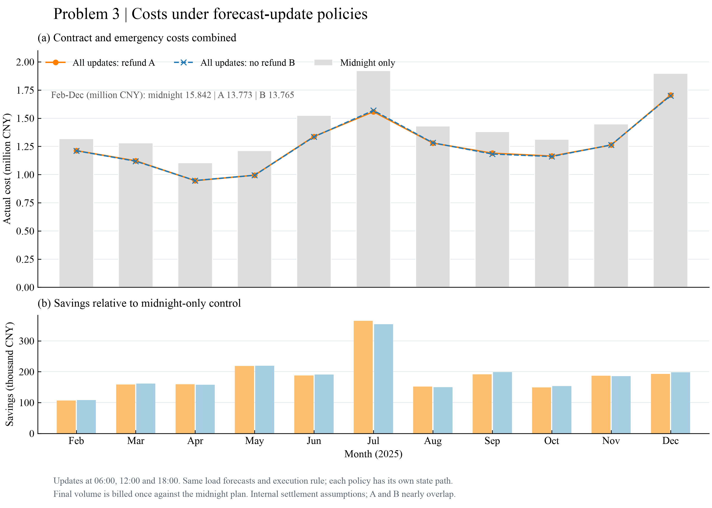

# Part06 问题3：日内更新与PV偏差校正

> 内部装配初稿；未确认口径不作正式提交结论。来源：q3_draft第1—4、7节；innovation_draft第1—4节PV与门槛；新增连续回放

## 6.1 信息更新与承诺规则

问题3每天0、6、12、18点取得未来24小时的整点光伏功率预报。本文沿用统一方案，在每个允许时刻取得实际储电量，优化尚未执行的区间，并执行到下一个允许时刻；合同不能在其他时刻任意重做。光伏使用当前发布版本按既有分段线性积分得到的十分钟电量，只截取到当天24点。首小时左端点按已复核规则使用此前可得版本，不用未来版本补点；原始时间键保持不变。

负荷预测沿用问题2于2月1日冻结的模型类型，每日0点按此前历史重估后保持日内固定。虽然问题2的候选全年表现劣于季节基线，这里不在评价期更换负荷模型。评价仍为2月1日至12月31日334天，共48,096段，各策略从相同的7,268.423164 kWh初态出发，随后各自连续运行。0点计划根据附件3预报重新优化，并非复制问题2购电量。

## 6.2 改购费用模型

对最终执行量$q_t$，令$\Delta_t^+=(q_t-q_t^0)_+$、$\Delta_t^-=(q_t^0-q_t)_+$，$(x)_+=\max(x,0)$。题面关于减购是否退原款存在两种解释：

$$F_A(q_t)=p_tq_t^0+1.5p_t\Delta_t^+-0.5p_t\Delta_t^-,$$
$$F_B(q_t)=p_tq_t^0+1.5p_t\Delta_t^++0.5p_t\Delta_t^-.$$

A表示退取消部分原款、再收50%违约费；B表示原款保留、另收50%违约费。每段按相对0点原计划的最终量结算一次，不累加中间版本目标。例如原量100、价格1，最终120时两者130元；最终80时A为90元、B为110元。先改到120又改回100的最终合同费为100元，此数值只适用于当前一次结算假设，不能推广到逐笔变更都收费的市场。

两种费用均为凸分段线性，可引入$v_t$并最小化其和。A使用
$$v_t\ge0.5p_tq_t^k+0.5p_tq_t^0,\qquad v_t\ge1.5p_tq_t^k-0.5p_tq_t^0;$$
B将第一条替换为$v_t\ge-0.5p_tq_t^k+1.5p_tq_t^0$。B下若$q<q^0$，将$q$提高到$q^0$并处置增加的富余即可保持同一充放电轨迹，费用反而不增，故可限定$q\ge q^0$。这不禁止把上一次超购的承诺降低到原计划。0点目标为$\min\sum p_tq_t^0$；更新目标为$\min\sum_{t\in\mathcal H_k}v_t$。

统一方案中的预计紧急补购在本实现可消去：常规增购没有数量上限，最大边际费1.5p低于紧急5p。把任意正的预计紧急量替换为等量常规增购，守恒和充放电轨迹均不变，目标下降。该支配关系仅限预测规划，不说明实际紧急量为零。

## 6.3 更新机制对照

主实验包括只用0点预报、A/B全更新和A下分别仅6、仅12、仅18点更新，共六组。时刻消融在本次Q3求解前列明，但此前已查看Q2全年结果，因此属于回顾性机制对照，不是未触及测试集上的策略选优。之后增加仅更新实际储能、继续使用0点PV预报的A对照，以区分反馈重规划与新PV信息；该补充在主实验结果之后提出，单独留存，未覆盖原六组。

所有策略保持相同负荷预测方法、物理参数、日终目标定义、执行器和起始实际SOC。不同策略后续SOC、甚至次日0点计划可能不同，这是连续闭环运行的结果；不会每日人为重置为共同SOC。费用比较的附加库存修正为$J-\bar p\eta_d(E_{\rm end}-E_{\rm start})$，它只用于检查末态价值影响，不是实际电网账单。

## 6.4 更新收益与来源

| 策略 | 实际总费/元 | 合同费/元 | 紧急费/元 | 紧急量/kWh | 相对0点节省/% | 期末储电/kWh |
| --- | --- | --- | --- | --- | --- | --- |
| 只用0点预报 | 15,842,067.99 | 12,281,584.60 | 3,560,483.39 | 574,236.05 | 0.000 | 4,391.08 |
| 6/12/18全更新 A | 13,772,880.06 | 13,053,598.95 | 719,281.11 | 125,345.25 | 13.061 | 7,173.09 |
| 6/12/18全更新 B | 13,765,041.25 | 13,065,826.78 | 699,214.47 | 121,548.11 | 13.111 | 7,144.64 |
| 仅6点更新 A | 15,167,392.95 | 12,656,594.48 | 2,510,798.47 | 394,008.18 | 4.259 | 4,453.85 |
| 仅12点更新 A | 15,067,335.84 | 12,418,603.14 | 2,648,732.70 | 438,816.90 | 4.890 | 4,562.33 |
| 仅18点更新 A | 14,167,394.07 | 13,037,729.42 | 1,129,664.65 | 211,441.86 | 10.571 | 7,149.11 |
| 只反馈储能状态 A | 13,934,357.97 | 13,120,798.33 | 813,559.64 | 143,574.44 | 12.042 | 7,142.85 |

以上为2025年2—12月累计实际费用，不是完整365天的账单。全更新A相对仅0点节省2,069,187.93元（13.061%），紧急量减少78.17%。原六策略共5,010次MILP、288,576个实际区间；补充对照再增加1,336次MILP及48,096个区间。

A的合同费比0点基线增加772,014.35元，但紧急费减少2,841,202.28元，净节省来自用较便宜的合同调整代替部分5倍价紧急电。A全年0点原计划费12,287,868.65元，增购项960,461.74元，减购净调整项-194,731.44元；相加得到合同费，并非把每版规划目标再次加入账单。

B实际总费比A低7,838.81元，差异仅约0.057%。B合同费反而高12,227.83元，紧急费低20,066.64元。B保持更多原承诺，产生不同的储能和富余轨迹；该闭环结果不违背相同q、q0下A费用不高于B，也不能据此证明不退款规则优于退款。两种费用解释都需保留。

若只允许一次日内更新，A下18点对照节省1,674,673.92元，优于本次6点和12点对照。三次全更新相对仅18点仍节省394,514.01元。但18点操作同时获得实际SOC，因此不能把全部效果归于18点PV预报。

补充控制给出更严格的分解：只反馈储能状态费用13,934,357.97元，相对只用0点节省1,907,710.02元；再刷新PV预报进一步节省161,477.91元，相对该控制为1.159%。在这三条连续策略路径的数值比较中，状态反馈控制已经取得总节省的92.20%。这是一组回顾性控制比较，不是普遍可加的因果贡献率。

是否引入其他时刻预报：在题设不计获取和通信开销、当前执行器及费用解释下，新预报带来额外正收益，支持纳入日内重规划；不能把13.06%的全部收益宣称为纯信息价值。实际采用前还需结合预报/通信成本、延迟、储能寿命费以及结算规则确认。单一时刻结果说明18点重规划很有价值，尚不能单独证明18点PV信息最有价值。

以下预测误差是求解后，针对相同剩余区间比较当前版本与0点旧版本，未回流训练或改购决策；不同发布时刻的剩余区间不同，不跨行直接比较谁“最好”。

| 发布时刻 | 同一剩余时域段数 | 0点旧预报MAE/kWh | 新预报MAE/kWh | 旧RMSE/kWh | 新RMSE/kWh |
| --- | --- | --- | --- | --- | --- |
| 00:00 | 48096 | 34.44 | 34.44 | 64.80 | 64.80 |
| 06:00 | 36072 | 45.50 | 30.02 | 74.75 | 47.82 |
| 12:00 | 24048 | 38.47 | 17.60 | 70.25 | 30.31 |
| 18:00 | 12024 | 2.64 | 2.65 | 10.46 | 10.09 |

Q2已冻结选中策略费用16,333,683.39元；本题仅0点预报策略为15,842,067.99元。该差额同时包含光伏预测源变化及随后状态路径差异，作为背景呈现，不将其混入日内更新净收益。问题2季节基线15,378,207.35元及原候选退化证据继续保留。七策略库存修正后的排名与原始账单排名一致：6/12/18全更新 B, 6/12/18全更新 A, 只反馈储能状态 A, 仅18点更新 A, 仅12点更新 A, 仅6点更新 A, 只用0点预报。库存修正仅作期末残值敏感性参照，不计入上述账单。

## 6.5 将PV校正写入原模型

在原有MILP前增加可追溯的预报偏差校正，不改变合同目标或实际执行器。对发布小时 $h\in\{0,6,12,18\}$，以当天0点前已完成、最近 $W=28$ 日且原始PV预报为正的目标区间估计实际减预报的平均偏差 $\bar r_{h,W}$，并令
$$\widehat G^{corr}_{t|k}=\begin{cases}\max(0,\widehat G^{raw}_{t|k}+\bar r_{h,W}),&\widehat G^{raw}_{t|k}>0,\\0,&\widehat G^{raw}_{t|k}=0.\end{cases}$$
历史不足时只用可得样本，无样本偏差取零；日内仍以当天0点为训练截止。保留夜间原始零值，不借用未来真实昼夜状态。

2—3月实际运行原始PV策略；3月校准比较选择了28天PV校正，于4月1日起启用。此次补充从2月1日起重新连续运行，3月31日至4月1日不重置SOC；最终334日账单、四个指定日表格和9个月配对效果见Part08。原创新包的分阶段账单作为历史实验记录保留，不能无说明拼接成正式全年策略。

写作贡献可表述为“针对分发布时刻的系统偏差，在因果信息约束下增加简洁预报校正，并用真实账单与连续储能回放检验改进”。不能称为全新优化算法，也不能声称四个发布时刻的预测误差都降低；既有结果仅12/18点误差明显改善，0/6点部分误差指标反而增大。

付费更新门槛在同一软终态条件下增费，故主策略保留正常更新，不以门槛作为成功改进。其公式和反例保留在附录B。

连续部署2—12月的实际成本为13,726,733.57元，原始PV基线13,772,880.06元；校正于4月启用后累计节省46,146.49元。9个月中7个月省费，同时存在122个增费日，收益的稳定范围见Part08。

## 6.6 图形与指定表格

图3-1显示三组主策略的月度实际费用和相对0点节省，A/B曲线接近，不将视觉重合解释为完全相同。图3-2保留四个指定日原承诺与最终有效量的十分钟阶梯，以及实际SOC和紧急量；灰色竖线标出允许更新时刻，实际SOC不被强制重置到0点值。

两图按ModelViz候选召回、真实字段选择、模板适配、执行与技术/实际视觉复核生成，全部英文，300 dpi PNG和SVG并存。模板、输入副本、决策、原图修复历史与哈希在同目录workspace；最终质检文件为final_quality_report.json。图形技术记录中的初始失败和待观察状态是保留的修复证据，不代表最终未验收。

四个指定日原始A策略表见附录A；校正后最终策略表对应 results/robustness/fixed_w28/table*.csv，属于独立完整策略，不混用两者。
