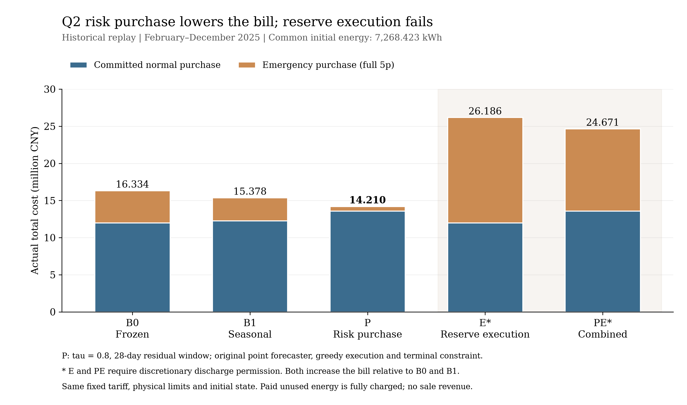
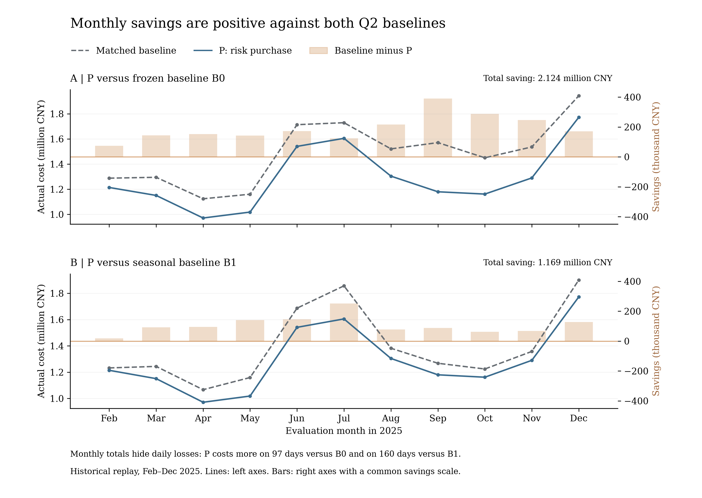

# Q2 紧急购电改进研究与验收报告

本轮已完成研究、实现、334天连续回放、独立验证、消融与有限敏感性。结论是：**预定风险采购 P 在本年度历史回放中同时胜过原冻结策略 B0 和季节性强基线 B1，实际总费用分别减少 2,124,173.55 元（13.0049%）和 1,168,697.51 元（7.5997%）。** 这是一项声明假设下的历史改善，不是未来年度保证。E/PE 库存保护实验失败，完整保留。

研究及结果均位于 `emergency_improvement_v1` 独立目录，未覆盖旧论文、五份 XLSX、旧账本或旧 ZIP，未重算 Q3/Q4，未 commit/push。最终独立审查见 `independent_review.md`；复现入口与包清单见 `README.md`、`package_manifest.csv`。

## 1. 到底省在哪里

以下均为2025-02-01—12-31的334天，同一固定分时电价、同一起始储电量7268.4231640740745 kWh。金额单位为万元；未用的合同电量仍全额付费，紧急价为5p全额，无售电收入。

| 策略 | 普通合同费 | 紧急费 | 实际总费用 | 紧急电量/kWh | 期末储电量/kWh |
|---|---:|---:|---:|---:|---:|
| B0 原冻结策略 | 1198.7832 | 434.5852 | 1633.3683 | 751884.1217 | 2723.6202 |
| B1 季节性强基线 | 1226.3658 | 311.4550 | 1537.8207 | 519849.5915 | 6434.1757 |
| P 预定风险采购 | 1356.7665 | 64.1845 | **1420.9510** | 105682.0882 | 10800.0000 |
| E 条件库存保护 | 1198.8496 | 1419.7056 | 2618.5552 | 3120531.4397 | 3459.2378 |
| PE 条件组合 | 1356.7684 | 1110.2907 | 2467.0591 | 2581410.2734 | 10800.0000 |

精确未舍入值见 `results/emergency_improvement_v1/comparison_all.csv`。原无储能账本的总费用为2002.2731万元、紧急费383.4748万元：再次说明“紧急费比B0低”本身不能证明总费用更优；其原账本副本随包保留。

P相对B0多付普通合同费 **157.9833万元**，但减少紧急费用 **370.4007万元**，净省 **212.4174万元**。相对B1多付合同费 **130.4007万元**，减少紧急费 **247.2704万元**，净省 **116.8698万元**。因此有成本项目之间的转移，但降低的不仅是单项紧急费，最终总账单也下降。

代价也很明确：P的已购未用电从B0的330363.15 kWh增加至1706751.33 kWh；总余电由1427774.16增加至3105041.40 kWh。所有这部分采购成本都已计入账单，没有藏掉。P紧急电量占负荷比例由B0的2.0317%、B1的1.4047%降至0.2856%，紧急发生115天、648段；B0分别为324天、4446段。

图1展示费用组成和失败分支，图2展示逐月差额。图内均为英文，原始月度和逐段数据未经平滑或移动。

## 2. 具体改了什么

P保留B0原来的负荷 OLS（历史28天）和光伏谐波/AR1（历史7天）点预测器，保留原贪心执行、各向效率0.9、母线侧5000kW、SOC1200—10800 kWh及计划首末储电量相等约束。仅在每日午夜，用过去已完成日期的**净负荷预测误差**校准规划净需求。

误差为 `实际负荷−实际PV−(当时发布的预测负荷−预测PV)`。过去28天、同一小时6个相邻十分钟段形成一个168样本池；取预定τ=0.8经验分位数，作为对当天对应时段净需求的修正。负荷/PV原预测不分别取上下分位数；误差联合相减后再取分位数。风险残差窗口与原负荷28天/PV7天训练窗口分别记录。

档案从1月2日起按历史午夜滚动重建，每个误差到次日午夜才可用；少于7个有效历史日时修正为0，一月1日没有预测不填造。主P的2—12月已有完整28日残差窗口，无风险冷启动回退。此档案是遵守历史可得信息的重新发布记录，**不是现实部署当年保存的原生预测日志**。

为何先选0.8：在单时段、无储能、无残值、固定价格、采购量非负的简化模型中，

\[
C(q)=pq+5p\mathbb E[(N-q)_+],\quad C'(q)=p-5p[1-F_N(q)].
\]

连续分布的内点条件给出`F_N(q)=0.8`；等价地少购损失4p、过购损失p，临界分位为4/(4+1)。这是候选的成本依据，**不是完整储能问题的最优分位数证明**。本题的跨期库存、分时价格、弃电、有限样本与执行反馈均超出该简化推导。原始方法依据及BZD适配见 `method_sources_and_bzd_fit.md`；使用的是经验残差分位校准，不冒称已拟合“分位数回归时间序列模型”。

## 3. 为什么结果可信，又不能夸大到哪里

- **基准没有换。** 复制原输入与原函数后，B0/B1全年预测、采购、充放电、SOC和各费用逐段差异均为0。原冻结策略虽逊于B1，仍按原值保留；不存在多解择优或换求解器制造的差额。
- **每个策略运行自己的电池。** 各日真实期初SOC进入当日规划，各策略跨日连续，未借用其他策略中途状态。P期末是10800 kWh，反而高于两基准，改善不是耗尽最后库存所得。
- **正常合同没有日内加购。** 逐日计划单独保存，执行仅使用冻结采购和当前段实际负荷/PV。独立验证器不导入求解器/执行器，重新核算源数据、计划、实际平衡/SOC/限额/互斥/紧急用途以及5p费用、每日和年度汇总。
- **不只有时间戳。** 对完整源数据副本，把1月25日12:00之后全部负荷增加800 kWh、PV乘0.5，重新运行预测→误差池→采购→执行链。5种策略此前1512段决策及当日已冻结计划差异均为0，次日决策有大于860 kWh的阳性响应。独立验证器再次读回两套轨迹检查。这是实质性无前视测试及代码审查证据，不是对所有可能输入的形式证明。
- **完整独立验收通过。** 18条年度路径865728段、5条一月检查12240段、66条压力路径9504段，连同预测/表格/扰动检查共72754385次数值或布尔比较，0失败。最大物理/预测类误差约2.08e-9 kWh，小于1e-6；最大金额/汇总误差约2.91e-11元，小于1e-5。阈值未放宽。
- **旧成果保护与移植复现。** 2837个受保护旧文件哈希一致；另在独立复制工作区重新生成预测并回放P的334天，其ledger文件SHA-256与主P完全相同。见 `portability_validation.json`。

按事先固定的`平均已知电价×ηd×(期末−期初库存)`从账单中扣除做辅助比较，P相对B0/B1节省为2129742.84/1171708.08元，和主账单差额接近。该库存价值仅为比较代理，不是售电收入，也没有修改主要费用指标。

## 4. 成功与失败都保留

2—12月每个月P的总费用都低于两个基准，但逐日并非总赢：对B0为237天省钱、97天更贵；对B1为174天省钱、160天更贵。`daily_costs_and_differences.csv`保留全部334天；`monthly_costs_and_differences.csv`保留全部11个月，没有只摘取有利日期。

E仅改变实际执行方法，日后采购仍按原规划方法随它自己的真实SOC重算，因此不强求逐日采购量和B0相同：用午夜点预测和冻结合同，保护未来价格更高时段的预计缺口所需库存；这允许在电池尚可放电时先用紧急购电补缺。其合法性题面未明确，因此E/PE均为条件分支，即使省钱也不能进入无条件结论。本轮实际上并不省钱：E比B0多985.19万元，PE比B0多833.69万元；PE比P多1046.11万元。

这个具体保护规则过于保守：E有35889段把保护量设到9600 kWh上限，有17226段尚未用尽可放电条件就产生紧急购电。它忽略未来可能补充的盈余，也没有完整权衡当前紧急补购代价。P在E基础上仍可减少151.50万元，但组合费用远高于P，不构成推荐。这里只否定本次明确实现的E，不能据此断言所有因果储能控制都无效。四格消融及交互项见 `ablation.json`。

## 5. 参数、模型口径与压力比较

### 风险参数单因素

| 候选 | τ | 残差天数 | 总费用/万元 | 紧急费/万元 |
|---|---:|---:|---:|---:|
| P_tau07 | 0.7 | 28 | 1423.7797 | 119.4770 |
| **P（预定主候选）** | **0.8** | **28** | **1420.9510** | **64.1845** |
| P_tau09 | 0.9 | 28 | 1456.3149 | 24.6227 |
| P_w14 | 0.8 | 14 | 1414.8049 | 62.1012 |
| P_w56 | 0.8 | 56 | 1419.8433 | 65.4521 |

五种候选均同时低于B0/B1。τ=0.9虽把紧急费再降39.5618万元，却让总账单比P增加35.3639万元；其已购未用电达到2616350 kWh（约）。14天窗口比主P少61461.11元，但每小时池只有84个相关样本；56天最多336样本，2月初仅30个历史日。窗口结果是敏感性观察，不把看过的年度结果用于重新宣称事前选优，也不称P为所有参数中的最佳。

### 物理/终态成对比较

仅在同一口径内比较P和对应B0/B1，不把改效率或终态的收益计入主P。

| 共同设定 | P总费/万元 | 比同设定B0省/万元 | 比同设定B1省/万元 |
|---|---:|---:|---:|
| 主设定：各向0.9、母线5000kW、计划终态等于真实初態 | 1420.9510 | 212.4174 | 116.8698 |
| 计划终态固定6000 kWh | 1403.5629 | 223.0008 | 130.1177 |
| 往返0.9对称分配、母线5000kW | 1372.3839 | 224.0476 | 123.6753 |
| 各向0.9、电池内部5000kW | 1420.9848 | 211.0332 | 115.5156 |

这些有限口径未使P与两基准的年度排名反转。它们不是效率×功率×终态全因子，也不替代题意确认；配对期末库存与库存调整差额见 `paired_assumption_sensitivity.csv`。终态固定6000的P期末实际为6528.8552 kWh，没有每日重置实际状态。

### 预测与时间相关性

P总体覆盖率为79.0835%，月度约74.95%—83.94%，不能把名义80%当作保证。τ=0.8 pinball损失由原点预测的26.8611降至16.8845 kWh/段；这支持尾部目标的适配性，不表示点预测MAE一定更低。月/小时覆盖、MAE及十分钟预测跨度诊断分别见 `forecast_coverage.csv`、`forecast_lead_time.csv`；午夜起点下，预测跨度与日内时段一一对应，不能把两者当独立因素。

按每日配对费用差做7/14日循环移动块自助，seed20260911、各2000次。以14日块为例，相对B0节省的95%描述性区间为142.69—282.98万元，相对B1为63.35—183.55万元。7日块同样跨不过0，但这些是单年相关样本条件下的不确定性描述，不能当独立外部验证或未来保证。

### 历史相关误差压力

每个月首日只从此前56天以内已完成的联合误差中，按累计净负荷低估的经验90%/95%选完整日轨迹，保留负荷/PV成对误差与日内顺序；共22情景，B0/B1/P各22条单日条件路径。负PV重构裁切为0，每个情景裁切量3.37—1000.62 kWh，明确保存，没有改原数据。

P在这些情景中的单日紧急费用最大约38997.63元、平均约5450.86元；这仍有尾部损失。由于起点使用每个策略主路径自身当日SOC，这只是各自状态条件下的压力表现，不能据此再计算“公平年度额外节省”或无条件排序。全部来源日、144段轨迹和费用均经过独立重建，详见 `stress/`。

## 6. 计算规模、求解性质和失败记录

冻结18条年度路径，6012次确定性MILP；各次865变量、578约束。年度求解器累计149.731秒、单次最大0.06538秒，包含建模/导出的逐策略总耗时304.346秒；最大报告MIP gap约5.35e-16，求解失败和求解回退均为0。另有一月85次、未来扰动软件检查120次，以及移植P334次MILP；不计为新增年度候选。打包阶段修正总复现入口的依赖顺序后，隔离工作区又实际完成一月68次、因果检查120次MILP及一月独立验收；见 `reproduction_dependency_validation.json`。没有重复运行全部18条年度优化。

这是给定预测、物理模型和终态条件下的数值最优性，不是未知未来下策略全局最优，也没有全知未来调度冒充可执行策略或数学下界。所有求解状态、界、目标、容差与耗时在各运行`models_and_solvers.json`，环境和依赖见 `environment.json`、`requirements.lock.txt`。

保留的失败包括E/PE经济负结果、每条预定候选、97/160个负收益日、单元测试预期red，以及独立审计在敏感性文件尚未写完时产生的一次中间不完整目录FAIL。最终全量重验通过；中间报告不删、不冒称当时已通过。详细变更见 `change_log.md`。

## 7. 哪些可以写入论文

**可写入终稿的数值结论（须保留前提）：** 在现有时间与物理工作口径下，预定净负荷残差风险采购在同周期、同初态、同5p结算的2025年历史回放中，相对B0/B1总费用降低13.0049%/7.5997%；独立物理和账单检查通过；代价是更多普通采购及已购未用电；主P并未改变执行器或终态条件。

**只能写作探索性结果：** 14日窗口较28日更低、其他物理/终态口径配对结果、移动块区间、历史压力、E/PE失败机制；不能将已看过的年度重新命名为盲测，不能称全面稳健、全局最优或长期一定省钱。

**仍待确认：** 原标签为区间终点、功率视为区间平均、区间实际信息即时平衡、90%单向/往返与5000kW侧别等题意口径；E合法性未获明确确认。尚无第二年度/站点数据，分位池相关性与季节漂移仍在。五份旧工作簿和正式候选论文未更新，本补充不是正式提交版。

Q4-2只建议在另行授权后迁移：保持因果价格信息，重新检查误差与价格依赖以及经济分位是否仍合理，按Q4-2同分支成对回放并验证。不得把本Q2节省量直接搬给Q4，也不改变Q3/4-3已交付结果。
