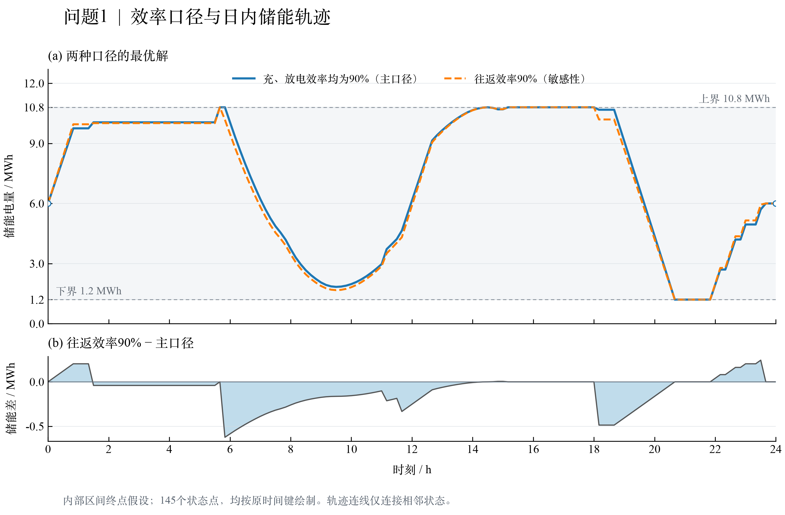
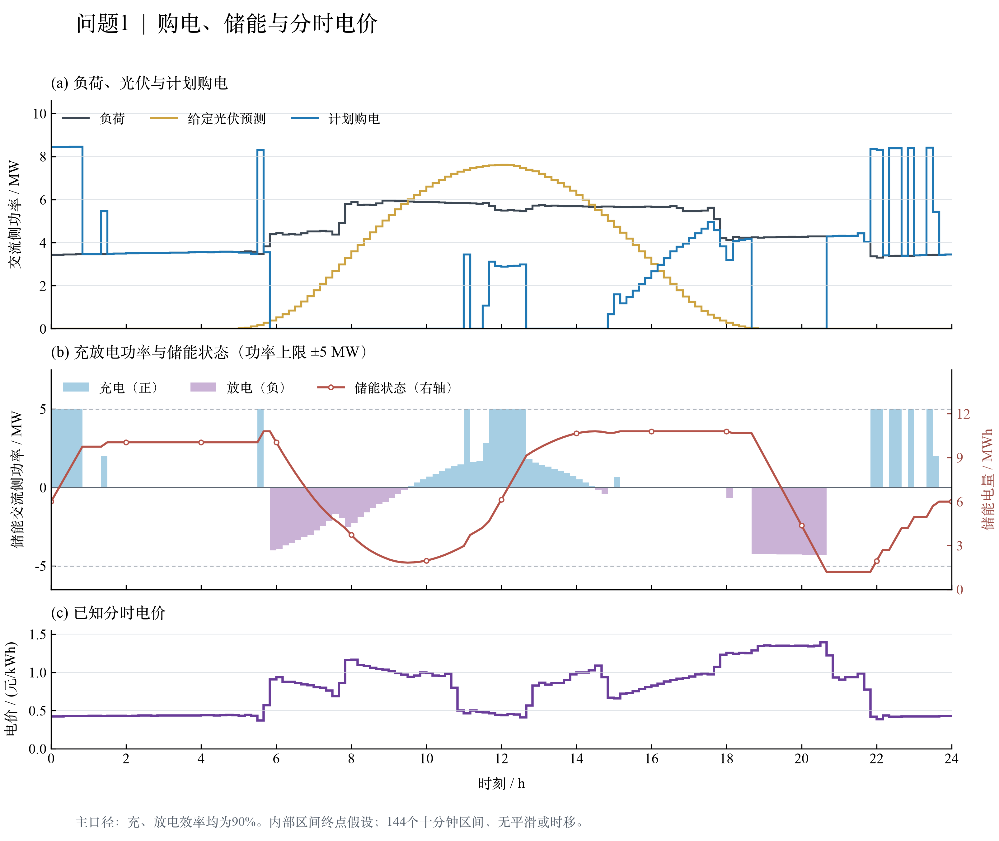
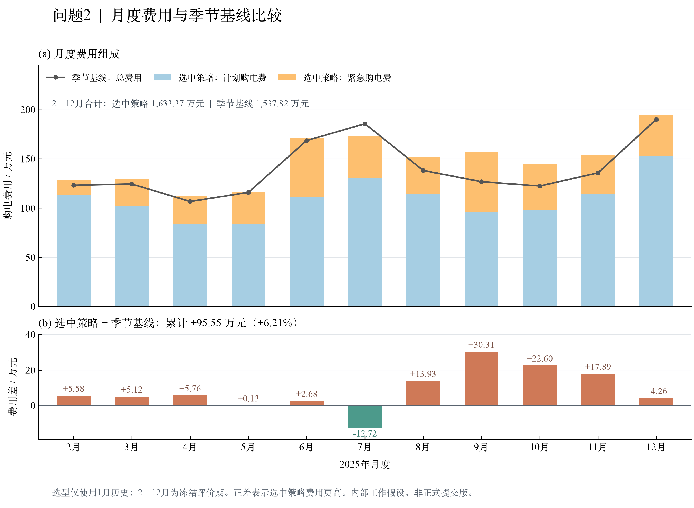
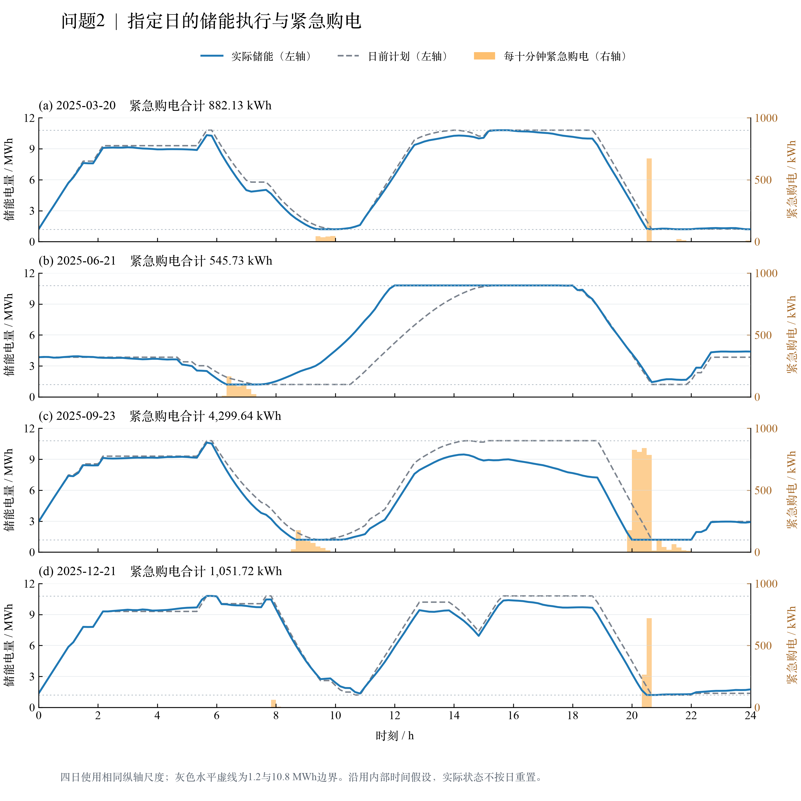

# 问题1、问题2图表改版记录

按用户指定的 `modelviz-skill` 重做四张图。当前论文初稿、Q1/Q2结果说明已引用本版；原图及问题1冻结包保持原样。所有图仍基于**内部区间终点工作假设，非正式提交版**。本轮只重绘、更新引用和核验，未重新求解或改变原有成本结论。

## 图表总览

| 图 | 模板 | 输出 |
|---|---|---|
| Q1效率口径与储能轨迹 | 12_TRD_004 复合时间序列；蓝橙双曲线与辅助差值 | [PNG](figures/modelviz_v2/battery_states/outputs/chart.png) · [SVG](figures/modelviz_v2/battery_states/outputs/chart.svg) |
| Q1购电、储能与电价 | 12_TRD_001 储能容量/功率双轴柱线；增加供需与电价面板 | [PNG](figures/modelviz_v2/dispatch/outputs/chart.png) · [SVG](figures/modelviz_v2/dispatch/outputs/chart.svg) |
| Q2月度费用与基线比较 | 12_TRD_004 柱线组合；辅助差值独立面板 | [PNG](figures/modelviz_v2/monthly_costs/outputs/chart.png) · [SVG](figures/modelviz_v2/monthly_costs/outputs/chart.svg) |
| Q2四个指定日执行 | 12_TRD_001 状态曲线/紧急购电双轴，四日相同尺度 | [PNG](figures/modelviz_v2/representative_execution/outputs/chart.png) · [SVG](figures/modelviz_v2/representative_execution/outputs/chart.svg) |









## 数据与表达

- Q1状态图使用两种效率下各145个原始状态点，以 `minute` 键对齐；保留两条曲线及其差值。曲线仅连接相邻真实状态，未做平滑或插值。
- Q1调度图使用原144个十分钟区间。电量乘6转换为平均功率，kW除以1000显示MW；阶梯图严格使用原起止边界。正柱为充电，负柱为放电。
- Q2月度图使用2—12月11行实际账单汇总，元除以10000显示万元。选中策略总费1,633.37万元、季节基线1,537.82万元；累计高95.55万元（6.21%）。保留7月负费用差，未隐藏失败对照。
- Q2指定日图使用3月20日、6月21日、9月23日、12月21日共576个十分钟区间。每幅145个状态点；左轴储能0—12 MWh，右轴每十分钟紧急购电0—1000 kWh，四日尺度一致。
- 全部提供300 dpi PNG与SVG。中文宋体、拉丁文字Times New Roman；没有改变原始结果文件、时间键或模型假设。

## ModelViz流程记录

每张图的 `figures/modelviz_v2/<名称>/workspace/` 保存需求、8个确定性召回候选、真实数据上下文、最终模板选择、列映射、依赖检查、适配代码、执行日志、技术检查及视觉检查。模板均来自实际候选列表：两张复合图采用第8候选，而非机械选排名第一。原始模板与模板目录只读。

当前Codex助手根据实际上下文提供结构化选择、适配代码和视觉判断，通过skill提供的Runnable接口及服务执行校验；没有额外调用模型API，也没有把脚本退出成功冒充视觉通过。初图实际查看后，局部修复了标题重叠及双轴刻度冲突；初图、初始代码、失败检查与修订记录保留在 `repair_versions/`、`first_visual_review.json`、`localized_repair_record.json`。最终PNG已实际查看，视觉意见绑定图片和脚本SHA-256。

skill现有适配服务在额外依赖步骤之前验证依赖名称。本次先用其依赖工具确认CSV/数组库可用，再将适配所需numpy/pandas合并到**项目内的目录副本**。原目录依赖、模板源码/预览哈希及原因见 `template_provenance.json`；未改动skill文件。所有中间文件与缓存均在本工作区。

## 复现与检查

无需重算模型，重绘当前已审阅版本：

```bash
cd /Users/justingao/Documents/CUMCM/C题工作区
PYTHONDONTWRITEBYTECODE=1 .venv/bin/python scripts/plot_results_modelviz.py --question all
PYTHONDONTWRITEBYTECODE=1 .venv/bin/python scripts/verify_modelviz_revision.py
```

`--question q1` 或 `--question q2` 可单独重绘。命令先验证数据、脚本及审阅记录，再重绘并检查PNG与已审阅版本完全一致。`report_q1.py`、`report_q2.py`现已调用这个入口，不会恢复旧版绘图。

从ModelViz服务重新执行已保存的适配决策（本机skill路径已记录）：

```bash
PYTHONDONTWRITEBYTECODE=1 .venv/bin/python scripts/modelviz_revision.py adapt
PYTHONDONTWRITEBYTECODE=1 .venv/bin/python scripts/modelviz_revision.py quality
```

这些命令复用已保存的助手判断，不会自动生成新的语义判断。修改数据或样式后必须重新读取skill、适配并实际查看新图，更新与图片哈希绑定的视觉报告；不能复用旧通过结论。`prepare`用于新一轮准备，不能把它当成对既有版本无副作用的验证命令。

绘图脚本位于 `scripts/modelviz/`，每图目录包含其独立可执行副本。工作流额外依赖版本与绘图库版本见 `figures/modelviz_v2/requirements.generated.txt`。当前系统宋体字体路径用于中文，换平台时须提供可用中文字体并重新视觉检查。

最终核验明细见 [verification.json](figures/modelviz_v2/verification.json)。完整改版材料另存 `deliverables/figures/modelviz_v2.zip`，包含图、绘图数据副本、代码、流程和质检记录、更新后的论文/报告及文件哈希清单；它是旧Q1结果包的绘图补充包，不替代原数值结果包。
