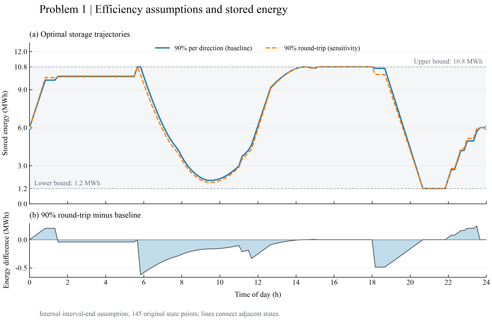
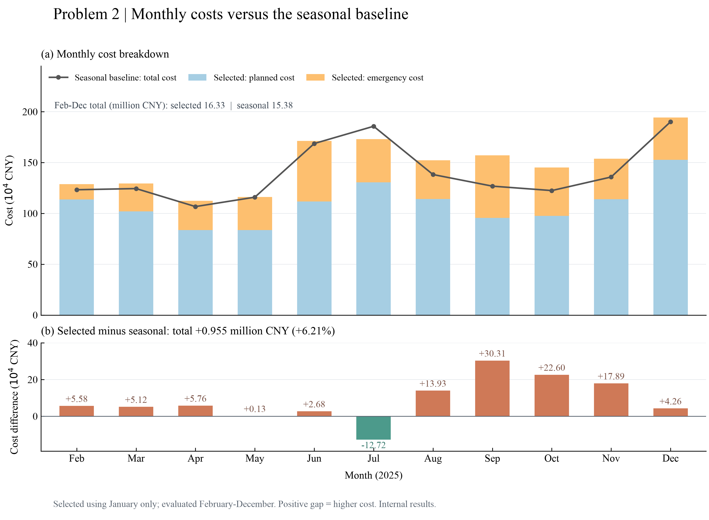
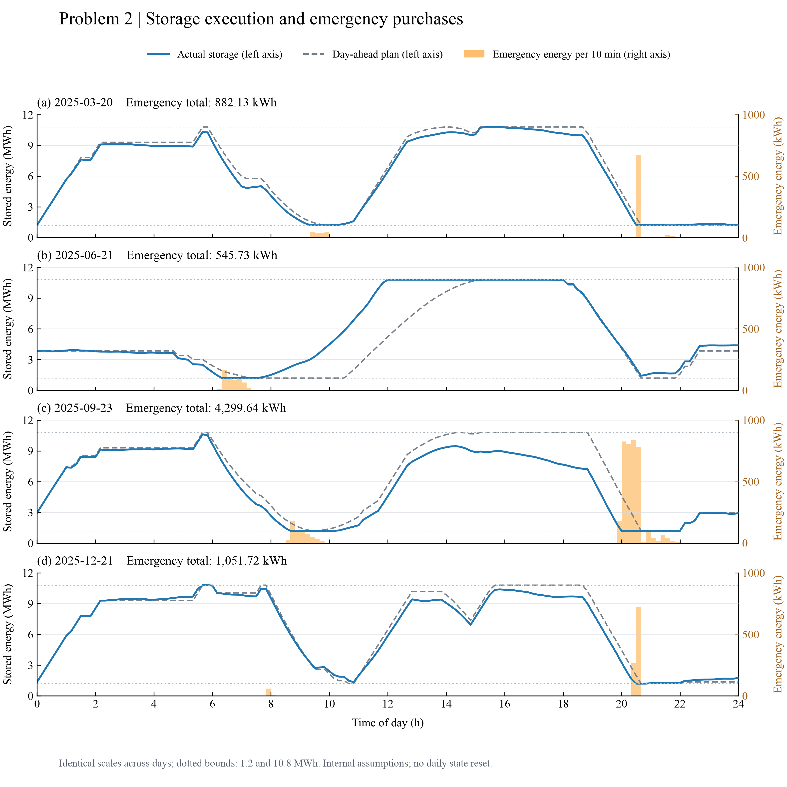

# English-only figures: Problems 1 and 2

All figure titles, axes, legends, annotations, footnotes and month labels are in English. This language revision retains the ModelViz templates, colors, layouts, original time keys and numerical results. The figures use the internal interval-end assumption and are not a formal submission.

| Figure | PNG | SVG |
|---|---|---|
| Efficiency assumptions and stored energy | [PNG](figures/modelviz_v3_en/battery_states/outputs/chart.png) | [SVG](figures/modelviz_v3_en/battery_states/outputs/chart.svg) |
| Grid purchases, storage and electricity price | [PNG](figures/modelviz_v3_en/dispatch/outputs/chart.png) | [SVG](figures/modelviz_v3_en/dispatch/outputs/chart.svg) |
| Monthly costs versus the seasonal baseline | [PNG](figures/modelviz_v3_en/monthly_costs/outputs/chart.png) | [SVG](figures/modelviz_v3_en/monthly_costs/outputs/chart.svg) |
| Storage execution and emergency purchases | [PNG](figures/modelviz_v3_en/representative_execution/outputs/chart.png) | [SVG](figures/modelviz_v3_en/representative_execution/outputs/chart.svg) |








The current paper draft and result reports link to these English-only figures. Earlier versions and the frozen Problem 1 results package are retained as historical records. PNG files use 300 dpi; SVG files are scalable. Typography uses Times New Roman with a DejaVu Serif fallback and requires no Chinese font.

Template selections and data mappings are inherited from the verified ModelViz revision: 12_TRD_004 for the efficiency and monthly cost figures, and 12_TRD_001 for dispatch and representative execution. The same ModelViz adaptation and quality services execute the English revision. The current assistant supplies structured adaptation decisions and records visual assessments only after viewing the actual PNGs. Each assessment is tied to the image and script SHA-256. No external model API is called.

Input copies, provenance, template decisions, dependency checks, executed scripts and quality reports are saved under `figures/modelviz_v3_en/<figure>/workspace/`. Independent checks verify that all original plotted values and time keys are unchanged, numerical totals agree, SVG and plotting code contain no Chinese characters, and all current image links resolve. Details are in [verification.json](figures/modelviz_v3_en/verification.json).

Re-render and verify the reviewed version without solving the models again:

```bash
cd /Users/justingao/Documents/CUMCM/C题工作区
PYTHONDONTWRITEBYTECODE=1 .venv/bin/python scripts/plot_results_modelviz.py --question all
PYTHONDONTWRITEBYTECODE=1 .venv/bin/python scripts/verify_modelviz_revision.py
```

The renderer checks source hashes and rejects changes that require a new visual review. The report generators also use this renderer. All current figure text must remain English, as recorded in the project `AGENTS.md`.

The supplementary archive is [modelviz_v3_en.zip](../deliverables/figures/modelviz_v3_en.zip), with a SHA-256 sidecar and internal file manifest. It contains the figures, plotting inputs, scripts, workflow evidence and updated paper/report copies. It supplements the original numerical results package.
