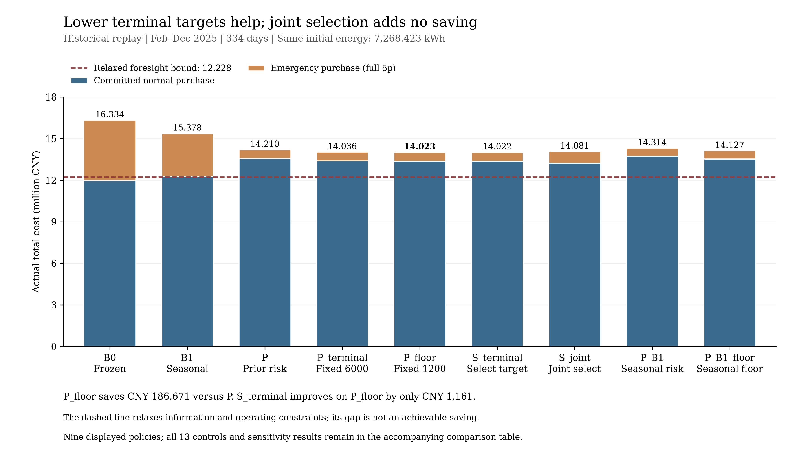
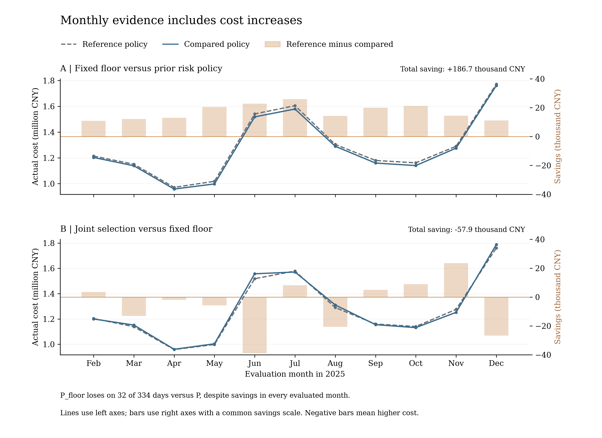

# Q2继续改进研究：库存终态有效，复杂联合选择未胜简单方案

本轮完成九条新策略的334天实际回放，并与原冻结B0、季节性强基线B1、上一轮风险采购P和固定6000终态P_terminal比较。结果支持继续修正库存终态，但不支持把复杂联合选择包装为额外成功。全部方案、负收益和中间候选均保留；这是已看过年度的历史研究，没有新增盲测数据。

## 省了多少

建议把**固定0.8风险校准＋计划终态1200 kWh的P_floor**作为简单的后续验证候选。它的实际总费用为**14,022,838.60元，即1402.28万元**。

| 参照 | 参照总费用（万元） | P_floor节省（万元） | 比例 |
|---|---:|---:|---:|
| B0原冻结方案 |1633.3683|231.0845|14.1477%|
| B1季节性强基线 |1537.8207|135.5369|8.8136%|
| P上一轮风险采购 |1420.9510|18.6671|1.3137%|
| P_terminal已测试6000终态 |1403.5629|1.2790|0.0911%|

新路径中的最低费用是S_terminal的1402.1678万元，只比P_floor再低1160.79元。保留这个最低结果，同时优先解释简单方案，是因为几乎全部收益已被固定低终态捕获；没有证明额外复杂度能在别的年度创造收益。

尤其不能忽略最后一行：相对已经测试的6000终态方案，本次新增节省只有1.28万元；7/14日移动块描述性区间分别为[−4041.22,28068.46]、[−3304.68,27916.37]元，均跨零。不能宣称稳定超越上一轮最好终态对照。

## 为什么费用仍高，策略哪里有问题

之前P把昂贵缺口压下去了，但“每日计划末态等于当日实际初态”会把较高实际库存继续带入计划。P有283个日初达到10800 kWh，平均日初10626.33 kWh；P_floor没有日初满电，均值2330.10 kWh。这里改的是规划附加终态，不是降低电池SOC下限，更不是把实际电池每天重置到1200。

从P到P_floor，普通合同费由1356.7665万元降至1336.1565万元，减少20.6100万元；紧急费反而从64.1845万元升至66.1274万元，增加1.9428万元。相抵后省18.6671万元。因此继续一味追求紧急费最低会偏离目标，少买一些日常冗余电、接受少量额外缺口，在本年反而更便宜。

P已购未用电的计价由95.5094万元降至76.8060万元。这是合同费中的一项分解，不能再加一遍当额外节省，也不能保证把它全部消除而不增加紧急费用。P_floor的普通采购费仍占总费约95.28%，费用大头已经是满足真实用电及储能损耗的日常采购。

为核实量级，我们另外求了明确放松约束的全知LP：它知道全部实际负荷和光伏，允许逐段普通价采购及跨日优化，取消每日计划终态和互斥限制，但仍保留同一电池容量、功率、效率和初态。独立原对偶证书给出的乐观下界为**1222.7565万元**。即使这个比实际政策更有利的模型，成本也仍在千万元级。P_floor与它相差179.5273万元；这是多项放松的合并差额，不能称还能实际省179.53万元，更不等于精确EVPI。

该下界成立的原因是：任一实际账本用g=q+紧急量、w=实际盈余可映射进放松模型，普通价目标不会高于原5p实际账单。LP原对偶目标一致，并由独立脚本另构造弱对偶下界验证；不是把某次全知调度的可行成本随意叫下界。详见论文补充第5节和`results/q2_cost_aware_v2/lower_bound/`。

## 所有候选，包括未成功的路线

原七条路径先冻结协议再运行；费用情景来自此前已完成的整日发布误差，候选分位0.5/0.6/0.7/0.8/0.9，计划终态为当日初态/1200/6000。主方案S_joint从15个可行整日采购计划中，按过去28日情景下“普通费＋原贪心实际补救紧急费−预定库存延续价值”选择。每个情景共用相同采购；情景执行只看当前区间和前一SOC。它是有限库的经验费用选择，没有求完整随机规划最优解。

| 策略 | 实际总费用（万元） | 紧急费（万元） | 较P节省（万元） | 结论 |
|---|---:|---:|---:|---|
| B0 |1633.3683|434.5852|−212.4174|原冻结对照|
| B1 |1537.8207|311.4550|−116.8698|必须保留的强对照|
| P |1420.9510|64.1845|0|上一轮风险采购|
| P_terminal |1403.5629|64.0493|17.3881|已测试固定6000|
| S_tau |1427.1940|92.8898|−6.2430|仅选分位失败|
| S_terminal |1402.1678|66.0044|18.7832|最低样本账单，较简单floor仅少1161元|
| S_joint |1408.0773|84.0832|12.8737|预定主方案未胜两个固定终态对照|
| S_w14 |1402.9849|85.9741|17.9661|14日窗口仍未胜floor|
| S_w56 |1407.0768|83.1358|13.8741|56日窗口仍未胜floor|
| S_no_inventory |1414.7804|98.8638|6.1706|删除延续价值后更贵|
| P_floor |1402.2839|66.1274|18.6671|简单候选，固定1200|
| P_B1 |1431.3828|56.3768|−10.4319|追加季节性风险采购未成功|
| P_B1_floor |1412.7223|58.3631|8.2287|追加季节性floor仍高于原预测floor|

两条P_B1分支是见到主结果后另立协议的有限探索，使用季节性预测自身的发布误差。P_B1虽然紧急费比P少，普通费增加更多，总费反而多10.4319万元；P_B1_floor也比P_floor多10.4384万元。说明较强点预测器不能保证相同风险校准配置下实际成本更优，但不证明季节性预测普遍较差。

消融四格P/S_tau/S_terminal/S_joint表明：仅选终态省18.7832万元，仅选分位增加6.2430万元；联合选择的收益缩至12.8737万元。每条连续轨迹各有自身状态反馈，所以不把这些差额当作同SOC下独立可加的因果贡献。只看联合方案比P便宜，会漏掉简单终态方案早已更好的事实。

S_terminal有295次显式选1200，另16次“等于初态”实际也等于1200，只有23次选较高目标。它与P_floor有20天费用更低、14天更高、300天相同。没有将标签变化次数夸大为有效动态调节。

## 是否靠消耗期末电量赚账面收益

各策略始终沿用同一7268.423164 kWh期初，各自真实连续运行。P末态10800 kWh，P_floor与S_terminal末态1978.550864 kWh，P_terminal末态6528.855166 kWh。用上一轮预先固定的0.6895775元/内部kWh估值作辅助调整后，P_floor较P仍省180588.17元，较P_terminal仍省9652.41元。因而18.67万元大部分不是年末少留电产生的表象；但相对6000终态的新增优势本来就很小。

实际账单完全不扣库存价值。候选得分中的μ=0.38232与辅助年末库存估值是不同用途的参数，文件中分别保存，没有假设售电收入。

## 为什么可信，哪些尚不可信

- 日期覆盖334天×144段，每条路径完整保存预测、选中计划、实际SOC、充放电、紧急量及费用；全部23714个年度候选也保存规划、来源日、逐情景费用与得分。失败日志没有删除。
- 一月6条四日路径共104个候选分别完成独立门槛；主回放9条。四个旧对照与上一轮文件逐个核SHA，未换基线。
- 独立实现不导入生产预测/规划/评分/执行逻辑，重建源预测与方程，检查互斥、供需、SOC、功率、连续性、费用和选优。一月＋年度730375组候选—情景、97243874项比较通过；物理最大差2.03e−9 kWh，费用最大差1.75e−10元，标准仍为1e−6 kWh/1e−5元。MILP最优性依据保存求解器界，独立可行性和目标证据已核，但没有再次重解全部MILP。
- 修改1月25日12:00后的真实未来输入后，原7＋追加2配置各原始/扰动三日，共18条轨迹的更早动作和已冻结采购不变，次日出现响应；情景未来半日扰动也不改变前缀动作。这比仅打印“截止时间”更有证据。
- P_floor对P仍有32个更贵日；对B0、B1分别有89、136个更贵日。对应全11个月仍各有净节省，日亏损没有隐藏。P_floor对P的7/14日块描述性区间分别[14.5091,23.0133]、[14.4156,23.1451]万元；对P_terminal的区间跨零。
- 全部20组主/追加分支重采样和18组终态补充重采样、日/月/小时汇总、6策略指定四日表均独立重核。110条历史尾部压力轨迹只是条件诊断：评分与压力历史重叠、各用自身SOC，不能充当外部稳健性证明。

独立是指另一代理编写的独立数学实现和审读，不是第三方机构认证。原始XLSX没有重新清洗。软件错误已修复并保留先失败证据；不足7日情景的协议回退尚未实现，当前显式停止，但本次无路径触发。BZD复核、修正情况和最终文本绑定见`independent_bzd_review.md`。

## 图与复现入口

图内文字全部英文，modelviz-skill完成真实模板召回、选择、改编、执行和实际图像检查；本地原模板未改。图1展示9条主要对照，完整13行及敏感性仍在上表；图2同时展示正负月份。

[图1 SVG](figures/annual/outputs/chart.svg)；[图2 SVG](figures/monthly/outputs/chart.svg)。图表数据分别由比较CSV和月度CSV精确选列、单位换算，来源SHA与ModelViz质量报告在各图`workspace/`。

复现与文件索引见本目录`README.md`，环境见`environment.json`、`requirements.lock.txt`。数值复现器复制到全新独立目录并拒绝覆盖已有路径；已完成的本年路径不因复现命令被替换。

## 可写入论文与下一步范围

可以写：在明确物理、信息和结算假设下，固定低终态风险采购较B0/B1分别少231.08/135.54万元；较P再少18.67万元，辅助库存调整后仍少18.06万元；主要收益来自降低持续高库存造成的采购支出，而非继续压低紧急费。可以把复杂联合选择、季节性追加未胜简单方案作为负结果。可以说明全知扩域LP下界及其有限含义。

不能写：P_floor是全局最优、已稳定超过6000终态、明年保证同幅节省、所有179.53万元下界差都可收回，或本轮有独立盲测。当前的合理研究优先级是取得新年份后验证1200/6000等少量冻结终态，并改进只用过去数据估计的跨日库存价值；不在同一年度继续无边界调参。若将来研究更自由储能执行，先确认题意允许。本轮不自行启动问题3—4，旧论文、正式XLSX和旧结果包均保留，无commit/push。
