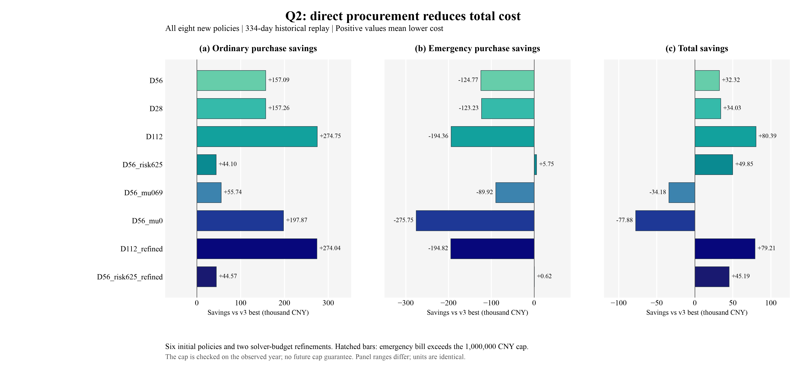
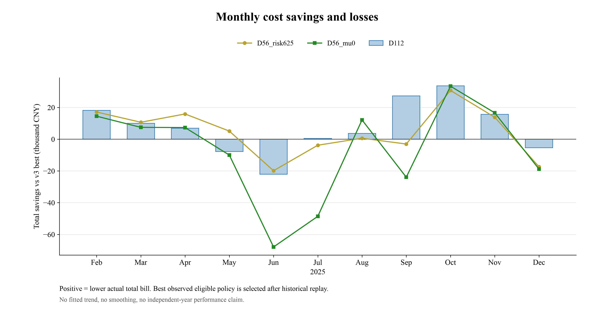

# Q2继续降费研究：直接采购与更充分搜索

本轮最低历史总费用为 **13,913,892.48元**，紧急费用 **838,655.45元**，低于用户100万元上限，余量 **161,344.55元**。比上轮v3最佳再省 **80,389.78元（0.5744%）**。不能称“已经降到极限”：这是八条明确研究路径中的历史最低值，非所有因果策略的最优解。

## 1. 省在哪里，为什么普通费用仍高

D112比v3少付普通费用274,753.07元，同时多付紧急费194,363.29元，净省80,389.78元。因此最低总费方案确实增加了紧急费用；它符合后续明确的100万元上限，但不符合较早的“紧急费完全不能再升”。这项取舍公开列示。

若仍希望紧急费也下降，D56_risk625总费13,944,430.74元、紧急费638,539.01元；比v3总费少49,851.51元，紧急少5,753.16元。它比最低总费D112多花30,538.26元，紧急费少200,116.44元。

334天源负荷约3700.81万kWh，D112仍须采购2099.94万kWh正常电，普通费1307.52万元，平均总费约4.17万元/天。因此“大额”本身不能证明模型出错。更有意义的是已付却未用普通电费：从v3的614,122.14元降至426,220.36元，减少187,901.77元。这是账目分解，不是独立可相加的因果贡献：减少采购会同时影响后续库存、紧急和弃电；剩余未用电也不能事后精准删除再称因果节省。

## 2. 做了什么，哪些约束没有改变

之前把每小时净误差分位数加入点预测，再解确定性采购。现在直接选择144维非负合同q：用过去完整日的净误差情景，逐段运行原严格贪心电池，最小化普通费、加权情景紧急费与末态价值代理的和。每个情景共享同一q，没有自由前视调度。预测器仍是B0；每日00:00冻结，.9/.9效率、SOC1200—10800kWh、833.333333kWh/段功率限制、紧急全额5p且只补负荷缺口均保持。

本轮公开移除了旧附加的“名义预测全天无紧急缺口”和“规划末态固定1200”限制，仅旧MILP起点保留它们；这些不是题面硬条件。最终名义回放缺口列forecast_emergency_kwh用于诊断，不是额外实际交易。直接法同时改变目标与候选空间，不能把全部收益单独归因于“去掉一个终态条件”。段内自动平衡、区间末观测与原时间映射仍为工作假设。

## 3. 全部结果与敏感性

同2025-02-01—12-31、48096段、相同期初7268.4231640740745kWh，各策略之后用自己的真实状态连续运行。B0/B1是原冻结策略和季节性强基线；四个基准副本已独立从源数据核验。

| 策略 | 普通费用/万元 | 紧急费用/万元 | 总费用/万元 | 比v3节省/元 | 紧急≤100万元 |
|---|---:|---:|---:|---:|:---:|
| B0 | 1198.7832 | 434.5852 | 1633.3683 | -2339401.13 | 否 |
| B1 | 1226.3658 | 311.4550 | 1537.8207 | -1383925.09 | 否 |
| P_floor | 1336.1565 | 66.1274 | 1402.2839 | -28556.34 | 是 |
| X_strong_morning85 | 1334.9990 | 64.4292 | 1399.4282 | 0.00 | 是 |
| D56 | 1319.2900 | 76.9065 | 1396.1965 | 32317.63 | 是 |
| D28 | 1319.2732 | 76.7524 | 1396.0256 | 34026.38 | 是 |
| D112 | 1307.5237 | 83.8655 | 1391.3892 | 80389.78 | 是 |
| D56_risk625 | 1330.5892 | 63.8539 | 1394.4431 | 49851.51 | 是 |
| D56_mu069 | 1329.4245 | 73.4216 | 1402.8461 | -34178.99 | 是 |
| D56_mu0 | 1315.2124 | 92.0040 | 1407.2164 | -77881.59 | 是 |
| D112_refined | 1307.5951 | 83.9116 | 1391.5067 | 79214.88 | 是 |
| D56_risk625_refined | 1330.5423 | 64.3673 | 1394.9096 | 45186.51 | 是 |

D56是事先主候选，W=56、κ=5、μ=.38232；D28/D112只改变情景历史窗；D56_risk625只增大规划紧急权重至6.25；mu069/mu0只改变末态价值。.6895775与0均没有改善v3，mu0虽然少买普通电但真实紧急费更高，总费反而增加，否定“越不保守越好”的简单说法。W=112在这些离散点中最低，不表示连续窗口都优于其他值或未来季节仍最优。

看到初轮结果后，另冻结refinement_protocol.md，仅给D112和D56_risk625更多搜索预算（180→1200次迭代、1600→10000次评估上限）。二者真实费用分别比原配置增加1,174.90元和4,665.01元。初轮与追加协议、结果、失败、停止原因均保留。更多搜索不是继续省费的充分条件。

## 4. 为什么账目可信，结论可信到哪里

新策略8×334天，2672次MILP起点，5344次双起点局部搜索，16032个保存候选、1014762个候选—日情景配对。优化器内部1624651次目标评估，另有16032次候选重评，合计1640683次目标核调用；优化器success 2533次、非success 2811次。最大一次搜索0.1798秒、累计127.01秒；初始化MILP最大0.0722秒、累计65.22秒。耗时依赖本机/并行负载，不是通用性能保证。success不是非光滑问题的最优性证书；非success保留当前最好已评估点，不伪装收敛，也不凭它证明效果。

独立验证器不导入生产预测器、执行器、场景费用核或梯度代码，重建发布预测、情景来源、六候选费用、完整MILP起点、实际贪心、冻结合同和账单。物理阈值1e-6kWh，账单核对1e-5元；业务100万元上限使用未舍入值严格比较。C反向导数与独立前向导数差约1.78e-15，离折点中心差分最大误差3.60e-7；不把折点的分支导数称唯一梯度。

将Jan25 12:00以后原负荷加800kWh、光伏乘.5，并从原始前缀重建预测/候选/执行。8种配置的更早216段差约9.09e-13，前两日采购和全部候选证据不变，次日有阳性响应。这是有意义的未来扰动测试，不能替代对所有输入的形式化无泄漏证明。另在全新目录重新编译C核、重跑最佳D112完整334天并独立核验，结果见portability_validation.json。

## 5. 没有隐藏的坏月份与库存效应

D112相对v3：250天总费更低、84天更高；8个月获益、3个月亏损；紧急费有68天、7个月更高。7/14日循环块各2000次（seed20260915）的总节省95%描述区间分别为7日块区间[-11.58, 23.06]万元；14日块区间[-11.03, 23.62]万元，均跨零。不得写成统计显著、未来必胜或未来紧急费必不超过100万元。整年已被多轮查看，连新八配置的最终选择也受历史结果影响；这不是盲测，重采样没有消除方法选择偏差。

D112期末3139.663254kWh，高于v3的2441.729981kWh。按事先固定ν=.6895775元/kWh辅助计价后，节省为80,871.06元，故本轮最低值并非靠多耗尽期末库存。库存价值只是统一比较口径，不是售电收入；真实账单不减该项。

图1把普通、紧急、总费分开，负值表示更贵；图2保留每月亏损。图内均英文，数据直接来自analysis_all；完整modelviz模板召回、选择、适配与技术/视觉核验记录随包保存。

## 6. “极限”目前能回答什么

全知LP证书对应同一2025-02-01至12-31的334天（不是365天），相同期初7268.4231640740745kWh，无每天日末等式，周期期末自由但须在1200—10800kWh范围。其原始值和对偶下界均为12,227,565.30317241元；独立检查同一采购量在原严格贪心执行下也达到该费用，数值误差内无紧急，因此可确认该具体334天全知问题的最优值。LP原SOC与贪心SOC最多相差9600kWh，不能将LP原调度冒充贪心轨迹。

对任一真实可行轨迹，将正常+紧急电映射为LP同价购电、复制原充放电和库存，则LP费用不高于原正常+5p紧急账单，故该放松是下界；再有同成本的严格贪心可行解，得到该全知问题的上下界闭合。它依赖本轮固定物理/结算/全年末态可在范围内的口径。

当前D112距它还差1,686,327.18元。这不是保证还能省的金额，也不是已经计算出EVPI：因果策略族的最优值未知，全年未来先知不能投入日前决策。继续寻找更好的预测、条件情景、跨日库存价值可能有空间，但本轮证据不能支持继续承诺具体金额。真正检验下一轮方法，需要新增未参与研究的时间段或数据，而不是反复挑这一年的最低数字。

## 7. 可入论文与保留意见

可以写：在明确工作假设和同周期实测回放下，D112相对B0省2,419,790.91元（14.81%）、相对B1省1,464,314.87元（9.52%），相对v3进一步节省80,389.78元；真实紧急费83.87万元满足本次年度上限。可以写双初值历史场景直接采购、完整独立核验、负结果与期末库存比较。

不能写：Q2全局最优、降到极限、未来年保证、显著改善、完全不增加紧急费、剩余168.63万元可全部实现、SOC触底比例是容量不足的因果贡献率。Q3/Q4没有重算；这些文件是研究补充，不是正式提交或旧XLSX的替代品。来源与适配边界详见method_fit_and_sources.md；论文补充见papers/q2_direct_v4/paper_supplement.md。
