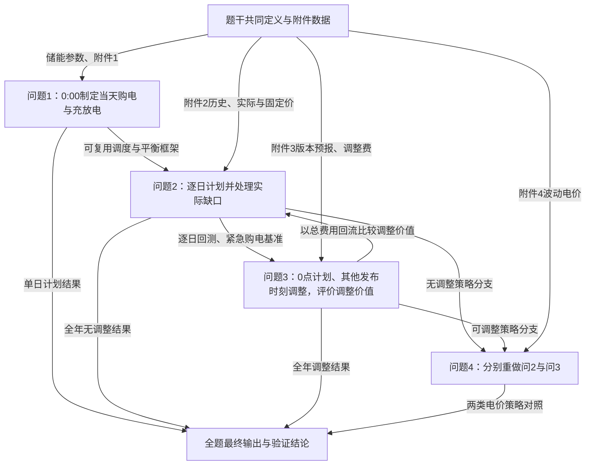

# C题 微网与外部电网电力调控策略

## 1. 整题概览

来源：`CUMCM2026Problems/C题/C题.pdf`，以“C题 微网与外部电网电力调控策略”为实际题名锚点。逐句原文据本地题面提取，保留换行以便追溯；跨页排版换行合并，不改实质内容。

对象是光伏、负载、储能与外网购电。问题1做确定信息下的一日计划；问题2增加负载光伏变化和5倍紧急电价；问题3利用每日四次光伏预报调整并计违约费用；问题4将两套策略转入波动电价。统计预测的价值须通过可行储能调度与实际费用证明，不能止于预测指标。

审计说明：排除题名前竞赛名称、格式提醒和页码。标题、表格字段和公式块也作为独立实质单元计数；同一句中的连续要求不因换行拆散。

## 2. 逐句题意翻译与联动表

| 编号 | 题干原句 | 通俗而精确的翻译 | 明示条件/数据 | 隐含建模信号 | 与前后内容的联动 | 漏读后果 | 后文必须出现的证据 | 来源页码/位置 |
| --- | --- | --- | --- | --- | --- | --- | --- | --- |
| C001 | C 题  微网与外部电网电力调控策略 | 题名规定本题研究对象与最终任务。 | C 题 微网与外部电网电力调控策略 | 需要在模型或交付中落实：研究范围与题名一致 | 相关问题；见第4节输入表 | 偏离题目任务 | 研究范围与题名一致 | 主PDF顺序单元1 |
| C002 | 微网是为解决光伏发电等分布式能源本地消纳， 减少并网问题而快速发展起来的小型发 用电系统。 | 研究小区微网中的光伏、负载、储能与外网交换。 | 微网是为解决光伏发电等分布式能源本地消纳， 减少并网问题而快速发展起来的小型发 用电系统。 | 需要在模型或交付中落实：系统能量边界 | 相关问题；见第4节输入表 | 漏掉储能状态 | 系统能量边界 | 主PDF顺序单元2 |
| C003 | 出于经济方面的考虑， 非孤岛式微网可在外部电网（以下简称外网）电价较低或 分布式能源有剩余电量的时间段，为储能设备充电，并在外网电价较高的时间段释放电能。 | 可以低价或光伏富余时充电、高价时放电，但受容量、功率、效率约束。 | 出于经济方面的考虑， 非孤岛式微网可在外部电网（以下简称外网）电价较低或 分布式能源有剩余电量的时间段，为储能设备充电，并在外网电价较高的时间段释放电能。 | 需要在模型或交付中落实：电价与储能协同 | 相关问题；见第4节输入表 | 只按电价高低贪心 | 电价与储能协同 | 主PDF顺序单元3 |
| C004 | 微网与外网的调控目的是：利用小区负载、 光伏发电量和储能设备的当前储电量等数据， 尽可能精准地给出微网的购电量和储能设备的充放电量，使得微网提供的电力既能满足小区 的负载，又尽可能节省微网的购电费用。 | 决策是购电与充放电，首先满足负载，再减少购电费用。 | 微网与外网的调控目的是：利用小区负载、 光伏发电量和储能设备的当前储电量等数据， 尽可能精准地给出微网的购电量和储能设备的充放电量，使得微网提供的电力既能满足小区 的负载，又尽可能节省微网的购电费用。 | 需要在模型或交付中落实：电量平衡和费用定义 | 相关问题；见第4节输入表 | 把预测精度当最终目标 | 电量平衡和费用定义 | 主PDF顺序单元4 |
| C005 | 问题 1  若每天的电价和小区负载相同，同时给出光伏发电功率一天的预测数据，要求 微网提供的电能不可低于小区负载，且储能设备在 0:00 和 24:00 的储电量相同。 | 问题1每天价荷相同且已给当日光伏预测，供电足额，明确要求日首末储量相等。 | 问题 1 若每天的电价和小区负载相同，同时给出光伏发电功率一天的预测数据，要求 微网提供的电能不可低于小区负载，且储能设备在 0:00 和 24:00 的储电量相同。 | 需要在模型或交付中落实：0:00计划和日循环约束 | 问题1 | 靠免费耗尽初始电量降低费用 | 0:00计划和日循环约束 | 主PDF顺序单元5 |
| C006 | 请在每天 0:00 制定微网当天的计划购电策略的数学模型。 | 所有计划在当天0:00生成，不能使用当天之后真实观测。 | 请在每天 0:00 制定微网当天的计划购电策略的数学模型。 | 需要在模型或交付中落实：决策时刻信息集 | 相关问题；见第4节输入表 | 未来信息泄漏 | 决策时刻信息集 | 主PDF顺序单元6 |
| C007 | 根据附件 1 和附录 1 中的数据，给出具体的计划购电策略，在论文中以表 1 的格式给出 指定时间段的购电量（单位：kWh）及全天的购电量 （单位：kWh） 和购电费 （单位： 元）， 以表 2 的格式给出储能设备在指定时间段的充放电量及 0:00 和 24:00 的储电量（单位：kWh）， 并将完整的计划购电策略保存到文件 result1.xlsx 中（模板文件见附件 5）。 | 按附件1和储能参数求计划，报告指定时段、全天购电费和电量、储能首末状态，并填result1。 | 根据附件 1 和附录 1 中的数据，给出具体的计划购电策略，在论文中以表 1 的格式给出 指定时间段的购电量（单位：kWh）及全天的购电量 （单位：kWh） 和购电费 （单位： 元）， 以表 2 的格式给出储能设备在指定时间段的充放电量及 0:00 和 24:00 的储电量（单位：kWh）， 并将完整的计划购电策略保存到文件 result1.xlsx 中（模板文件见附件 5）。 | 需要在模型或交付中落实：表1、表2及result1.xlsx | 相关问题；见第4节输入表 | 只有最优目标值没有策略 | 表1、表2及result1.xlsx | 主PDF顺序单元7 |
| C008 | 表 1  微网在指定时间段的购电量及全天的购电量和购电费 | 该表规定论文中必须展示的结果类型；具体行列见紧随的数据单元。 | 表 1 微网在指定时间段的购电量及全天的购电量和购电费 | 需要在模型或交付中落实：对应论文结果表 | 相关问题；见第4节输入表 | 遗漏指定表 | 对应论文结果表 | 主PDF顺序单元8 |
| C009 | 时间段 购电量 时间段 购电量 时间段 购电量 10:00-10:10  12:00-12:10  14:00-14:10 16:00-16:10  18:00-18:10  20:00-20:10 全天购电量  全天购电费 | 逐行列保留原表的时间、距离、日期及结果字段；空格是待填数据，不是零。 | 时间段 购电量 时间段 购电量 时间段 购电量 10:00-10:10 12:00-12:10 14:00-14:10 16:00-16:10 18:00-18:10 20:00-20:10 全天购电量 全天购电费 | 需要在模型或交付中落实：表中全部指定行列和单位 | 相关问题；见第4节输入表 | 把空白当零或漏掉终止/汇总行 | 表中全部指定行列和单位 | 主PDF顺序单元9 |
| C010 | 表 2  储能设备在指定时间段的充放电量及 0:00 和 24:00 的储电量 | 该表规定论文中必须展示的结果类型；具体行列见紧随的数据单元。 | 表 2 储能设备在指定时间段的充放电量及 0:00 和 24:00 的储电量 | 需要在模型或交付中落实：对应论文结果表 | 相关问题；见第4节输入表 | 遗漏指定表 | 对应论文结果表 | 主PDF顺序单元10 |
| C011 | 时间段 充电量 放电量 时间段 充电量 放电量 0:00-4:00   4:00-8:00 8:00-12:00   12:00-16:00 16:00-20:00   20:00-24:00 0:00 储电量  24:00 储电量 | 逐行列保留原表的时间、距离、日期及结果字段；空格是待填数据，不是零。 | 时间段 充电量 放电量 时间段 充电量 放电量 0:00-4:00 4:00-8:00 8:00-12:00 12:00-16:00 16:00-20:00 20:00-24:00 0:00 储电量 24:00 储电量 | 需要在模型或交付中落实：表中全部指定行列和单位 | 相关问题；见第4节输入表 | 把空白当零或漏掉终止/汇总行 | 表中全部指定行列和单位 | 主PDF顺序单元11 |
| C012 | 问题 2  若每天的电价相同， 而小区负载和光伏发电功率随时间变化，且微网提供的电 能不可低于小区负载，如果低于负载，需向外网紧急购电，其电价是交易时刻电价的 5 倍。 | 问题2负载和光伏随时间变，缺口须紧急购电且单价为当时电价5倍。 | 问题 2 若每天的电价相同， 而小区负载和光伏发电功率随时间变化，且微网提供的电 能不可低于小区负载，如果低于负载，需向外网紧急购电，其电价是交易时刻电价的 5 倍。 | 需要在模型或交付中落实：预测误差下供需平衡 | 问题2 | 当日实际数据当已知计划输入 | 预测误差下供需平衡 | 主PDF顺序单元12 |
| C013 | 除紧急购电费用外，其他时间段的购电费用均按计划购电量计算。 | 基础购电按计划量收费，不能把事后未使用的计划电量无成本删掉。 | 除紧急购电费用外，其他时间段的购电费用均按计划购电量计算。 | 需要在模型或交付中落实：计划与实际结算账本 | 相关问题；见第4节输入表 | 按实际净购电低估费用 | 计划与实际结算账本 | 主PDF顺序单元13 |
| C014 | 请在每天 0:00 制定微网 当天的计划购电策略。 | 所有计划在当天0:00生成，不能使用当天之后真实观测。 | 请在每天 0:00 制定微网 当天的计划购电策略。 | 需要在模型或交付中落实：决策时刻信息集 | 相关问题；见第4节输入表 | 未来信息泄漏 | 决策时刻信息集 | 主PDF顺序单元14 |
| C015 | 根据附件 1 中的电价和附件 2 中的数据，在每天 0:00 制定当天的计划购电策略。 | 所有计划在当天0:00生成，不能使用当天之后真实观测。 | 根据附件 1 中的电价和附件 2 中的数据，在每天 0:00 制定当天的计划购电策略。 | 需要在模型或交付中落实：决策时刻信息集 | 相关问题；见第4节输入表 | 未来信息泄漏 | 决策时刻信息集 | 主PDF顺序单元15 |
| C016 | 在论 文中按表 1 和表 2 的格式给出表 3 中指定日期的结果，按表 3 的格式给出紧急购电的结果， 并将完整的购电策略保存到文件 result2.xlsx 中（模板文件见附件 5）。 | 论文报告四个指定日期的购电与储能及紧急购电，完整策略须全年指定输出范围。 | 在论 文中按表 1 和表 2 的格式给出表 3 中指定日期的结果，按表 3 的格式给出紧急购电的结果， 并将完整的购电策略保存到文件 result2.xlsx 中（模板文件见附件 5）。 | 需要在模型或交付中落实：表1—3与对应Excel | 相关问题；见第4节输入表 | 只做四天忽略全年 | 表1—3与对应Excel | 主PDF顺序单元16 |
| C017 | 表 3  微网在指定日期的紧急购电量 | 该表规定论文中必须展示的结果类型；具体行列见紧随的数据单元。 | 表 3 微网在指定日期的紧急购电量 | 需要在模型或交付中落实：对应论文结果表 | 相关问题；见第4节输入表 | 遗漏指定表 | 对应论文结果表 | 主PDF顺序单元17 |
| C018 | 2025.3.20 2025.6.21 2025.9.23 2025.12.21 时间段 购电量 时间段 购电量 时间段 购电量 时间段 购电量 | 逐行列保留原表的时间、距离、日期及结果字段；空格是待填数据，不是零。 | 2025.3.20 2025.6.21 2025.9.23 2025.12.21 时间段 购电量 时间段 购电量 时间段 购电量 时间段 购电量 | 需要在模型或交付中落实：表中全部指定行列和单位 | 相关问题；见第4节输入表 | 把空白当零或漏掉终止/汇总行 | 表中全部指定行列和单位 | 主PDF顺序单元18 |
| C019 | 问题 3  在每天 0:00、6:00、12:00 和 18:00 可获得未来 24 小时整点的光伏发电功率预 报。 | 所有计划在当天0:00生成，不能使用当天之后真实观测。 | 问题 3 在每天 0:00、6:00、12:00 和 18:00 可获得未来 24 小时整点的光伏发电功率预 报。 | 需要在模型或交付中落实：决策时刻信息集 | 问题3 | 未来信息泄漏 | 决策时刻信息集 | 主PDF顺序单元19 |
| C020 | 可根据 0:00 的预报，制定当天的计划购电策略，也可根据其他时刻的预报，调整购电 策略。 | 0点定初始计划，其他发布时刻可用新信息调整未来策略。 | 可根据 0:00 的预报，制定当天的计划购电策略，也可根据其他时刻的预报，调整购电 策略。 | 需要在模型或交付中落实：计划与调整分别存储 | 相关问题；见第4节输入表 | 覆盖原计划失去结算基准 | 计划与调整分别存储 | 主PDF顺序单元20 |
| C021 | 计划购电量高于调整购电量的部分，违约电价是交易时刻电价的 50%。 | 下调部分违约电价为当时电价50%；退款/仍付原计划款的细节需明确解释。 | 计划购电量高于调整购电量的部分，违约电价是交易时刻电价的 50%。 | 需要在模型或交付中落实：下调结算口径及敏感性 | 相关问题；见第4节输入表 | 默认为无成本取消 | 下调结算口径及敏感性 | 主PDF顺序单元21 |
| C022 | 调整购电量 高于计划购电量的部分，超出部分的电价是交易时刻电价的 1.5 倍。 | 上调超过计划部分单价为当时电价1.5倍。 | 调整购电量 高于计划购电量的部分，超出部分的电价是交易时刻电价的 1.5 倍。 | 需要在模型或交付中落实：上调电量与费用单列 | 相关问题；见第4节输入表 | 与5倍紧急购电混为一谈 | 上调电量与费用单列 | 主PDF顺序单元22 |
| C023 | 总的购电费用包括计划 购电费用、 紧急购电费用和调整购电量的相关费用。 | 总费用须包含基础计划、紧急、调整相关项，避免重复收费或漏算。 | 总的购电费用包括计划 购电费用、 紧急购电费用和调整购电量的相关费用。 | 需要在模型或交付中落实：分项总费用复核 | 相关问题；见第4节输入表 | 只比较某个费用分项 | 分项总费用复核 | 主PDF顺序单元23 |
| C024 | 请在上述条件下， 建立微网当天购电策 略的数学模型。 | 建立能处理滚动预报与非对称调整代价的当天决策模型。 | 请在上述条件下， 建立微网当天购电策 略的数学模型。 | 需要在模型或交付中落实：信息时序与决策关系 | 相关问题；见第4节输入表 | 只预测不调度 | 信息时序与决策关系 | 主PDF顺序单元24 |
| C025 | 根据附件 1 中的电价、附件 2 中的小区负载和光伏发电及附件 3 的光伏发电预报数据， 在每天 0:00 制定当天的计划购电策略，在其他预报时刻制定调整购电策略。 | 所有计划在当天0:00生成，不能使用当天之后真实观测。 | 根据附件 1 中的电价、附件 2 中的小区负载和光伏发电及附件 3 的光伏发电预报数据， 在每天 0:00 制定当天的计划购电策略，在其他预报时刻制定调整购电策略。 | 需要在模型或交付中落实：决策时刻信息集 | 相关问题；见第4节输入表 | 未来信息泄漏 | 决策时刻信息集 | 主PDF顺序单元25 |
| C026 | 请在论文中按 表 1、表 2 和表 3 的格式给出表 3 中指定日期的结果，并将完整的购电策略保存到文件 result3.xlsx 中（模板文件见附件 5）。 | 论文报告四个指定日期的购电与储能及紧急购电，完整策略须全年指定输出范围。 | 请在论文中按 表 1、表 2 和表 3 的格式给出表 3 中指定日期的结果，并将完整的购电策略保存到文件 result3.xlsx 中（模板文件见附件 5）。 | 需要在模型或交付中落实：表1—3与对应Excel | 相关问题；见第4节输入表 | 只做四天忽略全年 | 表1—3与对应Excel | 主PDF顺序单元26 |
| C027 | 请分析是否需要引入其他时刻的预报制定调整购电策 略。 | 需比较是否使用其他预报的经济收益，不能仅以预报更准断言值得调整。 | 请分析是否需要引入其他时刻的预报制定调整购电策 略。 | 需要在模型或交付中落实：有/无调整的同口径对照 | 相关问题；见第4节输入表 | 缺少价值分析 | 有/无调整的同口径对照 | 主PDF顺序单元27 |
| C028 | 问题 4  实际上，外网的电价也是实时波动的。 | 问题4进一步放开外网电价每日固定的假设。 | 问题 4 实际上，外网的电价也是实时波动的。 | 需要在模型或交付中落实：波动电价信息结构 | 问题4 | 仍用附件1固定价 | 波动电价信息结构 | 主PDF顺序单元28 |
| C029 | 请针对波动电价，建立微网当天购电策 略的数学模型。 | 建立能处理实时波动电价的日计划与执行模型；未来电价是否预知需显式说明。 | 请针对波动电价，建立微网当天购电策 略的数学模型。 | 需要在模型或交付中落实：电价可用性假设 | 相关问题；见第4节输入表 | 真实未来电价泄漏 | 电价可用性假设 | 主PDF顺序单元29 |
| C030 | 根据附件 2 中的小区负载和光伏发电、 附件3 中的光伏发电预报和附件 4 中的电价数据， 在波动电价下重新计算问题 2 和问题 3。 | 问题2负载和光伏随时间变，缺口须紧急购电且单价为当时电价5倍。 | 根据附件 2 中的小区负载和光伏发电、 附件3 中的光伏发电预报和附件 4 中的电价数据， 在波动电价下重新计算问题 2 和问题 3。 | 需要在模型或交付中落实：预测误差下供需平衡 | 问题2 | 当日实际数据当已知计划输入 | 预测误差下供需平衡 | 主PDF顺序单元30 |
| C031 | 请在论文中给出相应的计算结果，并将完整购电策 略分别保存到文件 result4-2.xlsx（对应于问题 2）和 result4-3.xlsx（对应于问题 3）中（模板 文件见附件 5）。 | 问题2负载和光伏随时间变，缺口须紧急购电且单价为当时电价5倍。 | 请在论文中给出相应的计算结果，并将完整购电策 略分别保存到文件 result4-2.xlsx（对应于问题 2）和 result4-3.xlsx（对应于问题 3）中（模板 文件见附件 5）。 | 需要在模型或交付中落实：预测误差下供需平衡 | 问题2 | 当日实际数据当已知计划输入 | 预测误差下供需平衡 | 主PDF顺序单元31 |
| C032 | 附录 1  储能设备的参数 | 该附录定义相应问题的数据、参数或测试规则，是题目约束的一部分。 | 附录 1 储能设备的参数 | 需要在模型或交付中落实：按附录适用范围引用 | 相关问题；见第4节输入表 | 漏读附件或跨问误用 | 按附录适用范围引用 | 主PDF顺序单元32 |
| C033 | 储能设备的最大容量为 12000 kWh，最大充放电功率为 5000 kW。 | 额定容量12000 kWh、最大充放电功率5000 kW；功率转每10分钟电量要乘1/6 h。 | 储能设备的最大容量为 12000 kWh，最大充放电功率为 5000 kW。 | 需要在模型或交付中落实：容量与功率同时约束 | 相关问题；见第4节输入表 | 把5000 kW当每步5000 kWh | 容量与功率同时约束 | 主PDF顺序单元33 |
| C034 | 假设 2025 年 1 月 1 日 0:00 的电量为 6000 kWh。 | 仅2025-01-01 0:00给6000 kWh初值，不意味着每日重置6000。 | 假设 2025 年 1 月 1 日 0:00 的电量为 6000 kWh。 | 需要在模型或交付中落实：跨日状态连续 | 相关问题；见第4节输入表 | 每天凭空恢复电量 | 跨日状态连续 | 主PDF顺序单元34 |
| C035 | 为了避免过度充电或放电，在后继的充放电过程中，储能设备 的电量必须保持在 1200-10800 kWh 之间，储能设备的充放电效率为 90%。 | 后续储量须在1200—10800 kWh，效率90%需明确单程/往返口径。 | 为了避免过度充电或放电，在后继的充放电过程中，储能设备 的电量必须保持在 1200-10800 kWh 之间，储能设备的充放电效率为 90%。 | 需要在模型或交付中落实：逐时储量与损耗守恒 | 相关问题；见第4节输入表 | 使用额定全容量或漏效率 | 逐时储量与损耗守恒 | 主PDF顺序单元35 |
| C036 | 附录 2  附件说明 | 该附录定义相应问题的数据、参数或测试规则，是题目约束的一部分。 | 附录 2 附件说明 | 需要在模型或交付中落实：按附录适用范围引用 | 相关问题；见第4节输入表 | 漏读附件或跨问误用 | 按附录适用范围引用 | 主PDF顺序单元36 |
| C037 | 附件 1  提供某天不同时间的电价（单位：元/kWh）、小区负载（单位：kW）和光伏发 电预测功率（单位：kW），表中的 0:00+1 表示第二天凌晨 0:00，即当天 24:00（下同）。 | 附件1价为元/kWh、负载/光伏为kW；0:00+1是当前日24:00，避免日期重复。 | 附件 1 提供某天不同时间的电价（单位：元/kWh）、小区负载（单位：kW）和光伏发 电预测功率（单位：kW），表中的 0:00+1 表示第二天凌晨 0:00，即当天 24:00（下同）。 | 需要在模型或交付中落实：时间索引和单位表 | 相关问题；见第4节输入表 | 多计一天端点 | 时间索引和单位表 | 主PDF顺序单元37 |
| C038 | 附件 2  提供 2025.1.1-12.31 每天不同时间的小区负载（单位：kW）和光伏发电实际功 率（单位：kW）。 | 附件2全年实际负载与光伏是历史/验证观测，不是官方光伏预报。 | 附件 2 提供 2025.1.1-12.31 每天不同时间的小区负载（单位：kW）和光伏发电实际功 率（单位：kW）。 | 需要在模型或交付中落实：历史训练与事后核算划分 | 相关问题；见第4节输入表 | 混淆实际与预报 | 历史训练与事后核算划分 | 主PDF顺序单元38 |
| C039 | 附件 3  提供 2025.1.1-12.31 每天 0:00、6:00、12:00 和 18:00 发布的未来 24 小时整点 的光伏发电功率预报（单位：kW）。 | 所有计划在当天0:00生成，不能使用当天之后真实观测。 | 附件 3 提供 2025.1.1-12.31 每天 0:00、6:00、12:00 和 18:00 发布的未来 24 小时整点 的光伏发电功率预报（单位：kW）。 | 需要在模型或交付中落实：决策时刻信息集 | 相关问题；见第4节输入表 | 未来信息泄漏 | 决策时刻信息集 | 主PDF顺序单元39 |
| C040 | 附件 4  提供 2025.1.1-12.31 每天不同时间的电价（单位：元/kWh）。 | 附件4是全年分时电价，问题4替换固定电价来源。 | 附件 4 提供 2025.1.1-12.31 每天不同时间的电价（单位：元/kWh）。 | 需要在模型或交付中落实：价荷光伏对齐 | 相关问题；见第4节输入表 | 误用固定价 | 价荷光伏对齐 | 主PDF顺序单元40 |
| C041 | 附件 5  结果文件夹 | 相应附件/附录是本段数据或机制来源；须与题干任务一并读取。 | 附件 5 结果文件夹 | 需要在模型或交付中落实：文件及内容来源核验 | 相关问题；见第4节输入表 | 脱离附件凭空建模 | 文件及内容来源核验 | 主PDF顺序单元41 |
| C042 | result1.xlsx  问题 1 的结果文件 | 问题1每天价荷相同且已给当日光伏预测，供电足额，明确要求日首末储量相等。 | result1.xlsx 问题 1 的结果文件 | 需要在模型或交付中落实：0:00计划和日循环约束 | 问题1 | 靠免费耗尽初始电量降低费用 | 0:00计划和日循环约束 | 主PDF顺序单元42 |
| C043 | 在“计划购电量”工作表中保存间隔 10 分钟的购电量（单位：kWh）。 | 计划输出为每10分钟kWh；若输入为功率需积分/区间转换。 | 在“计划购电量”工作表中保存间隔 10 分钟的购电量（单位：kWh）。 | 需要在模型或交付中落实：10分钟电量表 | 相关问题；见第4节输入表 | 直接复制kW | 10分钟电量表 | 主PDF顺序单元43 |
| C044 | 在“充放电量”工作表中保存储能设备在指定时间段的充电量和放电量（单位：kWh）， 及 0:00 和 24:00 的储电量（单位：kWh）。 | 需保留指定时段充放电量与每天首末储量，不能只输出净充电量。 | 在“充放电量”工作表中保存储能设备在指定时间段的充电量和放电量（单位：kWh）， 及 0:00 和 24:00 的储电量（单位：kWh）。 | 需要在模型或交付中落实：储能状态与分项汇总 | 相关问题；见第4节输入表 | 掩盖同时充放电或首末不连续 | 储能状态与分项汇总 | 主PDF顺序单元44 |
| C045 | result2.xlsx  问题 2 的结果文件 | 问题2负载和光伏随时间变，缺口须紧急购电且单价为当时电价5倍。 | result2.xlsx 问题 2 的结果文件 | 需要在模型或交付中落实：预测误差下供需平衡 | 问题2 | 当日实际数据当已知计划输入 | 预测误差下供需平衡 | 主PDF顺序单元45 |
| C046 | 在“计划购电量”工作表中保存 2025.2.1-12.31 每天 0:00 制定的间隔 10 分钟的计划购 电量（单位：kWh）。 | 所有计划在当天0:00生成，不能使用当天之后真实观测。 | 在“计划购电量”工作表中保存 2025.2.1-12.31 每天 0:00 制定的间隔 10 分钟的计划购 电量（单位：kWh）。 | 需要在模型或交付中落实：决策时刻信息集 | 相关问题；见第4节输入表 | 未来信息泄漏 | 决策时刻信息集 | 主PDF顺序单元46 |
| C047 | 在“充放电量”工作表中保存储能设备在 2025.2.1-12.31 指定时间段的充放电量（单位： kWh），以及在 0:00 和 24:00 的存储电量（单位：kWh）。 | 需保留指定时段充放电量与每天首末储量，不能只输出净充电量。 | 在“充放电量”工作表中保存储能设备在 2025.2.1-12.31 指定时间段的充放电量（单位： kWh），以及在 0:00 和 24:00 的存储电量（单位：kWh）。 | 需要在模型或交付中落实：储能状态与分项汇总 | 相关问题；见第4节输入表 | 掩盖同时充放电或首末不连续 | 储能状态与分项汇总 | 主PDF顺序单元47 |
| C048 | 在“紧急购电量”工作表中保存 2025.2.1-12.31 紧急购电的时间段和购电量（单位： kWh），填写方法如表 4 所示。 | 记录2025年2—12月实际缺口发生时间段及电量，连续时段按模板聚合。 | 在“紧急购电量”工作表中保存 2025.2.1-12.31 紧急购电的时间段和购电量（单位： kWh），填写方法如表 4 所示。 | 需要在模型或交付中落实：紧急事件明细 | 相关问题；见第4节输入表 | 只有年度总缺口 | 紧急事件明细 | 主PDF顺序单元48 |
| C049 | 表 4  紧急购电填写示例 | 该表规定论文中必须展示的结果类型；具体行列见紧随的数据单元。 | 表 4 紧急购电填写示例 | 需要在模型或交付中落实：对应论文结果表 | 相关问题；见第4节输入表 | 遗漏指定表 | 对应论文结果表 | 主PDF顺序单元49 |
| C050 | 日期 紧急购电时间段 紧急购电量 2025/3/1 13:00-13:30 100 14:40-15:50 400 16:10-16:30 50 | 逐行列保留原表的时间、距离、日期及结果字段；空格是待填数据，不是零。 | 日期 紧急购电时间段 紧急购电量 2025/3/1 13:00-13:30 100 14:40-15:50 400 16:10-16:30 50 | 需要在模型或交付中落实：表中全部指定行列和单位 | 相关问题；见第4节输入表 | 把空白当零或漏掉终止/汇总行 | 表中全部指定行列和单位 | 主PDF顺序单元50 |
| C051 | result3.xlsx  问题 3 的结果文件 | 每天0、6、12、18时发布未来24小时整点光伏预测，发布时刻与目标时刻必须分开。 | result3.xlsx 问题 3 的结果文件 | 需要在模型或交付中落实：预报版本及小时到10分钟对齐 | 问题3 | 用后来发布的预报修正历史决策 | 预报版本及小时到10分钟对齐 | 主PDF顺序单元51 |
| C052 | 在“计划购电量”工作表中保存 2025.2.1-12.31 每天根据 0:00 预报制定的计划购电量 （单位：kWh）。 | 结果范围2025年2—12月，按每天0点当时预报生成计划；1月可作历史初始化。 | 在“计划购电量”工作表中保存 2025.2.1-12.31 每天根据 0:00 预报制定的计划购电量 （单位：kWh）。 | 需要在模型或交付中落实：年度逐日计划与数据切分 | 相关问题；见第4节输入表 | 遗漏输出范围或首日无历史 | 年度逐日计划与数据切分 | 主PDF顺序单元52 |
| C053 | 在“调整购电量”工作表中保存根据其他预报制定的调整购电量（单位：kWh）。 | 把其他发布时刻制定的调整量单独输出并保留版本。 | 在“调整购电量”工作表中保存根据其他预报制定的调整购电量（单位：kWh）。 | 需要在模型或交付中落实：调整量工作表 | 相关问题；见第4节输入表 | 原计划被覆盖 | 调整量工作表 | 主PDF顺序单元53 |
| C054 | 在“充放电量”工作表中保存储能设备在 2025.2.1-12.31 指定时间段最终的充放电量 （单位：kWh），以及在 0:00 和 24:00 的存储电量（单位：kWh）。 | 需保留指定时段充放电量与每天首末储量，不能只输出净充电量。 | 在“充放电量”工作表中保存储能设备在 2025.2.1-12.31 指定时间段最终的充放电量 （单位：kWh），以及在 0:00 和 24:00 的存储电量（单位：kWh）。 | 需要在模型或交付中落实：储能状态与分项汇总 | 相关问题；见第4节输入表 | 掩盖同时充放电或首末不连续 | 储能状态与分项汇总 | 主PDF顺序单元54 |
| C055 | 在“紧急购电量”工作表中保存 2025.2.1-12.31 最终的紧急购电时间段与购电量（单位： kWh）。 | 记录2025年2—12月实际缺口发生时间段及电量，连续时段按模板聚合。 | 在“紧急购电量”工作表中保存 2025.2.1-12.31 最终的紧急购电时间段与购电量（单位： kWh）。 | 需要在模型或交付中落实：紧急事件明细 | 相关问题；见第4节输入表 | 只有年度总缺口 | 紧急事件明细 | 主PDF顺序单元55 |
| C056 | result4-2.xlsx 和 result4-3.xlsx  问题 4 的结果文件 | 问题4进一步放开外网电价每日固定的假设。 | result4-2.xlsx 和 result4-3.xlsx 问题 4 的结果文件 | 需要在模型或交付中落实：波动电价信息结构 | 问题4 | 仍用附件1固定价 | 波动电价信息结构 | 主PDF顺序单元56 |
| C057 | 在 result4-2.xlsx 中保存波动电价下问题 2 的全部结果。 | 问题2负载和光伏随时间变，缺口须紧急购电且单价为当时电价5倍。 | 在 result4-2.xlsx 中保存波动电价下问题 2 的全部结果。 | 需要在模型或交付中落实：预测误差下供需平衡 | 问题2 | 当日实际数据当已知计划输入 | 预测误差下供需平衡 | 主PDF顺序单元57 |
| C058 | 在 result4-3.xlsx 中保存波动电价下问题 3 的全部结果。 | 每天0、6、12、18时发布未来24小时整点光伏预测，发布时刻与目标时刻必须分开。 | 在 result4-3.xlsx 中保存波动电价下问题 3 的全部结果。 | 需要在模型或交付中落实：预报版本及小时到10分钟对齐 | 问题3 | 用后来发布的预报修正历史决策 | 预报版本及小时到10分钟对齐 | 主PDF顺序单元58 |

## 3. 核心术语与口径表

| 术语 | 题目原始定义 | 建议采用的精确口径 | 单位/范围 | 影响问题 | 歧义或注意事项 |
| --- | --- | --- | --- | --- | --- |
| 功率与电量 | 负载光伏kW，结果kWh | 按时段长度转换；10 min=1/6 h | kW、kWh | 1—4 | 输入是点值或区间值需按附件解释 |
| 计划购电 | 每天0:00制定 | 仅用当时可获知信息 | 每10 min的kWh | 1—4 | 历史数据不等于事先知道未来 |
| 紧急购电 | 供电不足补购；5倍电价 | 当期实际能量缺口的补足 | kWh、元 | 2—4 | 与1.5倍上调购电区分 |
| 调整购电 | 新预报后调整计划 | 须保留原计划和调整后策略及结算基准 | kWh | 3、4 | 下调退款与违约附加关系不够明确 |
| 储能效率 | 充放电效率90% | 明确单向效率还是往返效率并做对照 | 比例 | 1—4 | 题面未分别给两个效率 |
| 储能初值 | 2025-01-01 0:00为6000 | 连续状态初始条件 | kWh | 1—4 | 不能每天重置 |
| 日首末相同 | 问题1明确要求 | 问题1硬约束；其他问是否继承须说明 | kWh | 1—4 | 年度连续模型也应避免末端免费放空 |
| 预报时效 | 每日四次未来24小时整点 | 同时保存发布时间和目标时间 | 小时 | 3、4 | 不能用未来发布版本 |
| 输出日期 | 结果文件为2.1—12.31 | 1月作为可用历史，2月起回测交付 | 2025年 | 2—4 | 不能仅求四个代表日期 |

## 4. 各问输入—任务—输出表

| 问题 | 直接输入 | 需要解决的任务 | 必须满足的约束 | 最终输出 | 依赖前问内容 | 将被后问复用的内容 |
| --- | --- | --- | --- | --- | --- | --- |
| 1 | 附件1、储能参数 | 0:00制定当天购电与充放电 | 供需平衡；日首末储量相等；容量功率效率 | 表1/2、result1.xlsx | 无 | 能量调度与费用基准 |
| 2 | 附件1电价、附件2历史与实际 | 逐日计划并处理实际缺口 | 因果信息；计划收费；紧急5倍；储量连续 | 四代表日表1—3、2—12月result2.xlsx | 复用问1调度；日循环继承须解释 | 无调整对照 |
| 3 | 附件1价、附件2实际、附件3预报 | 0点计划、其他发布时刻调整；评价调整价值 | 上调1.5倍、下调50%违约；防未来泄漏 | 表1—3、result3.xlsx、调整价值分析 | 复用问2执行回测与费用框架 | 调整策略 |
| 4 | 附件2/3、附件4波动价 | 分别重做问2与问3 | 电价信息可用性、全部储能/计费条件 | result4-2.xlsx与result4-3.xlsx、对比结果 | 两条分支分别继承问2、问3 | 波动电价下对照结论 |

## 5. 跨问题联动链

图中标注“复用”的边表示建模框架可继承，并不自动表示前问全部假设应继承；变化条件仍以本问为准。

## 6. 最容易漏读或误解的句子

| 优先级 | 原句/关键词 | 常见误读 | 正确理解 | 影响问题 | 建议检查证据 |
| --- | --- | --- | --- | --- | --- |
| 1 | 每天0:00 | 用当天真实负载光伏直接优化 | 只用截至决策时刻的历史或发布预报 | 2—4 | 对应约束、时间顺序或交付核查 |
| 2 | 充放电效率90% | 不说明就随意取两次损耗 | 明确效率口径并检查影响 | 1—4 | 对应约束、时间顺序或交付核查 |
| 3 | 0:00和24:00相同 | 每日重置6000 | 日循环与给定初值不同；跨日状态连续 | 1—4 | 对应约束、时间顺序或交付核查 |
| 4 | 按计划购电量计算 | 不用的电免费取消 | 基础计划费用不能被事后实际需求替换 | 2—4 | 对应约束、时间顺序或交付核查 |
| 5 | 违约电价50% | 擅自假设退款规则 | 清楚列出原计划款、退电与违约费用关系 | 3、4 | 对应约束、时间顺序或交付核查 |
| 6 | 整点未来24小时 | 直接和10分钟行错位拼接 | 按发布时刻、有效时刻与时间粒度对齐 | 3、4 | 对应约束、时间顺序或交付核查 |
| 7 | 最大充放电功率5000 kW | 每10分钟可充5000 kWh | 功率限额乘时段长度，另核SOC边界 | 1—4 | 对应约束、时间顺序或交付核查 |
| 8 | 其他时刻的预报 | 总是更新一定更便宜 | 比较预测改进与调整成本，给同口径回测 | 3 | 对应约束、时间顺序或交付核查 |
| 9 | 2.1—12.31 | 只做四个指定日期 | 代表日用于论文，完整年度范围用于文件 | 2—4 | 对应约束、时间顺序或交付核查 |
| 10 | 电价实时波动 | 未来真实价格提前已知 | 说明价格预测或可见信息，完美信息仅作下界 | 4 | 对应约束、时间顺序或交付核查 |

## 7. 完整性核验

| 核验项目 | 结果 | 说明 |
| --- | --- | --- |
| 来源与范围 | 已读取 | 主PDF 3页；包含表1—4、附录1/2与全部附件说明。主流程已核验全年负载光伏365×144、预报1460×24及模板，本文不进行数值优化。英文版对照未消除下列结算与效率歧义。 |
| 实质单元数 | 58 | 包括标题、正文句、表格字段、附录说明和公式块 |
| 逐句账本行数 | 58 | 与实质单元一一对应，不以省略号替代原句 |
| 编号问题覆盖 | 4/4 | 问题1、2、3、4均进入任务表 |
| 跨问题联动链完整性 | 通过 | Mermaid包含问题1、2、3、4独立节点、输入边、输出边和最终结论 |
| 未决歧义 | 已列明 | 效率90%口径、Q2—Q4是否继承每日循环储量、下调退款和违约收费、多个调整版本相对于哪次计划结算、未来实时价格可用性、光伏富余处置需要显式说明；不得伪称官方已明确。 |
| 排除项 | 题前竞赛名称、格式提醒、页码 | 这些不计入实质单元数 |
| 漏读审计 | 原提取文本范围内未静默遗漏 | 所有题名锚点后的正文、附录和表格文字均保留；图形本体与公式排版不能靠文字抽取完全保证 |
| 结论边界 | 题意解读完成；数值结果未求解 | 未生成竞赛结果Excel，未声称模型已验证 |
