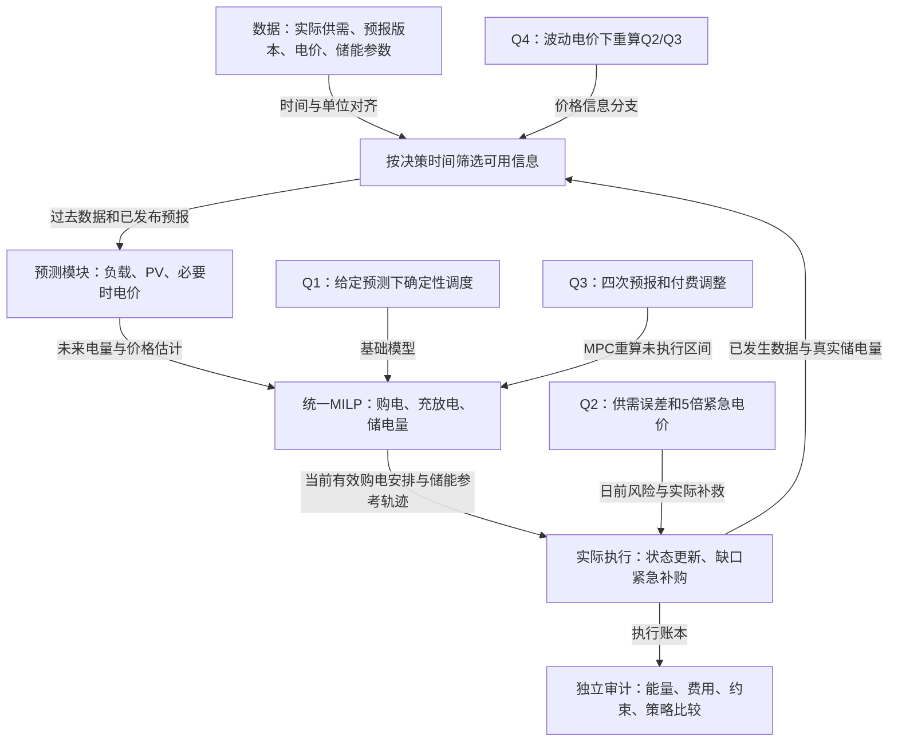

# 2026 C题统一建模实施方案（含公式）

> 题目：微网与外部电网电力调控策略。
>
> 用途：队伍内部讨论、建模与编程交接。主线为“可解释预测—统一储能调度—因果实际运行—费用与风险评价”。以下公式是拟采用的模型，不是已经完成求解的竞赛结论。费用歧义等未决条件采用明确分支，不能直接作为官方解释。

## 1. 方案概览与模型来源

我们不为四问搭四个互不关联的系统。统一变量、能量平衡、储能递推、执行器和费用审计；每问只增加相应的信息与决策机制。

| 用途 | BZD模型字典名称与编号 | 使用原则 |
|---|---|---|
| 负载预测、价格预测、已有预报的简单校正 | 多元线性回归 #1788 | 少量可用特征，优先可解释和时间验证 |
| Q2光伏日内周期预测 | 动态谐波回归 #2703 | 少量谐波＋低阶动态误差，与同期基线比较 |
| 误差风险估计 | 分位数回归 #1790 | 作为可选升级，不直接替代调度 |
| 四问调度核心 | 确定性混合整数线性规划 #913 | 线性约束＋充放电互斥，输出可行电量方案 |
| 简化基线和下界 | 线性规划 #797 | 若可证明无需互斥整数变量，可代替MILP |
| Q3及Q4日内调整 | 模型预测控制（MPC） #782 | 在允许时刻利用新信息重算，冻结已执行动作 |
| 有证据才启用的备选 | 广义加性模型（GAM） #1816 | 只替换出现稳定非线性偏差的预测模块 |

模型条目来源：**BZD数模社制作**。字典记录、限制与适配评估详见同目录《C题-适配优先的模型方案.md》。本文公式是针对C题组织的实现方案，不是把字典原文当作题目已知条件。

### 1.1 当前数据依据

只使用1月作为初始结构诊断：负载与前一周同时段相关系数约0.992，PV与前一天同时段约0.994，价格与前一周同时段约0.992。PV零值比例约52.06%。这支持从周期和滞后预测起步，但不代表模型预测精度已经达到这些数值。

初检支持“较晚版本PV预报值得研究”，不支持直接宣称“更新一定省钱”。预测器、调度器和风险模块均尚未完成效果验证。

### 1.2 四问联动图

## 2. 先冻结口径：题面事实与模型假设分开

| 项目 | 已知事实 | 本方案建议/待确认 |
|---|---|---|
| 时间间隔 | 输出为10分钟电量 | 每天144区间；00:10标签对应00:00—00:10是采用口径 |
| 输入功率 | 负载/PV单位kW | 区间平均功率法或点值积分法需统一；不得混用 |
| 储能 | 额定12000kWh，运行1200—10800kWh，最大充放电功率5000kW | 以下将充放电功率限额解释在微网母线侧；若改电池侧，要同时改功率与效率式 |
| 初值 | 2025年1月1日0点6000kWh | 不每天重置；Q1用6000作为可复算起点，注明该采用值 |
| 效率 | 充放电效率90% | 主情景可取两方向各0.9；另比较往返0.9的情景，不能混为同一解释 |
| 终端状态 | Q1明确日首尾相等 | Q2以后是否继承待解释；先用共同日循环作保守基线，再研究放开日循环的方案 |
| 富余供电 | 供电不能低于负载；未给售电收益 | 引入无收益富余处置量，不自行加入卖电收益；允许不用掉已付费电量是需声明的供给处置假设 |
| 紧急购买 | 缺电时5倍交易电价 | 只补真实供电缺口，不能把它当作可自由选择的套利购电渠道 |
| 调整结算 | 减购50%违约价，增购部分1.5倍价 | 是否退还被取消的原计划款、是否每次变更计费未清楚，见第9节双口径 |
| 波动价信息 | 附件4给实际价格 | 未来价格是否提前已知未明确；因果预测与完美信息情景分开 |

对效率，若采用“往返效率0.9且对称”情景，则

$$
\eta_c=\eta_d=\sqrt{0.9}.
$$

若采用“充、放单向各0.9”，则往返效率为0.81。两种情景分别计算，不在代码中只写一个含义不明的`efficiency`。

## 3. 统一符号、单位与信息集

设业务日为 $d$，日内时段为 $t=1,\ldots,T$，$T=144$，$\Delta=1/6\ \mathrm h$。储能状态 $E_{d,t}$ 表示时段 $t$ 开始时的储电量，$E_{d,T+1}$ 为当天24点。

| 符号 | 含义 | 单位/性质 |
|---|---|---|
| $L_{d,t},G_{d,t}$ | 实际负载与PV功率 | kW，外部实际数据 |
| $\ell_{d,t},g_{d,t}$ | 实际负载与PV电量 | kWh；区间平均法下为功率乘 $\Delta$ |
| $\widehat\ell_{d,t\mid k},\widehat g_{d,t\mid k}$ | 决策时刻 $k$ 对目标区间的电量预测 | kWh |
| $p_{d,t},\widehat p_{d,t\mid k}$ | 实际价格与当时的价格预测 | 元/kWh |
| $q^0_{d,t}$ | 0点确定的原计划购电量 | kWh，决策变量 |
| $q^k_{d,t}$ | 第 $k$ 次调整后的购电量 | kWh，决策变量 |
| $\bar q_{d,t}$ | 该区间最终实际执行的常规购电承诺 | kWh，由最后有效版本确定 |
| $c_{d,t},b_{d,t}$ | 从母线充入电池的电量、电池向母线输出的电量 | kWh，分别为充电与放电 |
| $E_{d,t}$ | 电池内部存储电量 | kWh，状态变量 |
| $z_{d,t}$ | 充放电模式，1允许充电、0允许放电 | 0/1，零充零放时取值不限 |
| $e_{d,t}$ | 紧急购电量 | kWh，实际补救量 |
| $u_{t\mid k},y_t$ | 预测下的补购缺口、用于禁止预计补购充电的辅助模式 | kWh、0/1，Q3/Q4内部求解使用 |
| $w_{d,t}$ | 富余处置电量 | kWh，非负、无收益；不等同于全部都是弃光 |
| $\eta_c,\eta_d$ | 充、放效率 | 无量纲 |
| $\mathcal I_k$ | 时刻 $k$ 可用的信息 | 已完成区间实际值、已发布预报、允许知道的价格、当前状态 |

预测与决策必须是 $\mathcal I_k$ 的函数。例如

$$
q^0_{d,1:T}=\pi_0(\mathcal I_{d,0}),\qquad
q^k_{d,\mathcal H_k}=\pi_k(\mathcal I_k),
$$

其中 $\mathcal H_k$ 是当前尚未执行的时段集合。不能在 $\mathcal I_{d,0}$ 中包含当天尚未发生的真实负载/PV或未来发布的预报。

## 4. 四问统一的物理约束

### 4.1 功率转换为电量

在区间平均功率口径下：

$$
\ell_{d,t}=\Delta L_{d,t},\qquad g_{d,t}=\Delta G_{d,t}.
$$

若原始数据采用点值口径，则改为相应功率曲线对该区间积分，其他电量模型不变。

### 4.2 母线能量平衡

实际执行满足

$$
\bar q_{d,t}+e_{d,t}+g_{d,t}+b_{d,t}
=\ell_{d,t}+c_{d,t}+w_{d,t}. \tag{1}
$$

各项均为kWh。$w$承接PV或已购电中的未利用富余，不给收益。若将来单独讨论弃光率，必须再区分弃光与未用购电，不能把 $w$ 全部当成弃光。

预测调度把 $\ell,g$ 换成当前预测值。在Q1基础模型中取 $e=0$；Q2确定性日前基线也不把 $e$ 当作自由套利变量，而在实际执行时补救。

### 4.3 储能递推

$$
E_{d,t+1}=E_{d,t}+\eta_c c_{d,t}-\frac{b_{d,t}}{\eta_d}. \tag{2}
$$

充电时母线输入 $c$，电池得到 $\eta_c c$；母线放电输出 $b$，电池减少 $b/\eta_d$。

$$
1200\le E_{d,t}\le10800. \tag{3}
$$

### 4.4 功率上限与互斥

在母线侧5000kW限额口径下，令 $M_P=5000\Delta=833.333\ldots\ \mathrm{kWh}$，则

$$
0\le c_{d,t}\le M_Pz_{d,t},\qquad
0\le b_{d,t}\le M_P(1-z_{d,t}),\qquad z_{d,t}\in\{0,1\}. \tag{4}
$$

同时有 $q^0,q^k,e,w\ge0$。不需要人为引入巨大 $M$；设备功率本身就给出了紧界。

### 4.5 跨日与终端条件

所有实际连续策略都满足

$$
E_{d+1,1}=E_{d,T+1},\qquad E_{\mathrm{Jan1},1}=6000. \tag{5}
$$

Q1额外满足

$$
E_{1,T+1}=E_{1,1}. \tag{6}
$$

Q2以后可先采用日循环计划约束作共同基线，但实际误差下的最终状态仍要真实递推，不能在日末补写成计划值。若放开日循环，可使用共同终端价值或目标作为模型假设，例如

$$
\Phi(E)=\lambda_E|E-E^{\mathrm{ref}}|, \tag{7}
$$

其中 $\lambda_E$ 单位元/kWh，目标和权重只由过去数据/预设策略确定。它是求解时的终端代理成本，不是电网真实账单。比较实际总费时单独列出代理项，并检查期末电量差异；不能靠耗尽电池免费降低费用。

## 5. Q1：确定性调度模型

### 5.1 输入与任务

输入附件1的电价、负载和PV预测以及统一储能参数。预测电量作为给定输入，不重新预测。

### 5.2 完整模型

$$
\min_{q,c,b,E,w,z}\ J_1=\sum_{t=1}^{144}p_tq_t \tag{8}
$$

满足式(2)—(4)、日循环式(6)、变量非负，以及

$$
q_t+\widehat g_t+b_t=\ell_t+c_t+w_t. \tag{9}
$$

这里 $E_1$ 主方案取6000kWh并明确采用值。若评估其他初始电量，必须保持日首尾相同并单列情景。

### 5.3 LP对照与结果

把 $z\in\{0,1\}$ 松弛为 $0\le z\le1$，得到LP下界；必须检查是否产生同时充放电。LP界与MILP解用于验证，不是两个独立创新。

输出十分钟 $q$，按题目时段汇总 $c,b$，给首尾 $E$ 与总费用，填 `result1.xlsx`。即使目标值相同也可能有多套充放电轨迹；需保存实际返回的方案并核验，不宣称解必唯一。

## 6. 预测模块：优先可解释，参数只用过去历史估计

### 6.1 负载：多元线性回归 #1788

以功率建预测，预测完成后转电量。一个可实现的少参数起点为

$$
\widehat L_{d,t\mid0}=\left[\beta_0+\beta_1L_{d-7,t}
+\beta_2L_{d-1,t}
+\sum_{j=1}^{6}\gamma_j\mathbf1\{\mathrm{weekday}(d)=j\}
+\sum_{m=1}^{K_L}\left(a_m\sin\frac{2\pi mt}{144}+b_m\cos\frac{2\pi mt}{144}\right)\right]_+. \tag{10}
$$

$[x]_+=\max(x,0)$。星期指标省略一个基准类别，避免与截距完全共线。$K_L$取少量候选，用过去窗口的滚动误差选择；不按全年未来结果调参。

输入特征都是0点已知：昨日和上周对应时段属于过去，星期和钟点属于日历。预测训练样本也必须按当时相同信息集构造。前7天没有周滞后时，采用已知历史同期均值等初始化基线并记录。

用最小二乘估计

$$
\widehat\beta=\arg\min_\beta\sum_{i\in\mathcal T_k}(y_i-x_i^\top\beta)^2, \tag{11}
$$

实际实现用稳定线性代数求解，不直接计算矩阵逆。检查共线性；需要删去冗余项时优先简化，不自动追加模型。误差有时间相关，不使用普通独立样本t检验宣称因果作用。

### 6.2 Q2光伏：动态谐波回归 #2703

设 $u$ 为连续十分钟索引。一个低阶实现为

$$
G_u=\alpha_0+\sum_{m=1}^{K_G}\left(A_m\sin\frac{2\pi mu}{144}+B_m\cos\frac{2\pi mu}{144}\right)+v_u, \tag{12}
$$

$$
v_u=\phi v_{u-1}+\epsilon_u,\qquad |\phi|<1. \tag{13}
$$

在截止索引 $u_0$ 预测未来 $h$ 步：

$$
\widehat G_{u_0+h\mid u_0}=\left[\widehat\alpha_0+
\sum_{m=1}^{K_G}\left(\widehat A_m\sin\frac{2\pi m(u_0+h)}{144}+\widehat B_m\cos\frac{2\pi m(u_0+h)}{144}\right)+\widehat\phi^{\,h}\widehat v_{u_0}\right]_+. \tag{14}
$$

参数在滚动历史窗口中重估，以跟随近期变化。第一版只用日周期，不拿1月数据估计可靠的年周期。谐波项过少可能漏掉日出日落形状，过多可能过拟合；先与前一日同期、过去若干日同期均值基线比较。

式(13)是具体的动态误差部分；如果最终取消它，应如实称静态谐波回归。夜间硬置零规则必须由过去数据或明确可用的日照信息确定，不能用当天未来真实零值设掩码。没有可用气象字段时不捏造气象特征。

### 6.3 Q3原始PV预报与可选校正

设附件3在时刻 $k$ 对目标整点 $s$ 的原始预报为 $F_{k,s}$。首先直接使用 $F$ 形成基线。

若历史残差存在稳定偏差，才拟合低参数校正：

$$
G_s-F_{k,s}=\theta_0+\theta_1h+\theta_2F_{k,s}
+\sum_{j\in\{6,12,18\}}\theta_j^{\mathrm{issue}}\mathbf1\{\mathrm{hour}(k)=j\}+\nu_{k,s},\quad h=s-k, \tag{15}
$$

时间差 $h$ 以小时计。校正预测为

$$
\widetilde G_{k,s}=\left[F_{k,s}+\widehat\theta^\top x_{k,s}\right]_+. \tag{16}
$$

当样本少时可仅估计整体偏差或发布时刻偏差，不必保留式(15)全部项。训练时目标 $s$ 必须已经发生；同一目标时刻的多个预报版本相关，必须按目标日期组织验证，不能拆到训练与测试两边。

整点功率变成十分钟电量时，同一已发布版本内构造曲线 $\widetilde G_k(\tau)$：

$$
\widehat g_{t\mid k}=\int_{a_t}^{b_t}\widetilde G_k(\tau)\,\mathrm d\tau, \tag{17}
$$

$\tau$以小时计。可采用分段线性，首小时缺失端点由当时可用信息衔接。点值与区间平均的区别需在数据说明中冻结，不借用未来实际值补插值端点。

### 6.4 Q4价格：先确定是否需要预测

如果未来价未知，可以式(10)的同类结构预测 $p$，用过去价格代替负载滞后项。价格预测须非负，并报告截断规则；不能把全年最低价格作为早期预测下限。

如果明确采用提前已知全天价格的情景，则令 $\widehat p=p$，该情景不需要价格预测器，标注为完美价格信息或相应假设。

## 7. Q2：日前计划、风险改进与实际费用

### 7.1 最小可运行基线

0点获取预测后求解：

$$
\min\ \widehat J_2^{\mathrm{base}}=\sum_t p_tq_t^0+\Phi(E_{T+1}) \tag{18}
$$

满足统一储能约束，以及预测平衡

$$
q_t^0+\widehat g_{t\mid0}+b_t=\widehat\ell_{t\mid0}+c_t+w_t. \tag{19}
$$

若采用硬日循环基线，使用 $E_{T+1}=E_1$ 并不再添加式(7)同类终端惩罚。式(18)是点预测调度，不是假装已经求得最小期望真实费用；它是后续风险模型的基准。

### 7.2 实际账单

实际运行产生紧急购电 $e$，按题目计算：

$$
J_2^{\mathrm{actual}}=\sum_{d,t}p_tq_{d,t}^0+5\sum_{d,t}p_te_{d,t}. \tag{20}
$$

未使用的原计划购电仍按计划收费。不能用实际消耗电量替换第一项。物理供电不足通过 $e$ 补足，不存在无成本未服务负荷。

### 7.3 模型选择目标

设 $\vartheta$ 是预测窗口、分位水平、余量强度等少量策略参数，以过去滚动验证日的真实执行费选择：

$$
\vartheta_k^*=\arg\min_{\vartheta\in\Theta}\sum_{d\in\mathcal V_k}J_{2,d}^{\mathrm{actual}}(\vartheta),\qquad \mathcal V_k\subset\{\text{在}k\text{之前已结束的日子}\}. \tag{21}
$$

因此5倍惩罚进入策略评价与参数选择。若仅实现式(18)且没有做风险校准，论文应称确定性基线，不称随机最优策略。

## 8. 实际运行：必须定义因果执行器

优化器给出的储能轨迹通常依据预测。实际供需偏离后，必须使用统一规则更新状态，否则只有计划，没有实际结果。

### 8.1 可复算的最小执行基线

先采用一个明确的逐区间基线：常规购电承诺固定后，富余优先充电，缺口优先放电，剩余缺口紧急购买。不允许用紧急购电充电套利。

定义

$$
a_t=\bar q_t+g_t-\ell_t. \tag{22}
$$

若 $a_t\ge0$：

$$
c_t=\min\left(a_t,M_P,\frac{E_{\max}-E_t}{\eta_c}\right),\quad b_t=e_t=0,\quad w_t=a_t-c_t. \tag{23}
$$

若 $a_t<0$：

$$
b_t=\min\left(-a_t,M_P,\eta_d(E_t-E_{\min})\right),\quad c_t=w_t=0,\quad e_t=-a_t-b_t. \tag{24}
$$

然后按式(2)更新 $E$。该基线满足能量平衡与设备边界，是可核验的运行规则，但**不保证经济最优，也不保证复现预测优化器的全部储能轨迹**。Q1直接验证其确定性最优计划；Q2—4同时保存“计划轨迹”和“实际执行轨迹”，不得混为一张表。

式(22)—(24)采用区间级准静态反馈近似：以该区间实际平均供需代表区间内即时监测与控制，只用于完成该区间结算，不向更早的日前/日内决策泄漏。若实现要求严格在区间开始就固定整个动作，则改为使用可用预测确定动作，并建独立的区间内补救模型；两种时间口径不能混用。

### 8.2 如何升级执行器

若基线在高价前过早放空电池，使用当前SOC与已有预测重算储能控制，但常规购电承诺只在题设允许时刻调整。未来实际值不得进入控制器。实现这类控制后，所有对照策略使用同样的执行规则，避免把执行器升级误当预测模型贡献。

风险余量若只用于日前规划，不应在实际已经缺电时机械禁止调用所留电量；是否为了未来更高成本缺口保留一部分电，是需要单独验证的经济决策。

## 9. Q3：MPC与调整费用

### 9.1 调整时刻与状态

每天允许预报更新时刻集合

$$
\mathcal K=\{0,6,12,18\}\ \text{小时}. \tag{25}
$$

0点按当时信息生成自己的 $q^0$，不是复制Q2方案。每个更新时刻获取实际SOC、最新预报和当前购电承诺，仅优化 $\mathcal H_k$。已执行时段的 $q,c,b,e,E$ 冻结。

### 9.2 一次结算的两种解释必须分开

对某目标时段，设原计划为 $q^0$，最终有效购电量为 $q$，价格为 $p$。记

$$
\delta^+=(q-q^0)_+,\qquad\delta^-=(q^0-q)_+. \tag{26}
$$

**口径A：取消部分退还原计划款，再收50%违约费。**

$$
F_A(q;q^0,p)=p\min(q,q^0)+1.5p\delta^++0.5p\delta^-
=pq^0+1.5p\delta^+-0.5p\delta^-. \tag{27}
$$

**口径B：原计划款全部保留，另加50%减购违约费。**

$$
F_B(q;q^0,p)=pq^0+1.5p\delta^++0.5p\delta^-. \tag{28}
$$

例如 $q^0=100$kWh、$p=1$元/kWh：不调整两者均100元；增到120两者均130元；减到80时A为90元，B为110元。该例是结算说明，不是附件计算结果。

题面不足以在这里把某种退款口径断言为官方规则。建议优先向队伍确认、必要时查官方澄清；若仍无结论，分别计算并分析结论是否改变。B口径下，若允许无成本处置富余且没有其他收购约束，减购通常被保持原计划弱支配；若模型声称大量减购显著省钱，应检查计费。

### 9.3 保持MILP线性与计费准确

两种 $F$ 都可用凸分段线性费用变量 $v_t$ 表达。A口径：

$$
v_t\ge0.5p_tq_t+0.5p_tq_t^0,\qquad
v_t\ge1.5p_tq_t-0.5p_tq_t^0. \tag{29}
$$

B口径：

$$
v_t\ge1.5p_tq_t^0-0.5p_tq_t,\qquad
v_t\ge1.5p_tq_t-0.5p_tq_t^0. \tag{30}
$$

最小化 $\sum v_t$ 时得到对应费用，不需要额外调整方向整数变量。以上要求用于优化的价格非负。不要把式(27)里的 $\delta^+,\delta^-$ 当两个任意非负自由量而不保证它们正确代表正负部分。

### 9.4 多次更新不能重复计费

主实现可采用“各时段相对0点原计划、按该时段最终有效量结算”的明确情景。在时刻 $k$ 最小化

$$
\min\ \sum_{t\in\mathcal H_k}\left[F(q^k_t;q_t^0,p_t)+5p_tu_{t\mid k}\right]+\Phi(E_{T+1}) \tag{31}
$$

其中 $u_{t\mid k}\ge0$ 是当前预测下的补购缺口估计，不是未来实际紧急量 $e_t$。采用

$$
q_t^k+u_{t\mid k}+\widehat g_{t\mid k}+b_t
=\widehat\ell_{t\mid k}+c_t+w_t. \tag{31a}
$$

为禁止借预计紧急购电充电，增加辅助模式 $y_t\in\{0,1\}$：

$$
0\le u_{t\mid k}\le\widehat\ell_{t\mid k}y_t,\qquad
0\le c_t\le M_P(1-y_t). \tag{31b}
$$

当预计需要紧急补购时不充电；缺口上界可用预测负载电量，因为PV、常规购电和放电均非负。保留常规充放电互斥。若未来价格预测为零，采用次级最小化预计紧急量与无用吞吐的规则消除无意义退化方案，不把零价退化结果解释成真实套利机会。

这样在预测负载提高时，冻结原购电承诺的方案仍可通过预计缺口参与费用比较。终端条件若采用不可达硬等式仍可能让它不可行，因此比较更新价值时须保持可行的共同终端规则，必要时使用同一软终端代理，并报告其偏差。

已结算时段的实际费用是常数，不再优化。式(31)中的补购是点预测下的确定性估计，不能解释成完整随机期望，也不能替代执行后按 $e_t$ 计算的账单。未来实际紧急费不能提前输入优化器；预测不确定性由后文风险改进和历史执行校准补充。

每个时段最终账单只记一次：

$$
J_3^{\mathrm{actual}}=\sum_{d,t}F(\bar q_{d,t};q^0_{d,t},p_t)+5\sum_{d,t}p_te_{d,t}. \tag{32}
$$

禁止把6、12、18点各自计算的整天 $F$ 相加，否则重复计算同一计划款。

若官方规定每次变更都成交收费，则应改成交易账本，例如在“增购1.5倍、减购净退款0.5倍”的成交口径下：

$$
J^{\mathrm{contract}}=\sum_t p_tq_t^0+
\sum_{k,t\in\mathcal H_k}\left[1.5p_t(q_t^k-q_t^{k-1})_+-0.5p_t(q_t^{k-1}-q_t^k)_+\right]. \tag{33}
$$

式(33)与最终量一次结算并不等价，也不能与式(32)叠加。Q4若交易按不同更新时间报价成交，还需把 $p_t$ 替换为交易版本报价；现有附件是否提供该价格维度需要另核验。

### 9.5 求解与执行流程

1. 0点只用已知信息制定 $q^0$。
2. 按统一执行器完成实际区间，记录真实SOC和紧急购电。
3. 到6/12/18点取新预报；未来预测采用新版本，历史计划保留。
4. 对未执行区间求解式(31)，更新有效购电承诺，保持已执行部分不变。
5. 到日末，按式(32)或明确选定的交易账本算费，衔接下一日SOC。

## 10. Q4：波动价格扩展

保留Q2与Q3两个分支。若未来价未知，用 $\widehat p_{t\mid k}$ 替代优化目标中的未来价格；实际结算用 $p_t^{\mathrm{actual}}$。

日前分支：

$$
J_{4-2}^{\mathrm{actual}}=\sum_{d,t}p_{d,t}^{\mathrm{actual}}q^0_{d,t}
+5\sum_{d,t}p_{d,t}^{\mathrm{actual}}e_{d,t}. \tag{34}
$$

调整分支，在“按目标时段实际价、最终量一次结算”的情景下：

$$
J_{4-3}^{\mathrm{actual}}=\sum_{d,t}F(\bar q_{d,t};q^0_{d,t},p_{d,t}^{\mathrm{actual}})
+5\sum_{d,t}p_{d,t}^{\mathrm{actual}}e_{d,t}. \tag{35}
$$

这里明确采用按目标交易时段实际价结算的解释；如果计划购电提前锁价、调整按发布时刻报价计费，需要额外报价数据或另设情景，不能擅自用式(35)解释所有交易机制。

分别输出 `result4-2.xlsx`、`result4-3.xlsx`。每条策略拥有独立连续SOC轨迹。比较更新机制时，同一对照双方应有相同0点信息来源；Q4日前分支是否允许使用附件3的0点预报需事先明确，不能默默多给一个策略额外信息。

## 11. 创新方向一：从单点误差转向连续缺口风险

本节是可选改进，先有基线再验证。不是算法原创声明。

### 11.1 使用真实可获得的预测残差

净负载电量和残差：

$$
n_t=\ell_t-g_t,\quad\widehat n_{t\mid k}=\widehat\ell_{t\mid k}-\widehat g_{t\mid k},\quad r_{t\mid k}=n_t-\widehat n_{t\mid k}. \tag{36}
$$

$r>0$表示低估需求/高估PV，可能导致缺口。训练风险模型用按过去信息生成的样本外残差，不用在同一批数据拟合后的过小残差。

对长度为 $H$ 的窗口，先定义累计残差：

$$
R_{k,H}=\sum_{j=1}^{H}r_{k+j\mid k}. \tag{37}
$$

但终点累计值会被前后正负误差抵消。更适合描述窗口内最不利累计需求的候选目标是

$$
S_{k,H}=\max\left(0,\max_{1\le h\le H}\sum_{j=1}^{h}r_{k+j\mid k}\right). \tag{38}
$$

$S$只是风险特征，仍未包含所有电池充电机会、效率、功率约束与时序动作，不能直接当精确必需电池容量。

### 11.2 分位数回归

令 $x_k$ 包括当时可用的预测水平、发布时间、窗口长度和过去波动特征。估计

$$
\widehat\beta_\alpha=\arg\min_\beta\sum_{i\in\mathcal T_k}\rho_\alpha(S_{i,H}-x_i^\top\beta),\qquad
\rho_\alpha(u)=u\left(\alpha-\mathbf1\{u<0\}\right). \tag{39}
$$

$$
\widehat S_{k,H}^{(\alpha)}=[x_k^\top\widehat\beta_\alpha]_+. \tag{40}
$$

初始只有31天，不能过细分成数十个模型或直接稳定估计极高分位。选少量中高分位作候选，检查覆盖率和实际费用，不从5倍价格机械推出唯一 $\alpha$。

### 11.3 一个可实现的接入方法

把风险量转换为参考内部储能余量：

$$
B_{k,H}=\min\left(E_{\max}-E_{\min},\frac{\gamma\widehat S_{k,H}^{(\alpha)}}{\eta_d}\right),\qquad\gamma\ge0. \tag{41}
$$

选择少量关键未来边界 $\mathcal B_k$，设置软储能参考：

$$
E_{\tau}+s_{\tau}\ge E_{\min}+B_{\tau},\qquad s_{\tau}\ge0,\quad \tau\in\mathcal B_k, \tag{42}
$$

并在求解目标中增加 $\lambda_B\sum_{\tau\in\mathcal B_k}s_{\tau}$。$B_\tau$必须在当前 $\mathcal I_k$ 内生成，不得用未来实际残差；$\lambda_B$为元/kWh，属于策略代理惩罚，不能记入真实购电费。

只约束可控的未来状态，不强迫已经发生的当前SOC立即达到目标。软约束避免高风险估计或功率不足造成不可行。风险窗口、关键边界、$\alpha,\gamma,\lambda_B$用过去验证选择，并限制候选数量。第一版可以只采用一个关键边界；不能给每个点独立堆巨大余量。

这是一种分位风险指导的储能余量策略，不是已证明的联合机会约束或严格鲁棒保证。若同时增加购电裕度，需检查是否重复防御同一风险。实际缺口发生时按执行规则使用可用储能，不把计划参考余量自动变成永远不能动用的硬下界。

### 11.4 对照与保留标准

比较无余量、固定余量和风险相关余量。报告总费、紧急购电、电量最低值、连续缺口与功率受限案例。若样本外费用不降或分位不稳，就删除该模块，保留简单方案。

## 12. 创新方向二：预报更新的净经济价值

### 12.1 原生优化已经允许“不调整”

在新预报下，分别求：

- 保持当前购电承诺，只允许同规则储能控制的方案 $a=0$；
- 允许修改未来承诺的方案 $a=1$。

在同一SOC、未来时域、预测和费用口径下，记预测成本为 $\widehat J_k^{(0)},\widehat J_k^{(1)}$：

$$
\widehat V_k=\widehat J_k^{(0)}-\widehat J_k^{(1)}. \tag{43}
$$

若不调整方案在更新优化可行集中且求解精确，$\widehat V_k\ge0$是优化的正常性质。因此“预测成本低才更新”不能单独当创新。

### 12.2 可选的可靠性门槛

过去已结束的决策窗口，可在同一当时SOC、相同后续外部真实序列和固定的未来控制规则下离线回放两个方案，得到历史实际差额 $V_i^{\mathrm{replay}}$。这是反事实回放证据，不是在当前时刻可以看到的未来值。

定义过去预测收益的高估误差

$$
\zeta_i=\widehat V_i-V_i^{\mathrm{replay}}. \tag{44}
$$

只有当历史样本足够且模型经验证，才用#1790或简单历史分位估计保守门槛

$$
\tau_k=\max\left(0,\widehat Q_\alpha(\zeta\mid\mathcal I_k)\right). \tag{45}
$$

候选规则为

$$
\text{调整购电承诺}\iff\widehat V_k>\tau_k. \tag{46}
$$

早期缺少回放样本时不启用额外门槛。不能把估计分位说成严格置信保证，也不能使用待评价日之后的窗口校准它。

### 12.3 实验拆分

比较四种机制：0点信息固定；预报更新但承诺冻结；允许付费更新；再增加可靠性门槛。前三种先完整实现，第四种只作有数据支撑的扩展。

局部窗口比较使用相同起始SOC；全年独立策略比较各自连续演化，不每次强行重置为共同SOC。分别报告计划费、调整费、紧急费、更新次数和更新电量，说明哪些更新“更准但无需改购电”。

## 13. 统一验证公式与结果表

### 13.1 预测误差

$$
\mathrm{MAE}=\frac1N\sum_i|y_i-\widehat y_i|,\qquad
\mathrm{RMSE}=\sqrt{\frac1N\sum_i(y_i-\widehat y_i)^2}. \tag{47}
$$

PV分别报告全部时段和明确口径的日间误差，避免夜间零值掩盖白天误差。不同预报版本必须比较相同目标集合。分位模型报告分位损失和实际覆盖率

$$
\widehat{\mathrm{Coverage}}_\alpha=\frac1N\sum_i\mathbf1\{S_i\le\widehat S_i^{(\alpha)}\}. \tag{48}
$$

### 13.2 独立物理审计

$$
\epsilon_t^{\mathrm{bal}}=\bar q_t+e_t+g_t+b_t-\ell_t-c_t-w_t, \tag{49}
$$

$$
\epsilon_t^{\mathrm{soc}}=E_{t+1}-E_t-\eta_cc_t+b_t/\eta_d. \tag{50}
$$

报告最大绝对残差、SOC界限违反量、功率违反量、同时充放电次数。容差需与单位、求解器精度和导出精度匹配。导出表重新读回独立复算，不能只检查优化器内部数组。

### 13.3 经济性

$$
\mathrm{SavingRate}=\frac{J_{\mathrm{baseline}}-J_{\mathrm{candidate}}}{J_{\mathrm{baseline}}}\times100\%. \tag{51}
$$

只有价格、信息、运行规则、计费解释和终端处理相同，才作直接策略节省比较。Q4固定价与波动价本身账单不同，不能将全部差额归因于算法。

费用旁同时报告紧急购电总量 $\sum e_t$、发生次数、运行时间、MILP gap、期末储电量。终端代理惩罚和风险软约束罚项单列，不混入真实账单。

### 13.4 必交结果

| 问题 | 论文与文件 |
|---|---|
| Q1 | 指定时段购电、充放电、首尾储电量、全天电量和费；`result1.xlsx` |
| Q2 | 2—12月每日计划、最终实际储能与紧急购电；四个指定日期表；`result2.xlsx` |
| Q3 | 原计划、最终有效调整安排、实际储能与紧急购电、更新价值分析；`result3.xlsx` |
| Q4 | 波动价格下两套完整结果；`result4-2.xlsx`、`result4-3.xlsx` |

四个代表日期为3月20日、6月21日、9月23日、12月21日。只算这四天不能代替334天完整输出。内部保留全部预报与计划版本，按模板要求汇总，避免用最后版本覆盖历史版本。

## 14. 推荐实施顺序与交接接口

1. 数据人员交付统一时间、单位与预报版本表，见《C题-数据处理任务交接.md》。
2. 建模人员确认第2节口径，先实现式(8)—(9)及独立审计，完成Q1。
3. 用简单回归/周期预测跑通Q2确定性基线和式(22)—(24)执行回放；先保证全年运行正确。
4. 以原始PV预报实现Q3 MPC，重点检查不同费用口径与重复计费。
5. 接入波动价格，分别重算Q4两分支。
6. 有基线后逐一加入预报校正、风险余量、可选更新门槛；只保留样本外有增量收益的组件。

| 模块 | 输入 | 输出 |
|---|---|---|
| 数据访问 | 决策时间、数据来源 | 当时可用历史/预报/价格，禁止未来穿越 |
| 预测 | 可用历史、目标时域 | 电量预测、必要时价格预测、模型版本 |
| 调度 | 预测、当前SOC、原/当前计划、费用口径 | 未执行时段的新承诺、储能参考轨迹、求解状态 |
| 运行 | 当前承诺、当前实际区间供需、真实SOC | 实际充放电、紧急量、富余量、下个SOC |
| 评价 | 原计划、每次更新与执行账本 | 实际费用、约束核验、论文表、结果文件 |

每个策略单独保存状态，所有随机或分割设置固定并记录。公式确定不代表实现正确；模型名称不代表创新成立。最终论文只写实际实现和验证过的内容。

## 15. 已完成与尚未完成

已完成：题面与附件结构阅读、1月结构诊断、模型字典筛选、数据交接说明、此公式方案。

尚未完成：结算等歧义冻结、处理后数据验收、预测滚动训练、优化求解、全年回放、创新对照、五份正式结果文件。

本方案有意保留清晰的基础版与可选改进。不能将尚未实现的随机性、风险保证或节费效果写入摘要。高质量论文依赖完整性、正确性、解释和验证，不能由模型组合预先保证获奖。

## 附：模型字典使用声明

下列声明随模型来源保留；本文只使用与本题相关的条目，不复制完整模型库。

### 条目1790声明（原文）

本模型说明出自BZD数模社学习资料（字典条目1790）。禁止借本资料拉群获客、诱导关注、账号涨粉或推广服务；使用前请自行查阅教材、论文和官方文档进行核验。

### 来源和完整许可

BZD数模社制作。

仅限个人学习、数学建模竞赛研究及非商业交流使用；禁止商用。

本资料由BZD数模社制作、整理与维护。未经明确书面授权，禁止以任何形式付费出售、倒卖、拆分售卖、二次包装后销售，或纳入商业课程、付费会员、付费社群及其他营利性产品。禁止利用本资料进行营销引流、拉群获客、诱导关注、账号涨粉、推广付费服务，或将其作为商业宣传与交易赠品。非商业转载或分享时，应保留“BZD数模社制作”署名及本完整声明，不得删除、遮挡或篡改来源信息。鼓励使用者自行查询教材、论文、官方文档及权威资料，对模型适用条件、算法原理和结论进行独立核验。本资料仅供学习参考，不替代原始文献、专业意见或竞赛规则；使用者应对具体建模选择和结果负责。
